<!-- Auto-generated by scripts/compile-toro-docs.ts. Do not edit by hand. -->
<!-- Run `bun run analytics:compile-toro-docs` to regenerate. -->

# Toro Result Sales — Business Knowledge

> Compiled 2026-05-24 from 35 source files.

# data/docs/discount-lottery-api.md

---

## title: "Discount Lottery (Sorteios) - Documentacao API"

Sistema de sorteios do modulo **Discount** (usado por Clube Guara e outros tenants do mesmo modulo). Diferente do `VSale Raffle` (ver `vsale-raffles-api.md`): aqui os participantes sao **marcenarias** (`business`) vinculadas a **lojas** (`store`), e os bilhetes sao gerados a partir das **vendas registradas** (`app_company_campaign_discount_register`).

**Controller:** `www/api/source/App/Incentive/Discount/DiscountLottery.php` (admin) e `DiscountBusiness::businessGetLotteries` (lojista).

---

## Conceitos

| Conceito                                                 | Descricao                                                                                                                                                                                                                                                              |
| -------------------------------------------------------- | ---------------------------------------------------------------------------------------------------------------------------------------------------------------------------------------------------------------------------------------------------------------------- |
| **Sorteio (Lottery)**                                    | Promocao dentro de uma campanha Discount. Tem janela de vendas (`start_date` -> `end_date`) e data de sorteio (`draw_date`).                                                                                                                                           |
| **Bilhete (Ticket)**                                     | Numero de 5 digitos (`00000`–`99999`) atribuido a uma marcenaria (`business_id`) em uma loja (`store_id`), gerado a partir de vendas.                                                                                                                                  |
| **Premio (Prize)**                                       | Item a ser sorteado, ordenado por `prize_position` (1, 2, 3...).                                                                                                                                                                                                       |
| **Loja participante (Store)**                            | Loja elegivel — apenas vendas dessas lojas geram bilhetes.                                                                                                                                                                                                             |
| **Valor do bilhete**                                     | `lottery_ticket_value` em R$ — quanto a marcenaria precisa gastar para ganhar 1 bilhete (ex.: R$ 500 = 1 bilhete a cada R$ 500).                                                                                                                                       |
| **Modo cumulativo (legacy)**                             | `lottery_cumulative = 1` — soma TODAS as vendas do par (business, store) e divide pelo valor do bilhete. NAO descarta saldo por NF. Mantido para tenants antigos; **nao recomendado** para promocoes formalizadas.                                                     |
| **Modo estrito SCPC (`lottery_strict_per_invoice = 1`)** | Geracao por register/NF: `floor(register_total_value / ticket_value)` por linha, com **filtro de NF aprovada** (todas as NFs do register precisam estar com `file_status = 1`) e **descarte de saldo individual** por NF. Atende §6.3-§6.5 do regulamento Clube Guara. |
| **Serie (`lottery_series_size`)**                        | Limite duro da serie de numeros distribuidos (default 100.000 — §11.1). Ao atingir, `lottery_series_closed_at` e preenchido e proximas chamadas de generate retornam `series_full: true`.                                                                              |

### Status do Sorteio (`lottery_status`)

| Valor | Significado                              |
| ----- | ---------------------------------------- |
| `1`   | Ativo (padrao)                           |
| `2`   | Sorteado (`lottery_drawn_at` preenchido) |

### Status dos Bilhetes (`lottery_ticket_status` — agregado da lottery)

| Valor      | Significado                                            |
| ---------- | ------------------------------------------------------ |
| `0` ou `1` | Bilhetes ainda nao gerados (lojista ve **estimativa**) |
| `2`        | Bilhetes gerados (lojista ve numeros reais)            |

### Status do bilhete individual (`ticket_status` na tabela `*_ticket`)

| Valor | Significado                                                                                                                                   |
| ----- | --------------------------------------------------------------------------------------------------------------------------------------------- |
| `0`   | Bilhete valido — participa do sorteio e conta para o limite da serie                                                                          |
| `1`   | Bilhete **invalidado** por estorno/cancelamento de NF (§6.6) ou desclassificacao (§12.1). Ainda ocupa numero na serie mas e ignorado no draw. |

Bilhetes sao invalidados automaticamente quando:

- a NF do register e reprovada (`POST /incentive/discount/admin/invoice/{file_id}/reject`),
- o register e excluido (`POST /incentive/discount/admin/register/delete/{register_id}`),
- uma aprovacao previa de NF e revertida para pendente (`adminRevertInvoice`).

A invalidacao alimenta `ticket_invalidated_at` + `ticket_invalidated_reason` para auditoria.

### Tipo de Sorteio (`lottery_draw_type`)

| Valor     | Descricao                                                                                                                                                                             |
| --------- | ------------------------------------------------------------------------------------------------------------------------------------------------------------------------------------- |
| `random`  | Sistema sorteia aleatoriamente, sem reposicao, garantindo **1 premio por CPF/CNPJ** (§11.3.2)                                                                                         |
| `federal` | Admin informa os 5 premios da Loteria Federal (ou o numero composto). Sistema extrai unidades (§11.3), aplica regra de aproximacao com virada (§11.5) e garante 1 premio por CPF/CNPJ |

---

## Tabelas

| Tabela                                         | PK                  | Conteudo                                                                                                     |
| ---------------------------------------------- | ------------------- | ------------------------------------------------------------------------------------------------------------ |
| `app_company_campaign_discount_lottery`        | `lottery_id` (UUID) | Cabecalho do sorteio                                                                                         |
| `app_company_campaign_discount_lottery_store`  | `item_id` (UUID)    | Lojas participantes (N:N)                                                                                    |
| `app_company_campaign_discount_lottery_prize`  | `prize_id` (UUID)   | Premios ordenados                                                                                            |
| `app_company_campaign_discount_lottery_ticket` | `ticket_id` (UUID)  | Bilhetes gerados (`ticket_number`, `business_id`, `store_id`, `register_id`, `ticket_is_winner`, `prize_id`) |

---

## Fluxo Operacional

```
1. Criar Sorteio (adminCreateLottery)
   - Nome, datas (start/end/draw), valor do bilhete, modo cumulativo, draw_type
   - Pode ja vir com stores[] e prizes[] no payload

2. Vendas acontecem no periodo
   - Lojista emite/valida voucher -> entra em app_company_campaign_discount_register
   - Nao ha geracao automatica de bilhetes — admin precisa rodar generate-tickets

3. Gerar Bilhetes (adminGenerateTickets)
   - Conforme `lottery_strict_per_invoice` / `lottery_cumulative`, calcula
     bilhetes por register (modo estrito SCPC) ou agregado por (business,
     store) — ver "Gerar Bilhetes" abaixo.
   - Operacao IDEMPOTENTE — pode rodar multiplas vezes; gera apenas o delta.
   - Respeita `lottery_series_size` (default 100.000): ao atingir, `series_full=true`.
   - Apos rodar, lottery_ticket_total > 0 e lottery_ticket_status = 2.

4. Acompanhar (adminGetTicketsSummary)
   - Lista bilhetes por participante (business + store + count).

5. Realizar Sorteio (adminExecuteDraw)
   - draw_type='random' -> aleatorio sem reposicao, garantindo 1 premio/CPF.
   - draw_type='federal' -> body.federal_prizes (5 premios da Federal),
     compoe via §11.3 e aplica regra de aproximacao §11.5 com virada.
   - Apenas bilhetes com `ticket_status=0` (validos) participam.
   - lottery_status vira 2; lottery_drawn_at/by preenchidos.

6. Consultar Resultados (adminGetDrawResults)
   - Vencedores em ordem de prize_position
```

> **Regras de imutabilidade:**
>
> - Apos `lottery_status = 2` (sorteada): nao pode editar, nao pode excluir, nao pode regenerar bilhetes.
> - Apos `lottery_ticket_total > 0` (bilhetes gerados): nao pode editar o cabecalho. Para mudar valor do bilhete ou stores/prizes, e preciso **excluir e recriar**. Validacao em `DiscountLottery.php:152`.

---

## Autenticacao e Body

- Todos os endpoints exigem JWT em `Authorization: Bearer ...`.
- Permissao adicional: usuario precisa ser admin da campanha (`app_company_campaign_admin`), nao apenas admin do company.
- Endpoints POST que recebem dados leem **JSON via `php://input`** (excecao a regra geral do projeto, que usa `$_POST`). Cliente deve enviar `Content-Type: application/json`.
- Filtro multi-tenant: todo SELECT/UPDATE filtra por `company_id` derivado do JWT — leak de tenant nao acontece por construcao.

---

## STUDIO - Endpoints Admin

Base URL: `/`

---

### 1. Criar Sorteio

```
POST /discount/admin/lottery/create/{campaign_uuid}
```

**Body (JSON):**

| Campo                  | Tipo          | Obrigatorio | Descricao                                                                 |
| ---------------------- | ------------- | ----------- | ------------------------------------------------------------------------- |
| `lottery_name`         | string        | Sim         | Nome do sorteio                                                           |
| `lottery_start_date`   | datetime      | Sim         | Inicio da janela de vendas (`YYYY-MM-DD HH:MM:SS`)                        |
| `lottery_end_date`     | datetime      | Sim         | Fim da janela de vendas                                                   |
| `lottery_draw_date`    | datetime      | Sim         | Quando o sorteio sera realizado (informativo)                             |
| `lottery_ticket_value` | decimal       | Sim         | Valor em R$ por bilhete                                                   |
| `lottery_cumulative`   | int           | Nao         | `1` (default) = soma vendas no par (business, store); `0` = por transacao |
| `lottery_draw_type`    | string        | Nao         | `random` (default) ou `federal`                                           |
| `lottery_rules`        | string        | Nao         | Texto do regulamento                                                      |
| `lottery_rules_file`   | string        | Nao         | URL do PDF do regulamento                                                 |
| `stores[]`             | array<int>    | Nao         | IDs das lojas participantes                                               |
| `prizes[]`             | array<object> | Nao         | Cada item: `{prize_name, prize_description?, prize_position}`             |

**Response (200):**

```json
{
  "status": "success",
  "lottery_id": "a1b2c3d4-..."
}
```

**Erros:**

- `400` — `Missing required fields` (algum campo obrigatorio ausente).
- `400` — `Campaign not exists` (UUID da campanha invalido).
- `403` — `Not authorized` (usuario nao e admin da campanha).

---

### 2. Atualizar Sorteio

```
POST /discount/admin/lottery/update/{lottery_id}
```

**Body (JSON):** todos os campos opcionais. Para `stores[]` e `prizes[]`, a operacao e **delete + reinsert** — envie a lista completa.

**Erros:**

- `400` — `Cannot update a drawn lottery` (status = 2).
- `400` — `Cannot update after tickets have been generated` (`lottery_ticket_total > 0`). Para mudar valor do bilhete, periodos ou lojas apos a geracao, exclua e recrie.

---

### 3. Listar Sorteios

```
GET /discount/admin/lotteries/{campaign_uuid}
```

**Response (200):**

```json
{
  "status": "success",
  "lotteries": [
    {
      "lottery_id": "a1b2-...",
      "lottery_name": "Sorteio Junho",
      "lottery_status": 1,
      "lottery_start_date": "2026-06-01 00:00:00",
      "lottery_end_date": "2026-06-30 23:59:59",
      "lottery_draw_date": "2026-07-05 19:00:00",
      "lottery_ticket_value": "100.00",
      "lottery_cumulative": 1,
      "lottery_draw_type": "random",
      "lottery_federal_number": null,
      "lottery_rules": null,
      "lottery_rules_file": null,
      "lottery_drawn_at": null,
      "total_prizes": 3,
      "total_tickets": 0,
      "lottery_ticket_status": 0,
      "lottery_ticket_expected": 0,
      "lottery_ticket_total": 0,
      "stores": [{ "store_id": 42, "user_name": "Loja Centro" }],
      "created_at": "2026-05-20 14:00:00"
    }
  ]
}
```

---

### 4. Detalhes do Sorteio

```
GET /discount/admin/lottery/{lottery_id}
```

**Response (200):**

```json
{
  "status": "success",
  "lottery": {
    "lottery_id": "...",
    "lottery_name": "Sorteio Junho",
    "lottery_status": 2,
    "lottery_start_date": "2026-06-01 00:00:00",
    "lottery_end_date": "2026-06-30 23:59:59",
    "lottery_draw_date": "2026-07-05 19:00:00",
    "lottery_ticket_value": "100.00",
    "lottery_cumulative": 1,
    "lottery_draw_type": "federal",
    "lottery_federal_number": "087423",
    "lottery_drawn_at": "2026-07-05 19:05:00",
    "lottery_drawn_by": 12,
    "lottery_drawn_by_name": "Andre Silva",
    "lottery_rules": "...",
    "lottery_rules_file": "https://...",
    "lottery_ticket_status": 2,
    "lottery_ticket_expected": 0,
    "lottery_ticket_total": 1532,
    "created_at": "..."
  },
  "stores": [...],
  "prizes": [...],
  "winners": [
    {
      "ticket_id": "...",
      "ticket_number": "087423",
      "business_id": 88,
      "store_id": 42,
      "business_name": "Marcenaria Acme",
      "business_document": "12.345.678/0001-90",
      "store_name": "Loja Centro",
      "prize_name": "TV 55",
      "prize_position": 1
    }
  ]
}
```

> `winners` so vem preenchido se `lottery_status == 2`.
> `lottery_drawn_at` retorna ja com fuso ajustado (`BravoUtils::subtractThreeHours`).

---

### 5. Excluir Sorteio

```
POST /discount/admin/lottery/delete/{lottery_id}
```

Faz cascade nas tabelas `_ticket`, `_prize`, `_store` antes de remover o cabecalho.

**Erros:**

- `400` — `Cannot delete a drawn lottery` (status = 2).
- `403` — usuario nao e admin da campanha.

---

### 6. Gerar Bilhetes (Reconciliacao)

```
POST /discount/admin/lottery/generate-tickets/{lottery_id}
```

Sem body. **Operacao idempotente** — pode (e deve) ser rodada multiplas vezes ao longo da campanha conforme novas vendas entram.

**Algoritmo:**

- **`lottery_cumulative = 1`** (cumulativo): para cada par `(business_id, store_id)` com vendas no periodo:
  ```
  total_value = SUM(register_total_value)
  total_deserved = floor(total_value / lottery_ticket_value)
  existing_count = COUNT(tickets atuais para esse par)
  new_tickets = total_deserved - existing_count   // gera so o delta
  ```
- **`lottery_cumulative = 0`** (por transacao, legacy): para cada `register_id` ainda **sem bilhetes validos nessa lottery**:
  ```
  new_tickets = floor(register_total_value / lottery_ticket_value)
  ```
- **`lottery_strict_per_invoice = 1`** (modo SCPC/SPA-MF — Clube Guara): para cada register cujas NFs estao **todas com `file_status = 1` (aprovadas)** e ainda nao tem bilhetes validos suficientes:
  ```
  deserved = floor(register_total_value / lottery_ticket_value)   // descarta saldo por NF (§6.4)
  new_tickets = deserved - existing_valid_tickets_for_register
  ```
  Registers com alguma NF pendente (0) ou reprovada (2) sao IGNORADOS ate a aprovacao (§6.5). Tem prioridade sobre `lottery_cumulative` (se ambos estao setados, vence o estrito).

**Numero do bilhete:** aleatorio de 5 digitos (`00000`–`99999` — §11.1), unico na lottery, ate 20 tentativas por bilhete.

**Limite da serie:** quando `total_tickets_existentes >= lottery_series_size` (default 100.000), a geracao para, `lottery_series_closed_at` e preenchido e o response devolve `series_full: true` (§15.3).

**Response (200):**

```json
{
  "status": "success",
  "generated": 47,
  "series_full": false
}
```

> `generated` e o numero de bilhetes criados **nesta chamada** (delta). Para o total acumulado, chame `GET /discount/admin/lottery/{lottery_id}` e olhe `lottery_ticket_total`. Quando `series_full=true`, sao precisas comunicacoes operacionais conforme §15.3 do regulamento.

**Erros:**

- `400` — `Cannot generate tickets for a drawn lottery` (status = 2).
- `400` — `Lottery not found`.

**Atencao operacional:**

- Sem job/cron — alguem precisa **clicar** o botao no admin. Combinar cadencia com o cliente (ex.: diariamente as 23h59) e proximo do `lottery_end_date` para garantir reflexao do estado final.
- No modo estrito, registers cujo conjunto de NFs nao esta totalmente aprovado nao geram bilhetes — admin precisa revisar as NFs antes do generate final.

---

### 7. Resumo de Bilhetes por Participante

```
GET /discount/admin/lottery/tickets-summary/{lottery_id}
```

**Response (200):**

```json
{
  "status": "success",
  "participants": [
    {
      "business_id": 88,
      "store_id": 42,
      "ticket_count": 24,
      "business_name": "Marcenaria Acme",
      "business_document": "12.345.678/0001-90",
      "store_name": "Loja Centro"
    }
  ]
}
```

> Ordenado por `ticket_count DESC`. Util para auditoria pre-sorteio.

---

### 8. Realizar Sorteio

```
POST /discount/admin/lottery/draw/{lottery_id}
```

**Body (JSON):**

| Campo            | Tipo     | Obrigatorio                 | Descricao                                                                                                                                                                                                |
| ---------------- | -------- | --------------------------- | -------------------------------------------------------------------------------------------------------------------------------------------------------------------------------------------------------- |
| `draw_type`      | string   | Nao                         | `random` ou `federal`. Default = `lottery_draw_type` cadastrado                                                                                                                                          |
| `federal_prizes` | array[5] | Se `federal` (preferencial) | Lista com os 5 premios da Loteria Federal (1o ao 5o). Cada valor pode ter qualquer numero de digitos — o sistema extrai a **unidade simples** (ultimo digito) de cada e compoe o numero da sorte (§11.3) |
| `federal_number` | string   | Se `federal` (fallback)     | Numero da sorte ja composto (5 digitos). Usado quando o admin nao quer passar os 5 premios                                                                                                               |

**Apenas bilhetes com `ticket_status = 0` (validos) participam.** Bilhetes invalidados por estorno/desclassificacao sao ignorados (§11.5).

**Algoritmo `random`:** seleciona aleatoriamente um bilhete por premio, em ordem de `prize_position`. Pula bilhetes cujo CPF/CNPJ (`user_document` do owner do business) ja foi premiado, atendendo §11.3.2 ("1 premio por CPF/CNPJ").

**Algoritmo `federal`:**

1. Se `federal_prizes` veio: compoe o numero da sorte concatenando as unidades dos 5 premios (§11.3). Caso contrario usa `federal_number` direto.
2. Para o **1o premio**: aplica a regra de aproximacao (§11.5) a partir do numero composto — testa alternadamente superior+1, inferior-1, superior+2, inferior-2, ... com **virada modular** (apos 99.999 volta para 00.000) ate achar um bilhete valido cujo CPF/CNPJ ainda nao foi premiado.
3. Para os **demais premios** (§11.3.1): mesma regra de aproximacao, mas iniciando do numero do **1o ganhador** (nao do numero extraido) e excluindo CPFs/CNPJs ja premiados.
4. Se nao houver bilhete valido para preencher todos os premios (todos os participantes restantes ja foram contemplados), o sorteio encerra com os premios entregues e o restante fica sem vencedor — admin pode reprocessar manualmente.

**Side effects:**

- `app_company_campaign_discount_lottery_ticket.ticket_is_winner = 1` e `prize_id` para os vencedores.
- `app_company_campaign_discount_lottery`: `lottery_status = 2`, `lottery_drawn_at = NOW()`, `lottery_drawn_by = user_id`, `lottery_draw_type`, `lottery_federal_number` (numero composto pelas unidades), `lottery_first_prize_number` (idem, mantido como historico mesmo apos reaplicacao da aproximacao).

**Response (200):**

```json
{
  "status": "success",
  "winners": [
    {
      "ticket_id": "...",
      "ticket_number": "087423",
      "business_id": 88,
      "store_id": 42,
      "business_name": "Marcenaria Acme",
      "business_document": "12.345.678/0001-90",
      "store_name": "Loja Centro",
      "prize_name": "TV 55",
      "prize_position": 1
    }
  ],
  "drawn_by_name": "Andre Silva"
}
```

**Erros:**

- `400` — `Lottery already drawn`.
- `400` — `Nenhum bilhete valido encontrado para sorteio` (lottery sem tickets ou todos invalidados).
- `400` — `No prizes configured`.
- `400` — `Informe federal_prizes (5 premios) ou federal_number (5 digitos)` (`draw_type=federal` sem input valido).
- `400` — `federal_prizes deve conter exatamente 5 numeros` / `federal_prizes[N] invalido`.

> **Sem integracao com CEF:** os premios da Loteria Federal sao digitados manualmente pelo admin. Para auditoria, o numero composto fica gravado em `lottery_federal_number` (compoe via §11.3) e o numero do 1o ganhador (antes/depois de aproximacao) em `lottery_first_prize_number`.

---

### 9. Resultados do Sorteio

```
GET /discount/admin/lottery/results/{lottery_id}
```

Mesmo formato de `winners` do endpoint anterior, com `prize_description` adicional.

```json
{
  "status": "success",
  "winners": [...]
}
```

> Vazio se ainda nao sorteado.

---

## CLIENT (LOJISTA) - Endpoint Business

Base URL: `/`

Lojista = marcenaria (`app_company_campaign_discount_business`). Precisa estar vinculada a uma loja (`business.store_id IS NOT NULL`).

---

### 10. Listar Meus Sorteios

```
GET /discount/business/lotteries/{campaign_uuid}
```

Retorna todos os sorteios (`lottery_status IN (1, 2)`) onde a loja vinculada a marcenaria do usuario logado participa.

**Response (200):**

```json
{
  "status": "success",
  "lotteries": [
    {
      "lottery_id": "...",
      "lottery_name": "Sorteio Junho",
      "lottery_status": 1,
      "lottery_start_date": "2026-05-31 21:00:00",
      "lottery_end_date": "2026-06-30 20:59:59",
      "lottery_draw_date": "2026-07-05 16:00:00",
      "lottery_drawn_at": null,
      "lottery_ticket_value": "100.00",
      "lottery_rules": "...",
      "lottery_rules_file": "https://...",
      "prizes": [
        {
          "prize_id": "...",
          "prize_name": "TV 55",
          "prize_description": "...",
          "prize_position": 1
        }
      ],
      "my_tickets": [
        { "ticket_number": "087423", "ticket_is_winner": 0, "prize_name": null }
      ],
      "my_ticket_count": 24,
      "winners": [],
      "i_won": false,
      "won_prizes": []
    }
  ]
}
```

**Campos uteis para a UI:**

| Campo             | Uso                                                                                                                                                                    |
| ----------------- | ---------------------------------------------------------------------------------------------------------------------------------------------------------------------- |
| `lottery_status`  | `1` Ativo / `2` Sorteado (badge)                                                                                                                                       |
| `my_tickets`      | Array de bilhetes do lojista. Vazio se ainda nao gerados                                                                                                               |
| `my_ticket_count` | Total. **Antes da geracao**, vem uma _estimativa_ calculada em tempo real a partir das vendas atuais (`floor(total / ticket_value)`); apos a geracao, vem o count real |
| `winners`         | Lista completa de vencedores (apenas se `lottery_status == 2`)                                                                                                         |
| `i_won`           | `true` se algum bilhete do lojista venceu                                                                                                                              |
| `won_prizes`      | Premios ganhos pelo lojista (numero do bilhete + nome do premio)                                                                                                       |

**Datas com fuso ajustado:** todos os campos `*_date` e `lottery_drawn_at` vem com `subtractThreeHours` aplicado.

**Erros:**

- `403` — `Not a business in this campaign` (usuario nao e marcenaria nesta campanha).
- `200 status=error` — `Sua marcenaria nao esta vinculada a nenhuma loja...` (campo `store_id` da marcenaria vazio).

---

## Frontend

### Admin (`bravohub-saas/`)

- `src/components/Campaigns/Discount/AdminFunctions/AdminLottery/index.tsx` — lista
- `src/components/Campaigns/Discount/AdminFunctions/AdminLottery/CreateLottery/index.tsx` — criar
- `src/components/Campaigns/Discount/AdminFunctions/AdminLottery/EditLottery/index.tsx` — editar
- `src/components/Campaigns/Discount/AdminFunctions/AdminLottery/LotteryDetail/index.tsx` — detalhe + acoes (generate, draw)
- `src/components/Campaigns/Discount/AdminFunctions/AdminLottery/LotteryPrizeForm/index.tsx` — premios
- `src/components/Campaigns/Discount/AdminFunctions/AdminLottery/DrawResults/index.tsx` — resultado

### Lojista (`bravohub-saas/`)

- `src/components/Campaigns/Discount/BusinessFunctions/BusinessLottery/index.tsx` — exibicao para a marcenaria (cards com bilhetes, premios, banner "voce ganhou", regulamento expansivel)

---

## Erros Comuns

| HTTP | Body                                                               | Causa                                                            |
| ---- | ------------------------------------------------------------------ | ---------------------------------------------------------------- |
| 404  | `Lottery not found`                                                | `lottery_id` invalido ou de outro tenant                         |
| 400  | `Campaign not exists`                                              | `campaign_uuid` invalido                                         |
| 400  | `Missing required fields`                                          | Falta `lottery_name`, datas ou `ticket_value` na criacao         |
| 400  | `Cannot update a drawn lottery`                                    | Tentou editar com `lottery_status = 2`                           |
| 400  | `Cannot update after tickets have been generated`                  | Tentou editar com `lottery_ticket_total > 0`                     |
| 400  | `Cannot delete a drawn lottery`                                    | Tentou excluir com `lottery_status = 2`                          |
| 400  | `Cannot generate tickets for a drawn lottery`                      | Tentou regenerar com `lottery_status = 2`                        |
| 400  | `Lottery already drawn`                                            | Tentou sortear novamente                                         |
| 400  | `No tickets generated`                                             | Tentou sortear sem chamar generate-tickets antes                 |
| 400  | `No prizes configured`                                             | Tentou sortear sem adicionar premios                             |
| 400  | `Informe federal_prizes (5 premios) ou federal_number (5 digitos)` | Input invalido no `draw_type=federal`                            |
| 400  | `Nenhum bilhete valido encontrado para sorteio`                    | Lottery sem tickets validos (todos invalidados ou nunca gerados) |
| 403  | `Not authorized`                                                   | Usuario nao e admin da campanha                                  |
| 403  | `Not a business in this campaign`                                  | Endpoint de business para usuario que nao e marcenaria           |

---

## Roteiro de Teste

Para validar a feature antes de uma promocao real (ex.: Clube Guara, `company_id = 19`, `campaign_id = 24`, junho/2026):

1. **Logar no Studio** como user admin da campanha alvo (precisa de linha em `app_company_campaign_admin`).
2. **Criar lottery de teste** com janelas curtas (`start_date` = ontem, `end_date` = amanha) para nao depender de tempo real. Definir `lottery_ticket_value` baixo (ex.: R$ 10) para gerar bilhetes com poucas vendas.
3. **Adicionar 2-3 premios** com `prize_position` distintos.
4. **Adicionar 1-2 lojas participantes** (preferencialmente lojas de teste/internas).
5. **Gerar vendas** dentro do periodo. Duas opcoes:
   - Real: fluxo de voucher do Clube Guara (ver `integrations/clube-guara.md:72-92`).
   - Atalho: INSERT direto em `app_company_campaign_discount_register` (mais rapido).
6. **Chamar `generate-tickets`** e verificar `total_tickets` em `GET .../lottery/{id}`.
7. **Validar visualizacao do lojista**: logar como business da loja participante, acessar `BusinessLottery` — `my_tickets` deve aparecer com os numeros corretos.
8. **Executar `draw`** com `draw_type=random` primeiro; depois testar com `draw_type=federal` em outra lottery (cria uma segunda para nao perder a primeira).
9. **Validar `results`** e o banner "Voce ganhou" no frontend do lojista (`i_won`, `won_prizes`).
10. **Testar bordas:**
    - Re-rodar `generate-tickets` apos novas vendas — deve gerar so o delta.
    - Tentar editar apos `lottery_ticket_total > 0` — deve retornar erro.
    - `draw` sem tickets ou sem premios — deve retornar erro.
    - `draw_type=federal` com numero invalido (7 digitos, letras) — deve retornar erro.

> **Sem ambiente de staging oficial documentado.** O teste roda em producao com lottery descartavel (datas curtas + lojas internas + nome "TESTE"). Apos validar, **excluir** a lottery (`POST .../delete/{id}` antes do sorteio) — depois de sorteada, nao pode mais excluir.

---

## Gaps Conhecidos

- **Sem notificacao automatica** apos sorteio (email/WhatsApp). Admin precisa avisar vencedores manualmente (§13.1 do regulamento da Clube Guara — 7 dias uteis).
- **Sem cron de generate-tickets.** Operador precisa rodar manualmente; combinar cadencia com o cliente.
- **Loteria Federal nao integrada.** Os 5 premios sao digitados manualmente; conferencia do regulamento (§11.3) e visual.
- **Sem audit trail** alem de `lottery_drawn_by` + `lottery_drawn_at`. Para comprovacao oficial, considerar registrar evidencia externa (foto/video da execucao do sorteio) e dump da tabela `*_ticket` imediatamente antes/depois do draw.
- **Sem fluxo de contemplado/72h/desclassificacao** (§11.6/§11.7). Quando o contemplado nao apresenta documentos no prazo, e preciso invalidar manualmente o ticket dele (`UPDATE ticket_status=1`) e reaplicar a regra de aproximacao manualmente — nao ha endpoint para isso ainda.
- **Sem validacao automatica dos criterios §6.1/§6.2** (idade ≥ 18, cadastro completo, aceite ao regulamento, tipo do produto MDF decorativo). Essas verificacoes precisam acontecer no fluxo de cadastro do tenant — o modulo Lottery confia na elegibilidade do `register` e seu cliente.
- **Sem export pronto para SCPC/SPA-MF** (§15.3.1). Lista de Participantes + numeros da sorte sai do endpoint `tickets-summary` + join manual com user_document.
- **Frontend admin ainda nao expoe `lottery_strict_per_invoice`.** Para a promocao Clube Guara Jun/2026, ativar via UPDATE direto no banco (ver SQL nos comentarios da migration `20260521-discount-lottery-compliance.sql`).

---

# data/docs/modules/analytics.md

---

## title: "Analytics (BravoAnalytics)"

Sistema interno de coleta de eventos de uso. Captura sessão (dispositivo, IP, geolocalização) e eventos nomeados dentro dela.

## Models

- `BravoAnalyticsSession` — sessão do usuário.
- `BravoAnalyticsEvent` — evento dentro da sessão.

## Controller

`App/BravoAnalytics.php`.

## Endpoints — `/ba/*`

| Método | Path                            | Propósito                  |
| ------ | ------------------------------- | -------------------------- |
| POST   | `/ba/session`                   | Criar sessão.              |
| GET    | `/ba/sessions`                  | Listar sessões do usuário. |
| GET    | `/ba/session/{session}`         | Detalhe.                   |
| POST   | `/ba/session/destroy/{session}` | Encerrar explicitamente.   |
| POST   | `/ba/event/{session}`           | Registrar evento.          |
| GET    | `/ba/logs`                      | Logs.                      |

## Payload

### Criar sessão — `POST /ba/session`

Minimalista: auth via JWT identifica `user_id`/`company_id`. Metadados derivados:

- **Geolocalização** — via `https://api.findip.net/{ip}/` (token hardcoded no controller). Extrai país/estado/cidade em inglês.
- **Dispositivo** — parse do `User-Agent`:
  - `DeviceType`: Mobile / Tablet / Desktop.
  - `OS`: Windows / Mac OS / Android / iOS.
  - `Browser`: Chrome / Safari / Firefox / unknow.
- Fallback `"unknow"` quando a detecção falha.

Retorno inclui `session_id` (UUID) — usado nos eventos.

### Criar evento — `POST /ba/event/{session}`

Payload esperado:

```json
{
  "event_type": "view_page",
  "event_data": { "page": "/campaigns", "refcode": "homepage" }
}
```

- `event_type` — string livre. Padrões comuns: `view_page`, `click_button`, `form_submit`.
- `event_data` — JSON arbitrário, salvo em `event_data` (TEXT).

Efeito colateral: atualiza `session_last_event` na sessão (permite detectar sessões inativas — ver [session-killer job](jobs.md)).

## Instrumentação

Dois lados:

- **Front chama manualmente** `/ba/session` ao abrir app e `/ba/event/...` em ações relevantes. Convenção de tipos depende do front.
- **Não há instrumentação automática** no backend — nenhum controller de outro módulo dispara evento de analytics por conta própria.

## Retenção

**Sem limpeza automática.** Tabelas crescem indefinidamente. Dois candidatos a cron de housekeeping:

- Sessões com `session_last_event < 90 dias` → arquivar.
- Eventos muito antigos → comprimir em agregações mensais.

`session-killer.php` apenas **fecha** sessões inativas (sem deletar registros).

## Gotchas

- **Token de geolocalização está hardcoded no código** — risco se o código vazar. Mover para `Config.php`.
- `event_data` é `TEXT` **sem indexação**. Buscas por conteúdo dentro do JSON são caras — para dashboards recorrentes, extrair colunas específicas.
- Não há tipagem/enum para `event_type` — divergências de nomenclatura (`view_page` vs `viewPage`) prejudicam queries.
- Endpoint de sessão **depende de IP externo** (findip.net). Se a API estiver fora, a criação de sessão fica lenta ou falha parcialmente.
- `destroySession` é opcional — front raramente chama em fechamento de aba. A maioria das sessões termina via `session-killer` (timeout).

---

# data/docs/modules/campaigns/affiliates.md

---

## title: "Afiliados"

Programa de afiliação com links trackáveis, boosters escalonados por volume (tiers) e pagamentos manuais de comissão.

## Controllers

| Camada     | Caminho                                | Propósito                                                            |
| ---------- | -------------------------------------- | -------------------------------------------------------------------- |
| Client     | `App/Incentive/Affiliates.php`         | Afiliado cria/gerencia links, consulta comissão, solicita pagamento. |
| Admin      | `App/Studio/Incentive/Affiliates.php`  | Admin configura programa, aprova pagamentos, gera relatórios.        |
| Integração | `App/CustomIntegration/Affiliates.php` | Webhooks de clique/conversão do parceiro.                            |

## Models principais (`www/api/source/Models/Affiliates/`)

- `AffiliateProgram` — programa raiz (regras base, % comissão).
- `AffiliateProgramBooster` + `AffiliateProgramBoosterTier` — escada de comissão (ex: vender 10 = +5%, vender 50 = +10%).
- `AffiliateProgramGroups` + `AffiliateProgramGroupSellers` — agrupamentos de afiliados.
- `AffiliateSellers` — afiliado (usuário que participa).
- `AffiliateSellerLinks` + `AffiliateSellerLinkAlias` — links de rastreamento com URL customizada.
- `AffiliateSession` + `AffiliateSessionEvent` — rastreio de clique (cookie/session).
- `AffiliateSellerOrder` + `AffiliateSellerOrderItems` — conversões.
- `AffiliateOrders` — agregação de ordens para cálculo de comissão.
- `AffiliatePayments` — solicitações/liquidações de pagamento.
- `CampaignAffiliates` — associação campanha × programa.

## Fluxo end-to-end

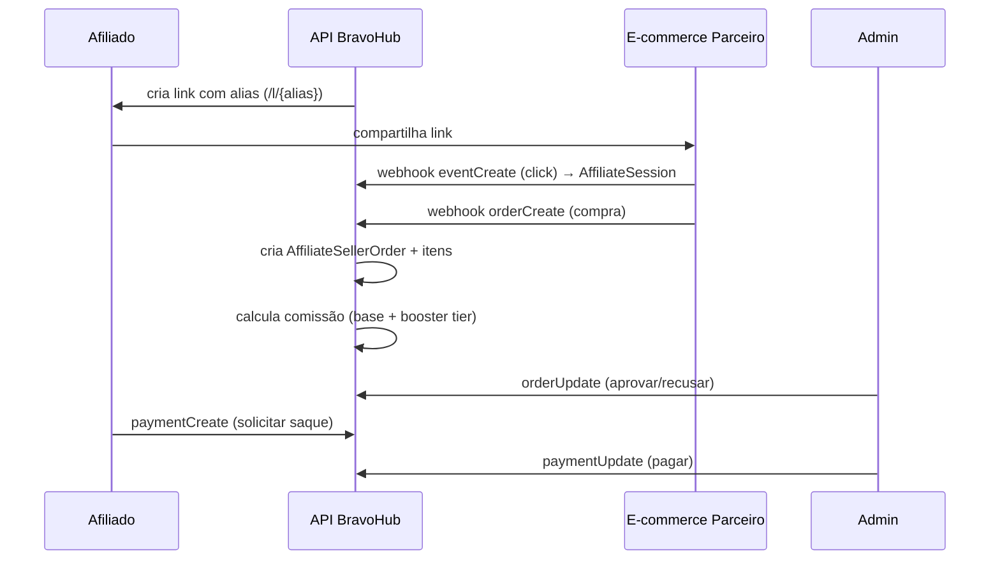

### 1. Configuração (Studio)

- `POST /studio/.../affiliates/program/create` — cria programa com `% base`.
- `POST /studio/.../affiliates/program/booster/create` — tiers (ex: 10 pedidos = +5%).
- `POST /studio/.../affiliates/program-group/create` — agrupamento (franquias, regiões).

### 2. Afiliado gera link

- `POST /.../affiliates/seller/link/create` → produz `AffiliateSellerLinks` com `link_alias` único.
- URL final servida pelo front: `<dominio>/l/{alias}` (redireciona com cookie de sessão).

### 3. Clique rastreado

- Parceiro dispara `POST /ci/affiliates/event/create` com `session_id` (cookie).
- API cria `AffiliateSession` (se nova) + `AffiliateSessionEvent` (clique/conversão).

### 4. Conversão

- Parceiro chama `POST /ci/affiliates/order/create`:
  - Cria `AffiliateSellerOrder` + `AffiliateSellerOrderItems`.
  - Vincula à sessão original (atribui comissão ao afiliado).
- `POST /ci/affiliates/order/update` para mudar status (pendente → aprovado → recusado).

### 5. Cálculo de comissão

- Background aggregator lê `AffiliateSellerOrder` aprovadas → popula `AffiliateOrders` com `commission_value`.
- Aplica tier: base % + incrementos de boosters atingidos.

### 6. Pagamento

- Afiliado consulta: `getCommissionsResume`, `getAvailableCommissions`, `getPaymentForecast`.
- Solicita: `POST /.../affiliates/payment/create`.
- Admin aprova/recusa: `POST /studio/.../affiliates/payment/update`.

## Endpoints — Client

| Path                                          | Método                    |
| --------------------------------------------- | ------------------------- |
| `/incentive/affiliates/programs`              | `getPrograms`             |
| `/incentive/affiliates/seller/code`           | `getSellerCode`           |
| `/incentive/affiliates/seller/links`          | `getSellerLinks`          |
| `/incentive/affiliates/seller/link/create`    | `createSellerLink`        |
| `/incentive/affiliates/seller/link/update`    | `updateSellerLink`        |
| `/incentive/affiliates/seller/link/alias`     | `getAliasLink`            |
| `/incentive/affiliates/reports`               | `getReports`              |
| `/incentive/affiliates/graphic`               | `getGraphic`              |
| `/incentive/affiliates/commissions/resume`    | `getCommissionsResume`    |
| `/incentive/affiliates/commissions/available` | `getAvailableCommissions` |
| `/incentive/affiliates/payments/forecast`     | `getPaymentForecast`      |
| `/incentive/affiliates/payments/paid`         | `getPaidCommissions`      |
| `/incentive/affiliates/orders`                | `getOrders`               |
| `/incentive/affiliates/payments`              | `payments`                |
| `/incentive/affiliates/payments/eligibility`  | `checkPaymentEligibility` |
| `/incentive/affiliates/payment/create`        | `paymentCreate`           |

## Endpoints — Studio (admin)

| Path                                                                         | Método                                          |
| ---------------------------------------------------------------------------- | ----------------------------------------------- |
| `/studio/.../program/create` · `/update` · `/all`                            | `programCreate/Update/GetAll`                   |
| `/studio/.../program/booster/create` · `/update` · `/all`                    | `programBooster*`                               |
| `/studio/.../program-group/create` · `/update` · `/delete` · `/get` · `/all` | `*ProgramGroup*`                                |
| `/studio/.../reports` · `/orders` · `/sellers`                               | `getReports/Orders/Sellers`                     |
| `/studio/.../payments` · `/forecast` · `/update`                             | `payments`, `paymentsForecast`, `paymentUpdate` |

## Integração externa (`/ci/affiliates/*`)

| Path                            | Método          | Propósito                          |
| ------------------------------- | --------------- | ---------------------------------- |
| `/ci/affiliates/befly-register` | `beflyRegister` | Onboarding via landing page Befly. |
| `/ci/affiliates/event/create`   | `eventCreate`   | Clique/sessão.                     |
| `/ci/affiliates/order/create`   | `orderCreate`   | Nova conversão.                    |
| `/ci/affiliates/order/update`   | `orderUpdate`   | Mudar status de ordem.             |

## Gotchas

- **`beflyRegister` cria `CompanyUser` com `user_status = 0`** (inativo). Ativação posterior. Também vincula aos grupos 155 (Global) e 156 (Afiliados) — **company-specific**, não replicar em outro tenant sem revisar.
- Sessões usam cookie. TTL não está no código — assume-se padrão do browser. Se a loja parceira usa domínio diferente (cross-site), o tracking pode falhar dependendo do SameSite.
- Uma ordem recusada (`orderUpdate` com status negativo) **não credita** comissão, e reverte se já havia contado.
- Um afiliado pode estar em vários `AffiliateProgramGroups` — o payload de reports agrega tudo.
- **Conciliação de pagamento é manual**. Não há integração bancária/PIX — admin aprova em lote.
- Links têm alias editável: cuidado com colisão entre afiliados (constraint no alias + company_id).

## Troubleshooting — problemas recorrentes

Problemas reais que já apareceram em produção com a integração Befly. Se você é o próximo dev/suporte atendendo, comece por aqui antes de abrir o código.

### Caso mais comum: "Befly diz que uma venda não subiu"

As solicitações geralmente chegam pela **Juliana Dias** (Befly), no grupo de suporte Toro ↔ Befly. Ela costuma mandar o `order_id`, e-mail/nome do afiliado e a data da venda.

Quando a Befly reclama que uma venda específica não foi creditada ao afiliado, o trabalho é descobrir **em qual etapa da cadeia a venda parou**. Siga esta checklist na ordem:

**1. O pedido chegou na nossa API?**

Consulte `AffiliateSellerOrder` (e `AffiliateSellerOrderItems`) pelo `order_id` que a Befly informou (é o ID do pedido no ERP deles).

- **Não existe registro** → o pedido nunca foi enviado. O problema está na ponta da Befly (webhook não disparou, erro de autenticação, payload malformado). → Acionar **Fábio Yamahira** (ver contato abaixo) com o `order_id`, data/hora da venda e o afiliado envolvido.
- **Existe registro** → o pedido chegou, seguir pros próximos passos.

**2. A sessão e os eventos do afiliado estão consistentes?**

Com o `affiliate_id` / `link_code` do afiliado, consulte:

- `AffiliateSession` — sessões do afiliado no período da venda.
- `AffiliateSessionEvent` — eventos de clique/conversão vinculados à sessão.

Verifique se há uma sessão ativa no momento da venda e se o `session_id` da ordem bate com alguma sessão existente. Sem vinculação válida, a ordem existe mas **não é atribuída ao afiliado** (comissão fica órfã).

**3. Qual o status da ordem?**

Em `AffiliateSellerOrder.order_status`:

- `0` = pendente (ainda não credita).
- `1` = aprovado (credita).
- Negativo/recusado = reverte se já tinha creditado.

Se o status está pendente/recusado, a Befly precisa chamar `POST /ci/affiliates/order-update` para mudar para aprovado.

**4. Tudo consistente, mas a comissão não aparece no painel do afiliado?**

- Conferir log do job agregador (`www/api/jobs/befly/com.php`) — ele popula `AffiliateOrders` com `commission_value`.
- Forçar recálculo com `www/api/jobs/befly/recalculate-commission.php` (rodar com cuidado — reprocessa histórico).
- Verificar se o afiliado está dentro do programa/booster tier correto.

### Contato — Fábio Yamahira (T.I)

Para qualquer assunto de T.I / integração de API entre Befly e Toro — especialmente casos em que o pedido ou evento **não chegou na nossa API** — o contato é o **Fábio Yamahira**.

- **Canal**: grupo de suporte Toro ↔ Befly (Fábio está no grupo).
- **WhatsApp direto**: +55 41 98716-1717.
- **Quando acionar**:
  - Pedido não existe em `AffiliateSellerOrder` (webhook não chegou).
  - Evento de clique/sessão não chegou (ausência em `AffiliateSessionEvent`).
  - Autenticação rejeitando (`company_api_key` / `campaign_api_key`).
  - Dúvidas sobre payload esperado pela API da Befly.
- **O que mandar ao abordá-lo**: `order_id` / `session_id`, data+hora da ocorrência, afiliado (e-mail ou `link_code`), comportamento esperado vs observado, qualquer erro/log disponível.

> Em resumo: se o problema é **"venda não chegou"**, é Fábio. Se o problema é **"venda chegou mas não virou comissão"**, é nosso (código ou config).

---

# data/docs/modules/campaigns/cashback.md

---

## title: "Cashback"

🚧 **Página em construção.**

## Models (raiz de `www/api/source/Models/`)

- `CompanyCampaignCashbackOrder`
- `CompanyCampaignCashbackProduct`
- `CompanyCampaignCashbackInstallment`
- `CompanyCampaignCashbackTrade`
- `CompanyCampaignCashbackWallet`
- `CompanyCampaignCashbackWalletExtract`

## A fazer

- [ ] Fluxo de acúmulo de saldo (order → installment → wallet).
- [ ] Regras de expiração / trade (troca).
- [ ] Extrato e como é renderizado.
- [ ] Endpoints Studio (config) e Client (consulta de saldo, resgate).

---

# data/docs/modules/campaigns/checkout.md

---

## title: "Checkout / Loja"

Catálogo de produtos específico de campanha, com brand → categoria → produto → item (oferta).

!!! note "Checkout ≠ CompanyStore"
**Checkout** (`CompanyCampaignCheckout*`) é um mini-catálogo **por campanha**, usado como mecânica de premiação/trade.
**CompanyStore** (`CompanyStore*`) é a **loja geral** da empresa (produtos permanentes, vouchers de nível). São sistemas paralelos, não se confundem.

## Controllers

- Client: `App/Incentive/Checkout.php`
- Admin: `App/Studio/Incentive/Checkout.php`

## Models

- `CompanyCampaignCheckout` — checkout raiz (uma campanha pode ter N).
- `CompanyCampaignCheckoutBrand` — marcas/fornecedores (com logo).
- `CompanyCampaignCheckoutCategory` — categorias.
- `CompanyCampaignCheckoutProduct` — produto base (SKU).
- `CompanyCampaignCheckoutItem` — oferta concreta (produto + brand + preço/estoque).
- `CompanyCampaignCheckoutOrder` + `CompanyCampaignCheckoutOrderItem` — pedido + itens.

## Hierarquia

```
Campaign
  └── Checkout
        ├── Brand (marca/parceiro)
        ├── Category
        ├── Product (SKU)
        └── Item (oferta = Brand + Product + preço/estoque)
              └── OrderItem (selecionado no pedido)
```

## Endpoints Client

| Método                                            | Path                                       |
| ------------------------------------------------- | ------------------------------------------ |
| GET                                               | `/incentive/checkout/checkouts/{campaign}` |
| _(demais: conferir `App/Incentive/Checkout.php`)_ |                                            |

## Endpoints Studio

Blocos principais (CRUD via `/studio/.../checkout/*`):

- `brand` — `getBrands`, `createBrand`, `updateBrand`, `deleteBrand` (aceita upload de logo).
- `category` — `getCategories`, `createCategory`, `updateCategory`, `deleteCategory`.
- `product`, `item` — CRUD similares.
- `order` — listar/exportar.

## Gotchas

- **Estoque é por Item**, não por Product. Dois itens do mesmo produto em brands diferentes têm contagens independentes.
- Ordens persistem snapshot do preço — mudar preço do item não afeta ordens antigas.
- **Não confundir com Gift**: `CompanyCampaignGift*` é entrega de brinde fixo/voucher (ver [Gamificação](gamification.md)).
- Não há integração de pagamento — Checkout assume que a "moeda" é interna (pontos/moedas da gamificação).

---

# data/docs/modules/campaigns/discount.md

---

## title: "Descontos e Loterias"

Sistema de cupons/códigos de desconto para venda em lojas parceiras, com loteria opcional acoplada. É um dos módulos mais envolvidos do sistema — tem **5 tipos de usuário** e controllers separados por papel.

## Papéis do usuário

| Papel        | Controller         | Quem é                                                                         |
| ------------ | ------------------ | ------------------------------------------------------------------------------ |
| **Admin**    | `DiscountAdmin`    | Admin da campanha. Configura tudo.                                             |
| **Business** | `DiscountBusiness` | Negócio/marcenaria que gera vouchers. Pode ou não estar vinculado a uma Store. |
| **Store**    | `DiscountStore`    | Loja física que valida/aplica o voucher.                                       |
| **Worker**   | `DiscountWorker`   | Vendedor/operário contratado pelo Business. Registra vendas com voucher.       |
| **(base)**   | `DiscountBase`     | Helpers comuns (detectar tipo, escolher loja, info de desconto).               |

Um usuário pode ter **múltiplos papéis** numa mesma campanha. `DiscountBase:getUserType` retorna qual papel ele assume.

## Controllers

`www/api/source/App/Incentive/Discount/`:

- `DiscountBase.php`
- `DiscountAdmin.php`
- `DiscountBusiness.php`
- `DiscountStore.php`
- `DiscountWorker.php`
- `DiscountLottery.php`

## Models

**Desconto:**

- `CompanyCampaignDiscount` — cupom raiz (período, valor máximo por uso).
- `CompanyCampaignDiscountProducts` / `CompanyCampaignDiscountSegmentationProducts` — produtos elegíveis.
- `CompanyCampaignDiscountStore` · `DiscountStoreCode` · `DiscountStoreCodeUser` · `DiscountStoreSeller` — lojas e códigos.
- `CompanyCampaignDiscountBusiness` — negócio.
- `CompanyCampaignDiscountWorker` · `DiscountWorkerCode` — vendedor e seus códigos.
- `CompanyCampaignDiscountRegister` · `DiscountRegisterFiles` · `DiscountRegisterProducts` — venda registrada (com NF).
- `CompanyCampaignDiscountUser` · `DiscountGroup` — quem pode usar.

**Loteria:**

- `CompanyCampaignDiscountLottery` — sorteio vinculado à campanha.
- `CompanyCampaignDiscountLotteryTicket` — ticket gerado a partir de uso de voucher.
- `CompanyCampaignDiscountLotteryPrize` — prêmios.
- `CompanyCampaignDiscountLotteryStore` — prêmios disponíveis por loja.

## Fluxo end-to-end

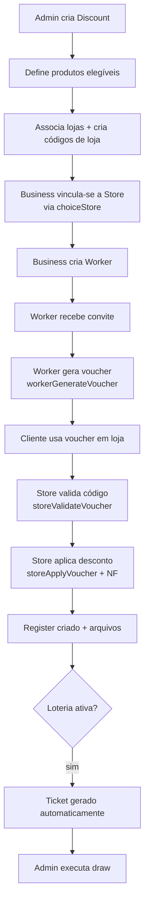

## Endpoints por papel

### Admin (`DiscountAdmin`)

CRUD de Discount, Store, Business, Worker, Products, Codes + aprovação de NFs:

- `POST /incentive/discount/create` · `admin/update`
- `POST /incentive/discount/admin/manage/users/{uuid}`
- `POST /incentive/discount/store/create/{campaign}`
- `POST /incentive/discount/admin/store/transfer/{campaign}` · `deactivate` · `reactivate`
- `POST /incentive/discount/business/create` · `select`
- `POST /incentive/discount/worker/create`
- `POST /incentive/discount/admin/store/code/create` · `update` · `delete`
- `POST /incentive/discount/admin/products/create/{campaign}` · `update` · `delete`
- `POST /incentive/discount/admin/register/delete/{id}` · `update-value`
- `POST /incentive/discount/admin/invoice/{file}/approve` · `reject`
- `GET /incentive/discount/admin/extract/{campaign}`

### Business (`DiscountBusiness`)

- `GET /incentive/discount/business/workers/{campaign}`
- `GET /incentive/discount/business/discounts/{campaign}`
- `POST /incentive/discount/business/workers/vouchers/{campaign}`
- `POST /incentive/discount/business/workers/invite/{campaign}`
- `POST /incentive/discount/business/worker/create/{campaign}`
- `POST /incentive/discount/business/voucher/generate/{discount}` — **gera voucher** com limite.
- `GET /incentive/discount/business/extract/{campaign}` · `/lotteries/{campaign}`

### Store (`DiscountStore`)

- `POST /incentive/discount/store/voucher/validate/{campaign}` — valida código.
- `POST /incentive/discount/store/voucher/apply/{campaign}` — aplica.
- `POST /incentive/discount/store/register/update/{id}` · `value/{id}`
- `GET /incentive/discount/store/invoices/{campaign}` · `/extract/{campaign}` · `/sellers/{campaign}`
- `POST /incentive/discount/store/seller/create/{campaign}`
- `GET /incentive/discount/business/store/{store_id}`

### Worker (`DiscountWorker`)

- `GET /incentive/discount/worker/invite/{campaign}` · `accept` · `decline`
- `GET /incentive/discount/worker/vouchers/{campaign}`
- `POST /incentive/discount/worker/voucher/generate/{discount}`
- `GET /incentive/discount/worker/extract/{campaign}`

### Base / comuns

- `GET /incentive/discount/user/type/{campaign}` — detectar papel.
- `GET /incentive/discount/info/{id}` — metadata do desconto.
- `POST /incentive/discount/store/choice/{campaign}` — Business escolhe Store.
- `GET /incentive/discount/store/sellers/{campaign}`

### Lottery (`DiscountLottery`)

- `POST /incentive/discount/admin/lottery/create/{campaign}` · `update` · `delete`
- `GET /incentive/discount/admin/lotteries/{campaign}` · `/lottery/{id}`
- `POST /incentive/discount/admin/lottery/generate-tickets/{id}`
- `GET /incentive/discount/admin/lottery/tickets-summary/{id}`
- `POST /incentive/discount/admin/lottery/draw/{id}` — **executa sorteio**.
- `GET /incentive/discount/admin/lottery/results/{id}`

## Gotchas

- **Código de loja** (`DiscountStoreCode`) tem contador (`code_limit_usage`) — uso decrementa. Compartilhado por todos os Workers da loja.
- **Código de worker** (`DiscountWorkerCode`) tem contador próprio (`discount_limit_usage`). Um código queimado pelo Worker A não afeta o Worker B.
- `discount_max_value_usage` (no Discount) limita o **total** que um usuário pode economizar.
- Business **pode não ter Store** (`business.store_id = NULL`) — usado em modelos em que o negócio roda vouchers sem ponto físico.
- NFs passam por aprovação manual (`adminApproveInvoice` / `adminRejectInvoice`). Rejeição invalida o Register e reverte.
- **Loteria é embutida** (não usa tabelas VSaleRaffle). Tickets são gerados automaticamente ao usar voucher (quantidade segue regra própria — conferir `adminGenerateTickets`).
- Um cliente pode ganhar **múltiplos prêmios** num mesmo sorteio se tiver vários tickets sorteados — confirmar com equipe se isso é o comportamento desejado.

## Troubleshooting — problemas recorrentes

Chamados frequentes sobre o módulo de Descontos costumam vir de dois contatos na Guararapes. Mapeamento pra saber por onde começar:

### Luciana — dona operacional da campanha

A **Luciana** é o principal canal de solicitações operacionais sobre descontos. Típicos pedidos:

- **Editar um desconto existente**: ajustar período, valor máximo de uso, produtos elegíveis, lojas vinculadas, códigos.
- **Relatórios de campanha**: extrato consolidado, listagem de registros/vendas por período, ranking de Stores/Workers, vouchers usados vs disponíveis.
- **Criar ou ajustar códigos de loja/worker**: limites, reativações, transferências.
- **Dúvidas sobre status de voucher/register** antes de escalar como bug.

**Endpoints que costumam atender a maioria dos pedidos dela**:

- `POST /incentive/discount/admin/update` — editar o desconto.
- `POST /incentive/discount/admin/store/code/update` — ajustar código de loja.
- `GET /incentive/discount/admin/extract/{campaign}` — extrato geral.
- `POST /incentive/discount/admin/register/update-value/{id}` — ajustar valor de um register.

Se o pedido for algo que ainda não dá pra fazer pela UI do Studio, priorize implementar a edição no admin antes de fazer ajuste direto no banco.

#### Caso recorrente: descontinuação de lojas (Clube Guara)

A Luciana periodicamente envia uma **planilha Excel** com a relação de lojas que serão **descontinuadas** no Clube Guara. Para cada loja da planilha ela especifica **o que fazer com as marcenarias (Business) e marceneiros (Worker) vinculados**:

- **Migrar** para outra loja específica (ela indica qual).
- **Desvincular** — Business fica "solto" e o usuário cliente pode escolher qualquer loja disponível quando for usar voucher.

**Como aplicar (via Studio, caminho recomendado)**:

A listagem de lojas no Studio (`/studio/.../campanha/{id}/descontos` → aba Lojas) tem o fluxo pronto pra isso. Ao abrir o menu de ações de uma loja, estão disponíveis (entre outras):

- **Migrar clientes (Business) para outra marcenaria** — transfere os Business vinculados à loja X para a loja Y escolhida. Endpoint por trás: `POST /incentive/discount/admin/store/transfer/{campaign}` (atualiza `CompanyCampaignDiscountBusiness.store_id` em batch).
- **Deixar Business para escolha** — desvincula os Business (seta `store_id = NULL`). No fluxo de uso do voucher, o cliente final escolhe qualquer loja ativa via `POST /incentive/discount/store/choice/{campaign}` (`DiscountBase:choiceStore`).
- **Desativar / reativar loja** — `POST /incentive/discount/admin/store/deactivate` · `/reactivate`.

Use SEMPRE o Studio. Só cair em SQL direto se a UI não cobrir o caso específico — e ainda assim, dentro de transação + registrar o que foi feito.

**Estado final esperado** (após aplicar a planilha da Luciana):

- Loja descontinuada → `store_status = 0` (desativada).
- Business migrado → `store_id` apontando para a nova loja.
- Business desvinculado → `store_id = NULL`, cliente escolhe loja via `choiceStore` na hora de aplicar voucher.
- Workers acompanham o Business automaticamente (vinculam ao Business, não direto à Store).

**Checklist para cada execução**:

1. Abrir a listagem de lojas da campanha no Studio.
2. Para cada loja do Excel, identificar ação (migrar → qual loja destino, ou desvincular).
3. Executar a ação pelo menu da loja.
4. Desativar a loja descontinuada ao final.
5. Arquivar o Excel original em local versionado — histórico pra quando a Luciana voltar a perguntar o que foi feito.

> Business sem `store_id` continua válido pra gerar voucher. Quem precisa da loja é o cliente final na hora de aplicar — `choiceStore` já cobre esse caso.

### Lucas — auditor da Guararapes (notas fiscais)

O **Lucas** é auditor e atua no **fluxo de aprovação de NFs** dos registros de venda. Ele aprova ou reprova as notas anexadas pelas Stores/Workers via `DiscountRegisterFiles`.

Pedidos típicos dele:

- **"Nota foi aprovada/reprovada errada"** — reverter status em `CompanyCampaignDiscountRegister` / `DiscountRegisterFiles`.
- **"NF sumiu"** / upload falhou — verificar `DiscountRegisterFiles` e S3 (uploads).
- **"Register com valor divergente da NF"** — conferir `register_value` e usar `admin/register/update-value` se precisar corrigir.
- **Dúvidas sobre histórico de aprovação** de um register específico.

**Endpoints envolvidos**:

- `POST /incentive/discount/admin/invoice/{file}/approve` — aprovar NF.
- `POST /incentive/discount/admin/invoice/{file}/reject` — reprovar NF.
- `POST /incentive/discount/admin/register/delete/{id}` — remover register indevido.
- `POST /incentive/discount/admin/register/update-value/{id}` — ajustar valor.

Rejeitar uma NF **invalida o Register** (reverte desconto creditado). Cuidado ao fazer operação em lote — sempre confirmar o `register_id` antes de executar.

### Regra geral

- Pedido **operacional sobre o desconto/campanha** (edição, relatório, código) → Luciana.
- Pedido **sobre nota fiscal / auditoria de venda** → Lucas.
- Os dois chegam pelo **grupo de suporte Guararapes ↔ Toro**.

---

# data/docs/modules/campaigns/gamification.md

---

## title: "Gamificação"

Sistema central de **pontos, moedas, níveis e carteira** que sustenta a economia interna. Quase todo módulo (campanhas, feed, cursos, surveys) credita ou debita valores aqui.

## Distinção importante

|           | Pontos                                      | Moedas                                              |
| --------- | ------------------------------------------- | --------------------------------------------------- |
| Tabela    | `company_user_gamification_wallet_points`   | `company_user_gamification_wallet_coins`            |
| Propósito | Contagem para ranking / progressão de nível | Moeda interna trocável por prêmios                  |
| Débito    | Direto na wallet (pode negativar)           | FIFO por expiração (com controle `coins_available`) |
| Expiração | `points_expire` (dias)                      | `coins_expire` (dias)                               |

Ambos têm extrato (`IN` / `OUT`) e estão vinculados a `CompanyUserGamificationWallet` (uma por usuário).

## Controllers

| Camada       | Caminho                                          |
| ------------ | ------------------------------------------------ |
| Client       | `App/Gamification.php`                           |
| Admin        | `App/Studio/Gamification.php`                    |
| External API | `App/CustomIntegration/ExternalGamification.php` |

## Models

**Configuração:**

- `CompanyGamificationModule` — liga/desliga gamificação para a empresa.
- `CompanyGamificationDefaultValue` — valores padrão por ação (ex: curtir post = 1pt).
- `CompanyLevel` — níveis (Bronze, Prata, Ouro) com `level_points` threshold.
- `CompanyCoin` — moeda customizada (pode ter N por empresa).

**Carteira:**

- `CompanyUserGamificationWallet` — carteira do usuário (totalizador).
- `CompanyUserGamificationWalletPoints` — extrato de pontos.
- `CompanyUserGamificationWalletCoins` — extrato de moedas.

**MGM (Member-Get-Member):**

- `CompanyGamificationMGM` — programa de indicação.
- `CompanyGamificationMGMCode` — códigos por vendedor.

**Premiação:**

- `CompanyCampaignGift`, `CompanyCampaignGiftConfig`, `CompanyCampaignGiftVoucher` — brindes de campanha.
- `GiftCardRedeem`, `GifttyProduct`, `CompanyGifttyStore` — integração com catálogo Giftty.

## API central: `BravoUtils::gamificationPoints`

```php
BravoUtils::gamificationPoints(
    int    $userId,
    string $type,         // "IN" ou "OUT"
    int|float $value,
    string $flag,         // identificador de origem
    string $description,
    string $data,         // referência contextual (order_id, campaign_id, etc.)
    ?int   $expires = null  // dias até expirar (só IN)
): bool;
```

Comportamento:

- `IN` → incrementa `wallet.points` e cria linha `CompanyUserGamificationWalletPoints` com `extract_type = 'IN'`, `points_flag`, `points_expire` (se `$expires > 0`).
- `OUT` → decrementa `wallet.points`. **Não há controle de saldo** — pode zerar/negativar.
- Cria/atualiza `CompanyUserGamificationWallet` se não existir.

## API central: `BravoUtils::gamificationCoins`

```php
BravoUtils::gamificationCoins(
    int    $userId,
    string $type,
    int|float $value,
    string $flag,
    string $description,
    string $data,
    ?int   $expires = null,
    bool   $forceNegative = false
): bool;
```

Diferenças vs pontos:

- `OUT` consome linhas `IN` em **FIFO por `coins_expire`** (mais antiga primeiro), zerando `coins_available` ao gastar.
- Sem `$forceNegative`, o débito é limitado ao saldo disponível.
- Com `$forceNegative = true`, permite negativar (cenários administrativos).

## Níveis

- Admin cria `CompanyLevel` com `level_points` (threshold).
- `user_level` (em `CompanyUser`) é **armazenado no usuário**, não calculado on-the-fly.
- Promoção é triggada ao creditar pontos que ultrapassem o threshold do próximo nível — mas a lógica exata de update varia conforme o fluxo (confirmar com equipe quais caminhos fazem o upgrade automático).
- **Não há "demote"** (rebaixamento): uma vez que atinge, não cai.
- `calculateLevelProgress(points, current, next)` retorna % entre níveis.

## Eventos típicos que creditam pontos

Disparados a partir de controllers de outros módulos, passando um `flag` descritivo:

| flag comum                      | Disparado em                        |
| ------------------------------- | ----------------------------------- |
| `purchase`                      | Venda aprovada (cashback, sellout). |
| `referral` / `mgm`              | Programa MGM.                       |
| `checkin`                       | Eventos / VSale booster.            |
| `challenge`                     | Conclusão de desafio Rex.           |
| `course_complete` / `quiz_pass` | Campus.                             |
| `survey_answer`                 | Survey respondida.                  |
| `post_reaction`                 | Interação no feed.                  |
| `admin_bonus`                   | Crédito manual via Studio.          |

Valores padrão por ação ficam em `CompanyGamificationDefaultValue` — admin pode ajustar por empresa.

## Endpoints

### Client — `App/Gamification.php`

| Método | Path                           | Propósito                                            |
| ------ | ------------------------------ | ---------------------------------------------------- |
| GET    | `/gamification/wallet/extract` | Extrato paginado de pontos e moedas (com expiração). |
| GET    | `/gamification/user/level`     | Nível atual + progresso para o próximo.              |

### Studio — `App/Studio/Gamification.php`

| Método | Path                                                              | Propósito         |
| ------ | ----------------------------------------------------------------- | ----------------- |
| POST   | `/studio/gamification/level/create` · `/edit/{level}` · `/delete` | CRUD de níveis.   |
| GET    | `/studio/gamification/users/ranking`                              | Ranking geral.    |
| GET    | `/studio/gamification/users/ranking/v2`                           | Ranking paginado. |

### External API — `App/CustomIntegration/ExternalGamification.php`

- `POST /ci/gamification/pontuation/manage` — sistema externo credita/debita pontos, autenticando via `partner_key` (validado contra `CompanyPartner.partner_key`).

## Resgate / premiação

Há **3 caminhos** de resgate, independentes:

1. **Gift de campanha** — `CompanyCampaignGift` / `CompanyCampaignGiftVoucher` (ver rotas `/studio/incentive/gift/*` e `/incentive/gift/*`).
2. **Giftty** — catálogo externo, integração via `GiftCardRedeem` + `GifttyProduct`.
3. **Company Store** — loja geral (produtos/vouchers permanentes) — ver `CompanyStore*` models.

## Gotchas

- **Débito de pontos não valida saldo** — use `gamificationCoins` quando precisar proteger saldo.
- **Expiração não é purgada automaticamente.** Linhas com `points_expire < NOW()` continuam na tabela; a soma visível em extrato filtra, mas o cleanup é manual (job candidato).
- `wallet.points` no totalizador **pode divergir** da soma atual do extrato se houver expiração/reversão manual. Reconciliação periódica é recomendada.
- MGM (`CompanyGamificationMGMCode`) gera código único por vendedor — cuidado com colisão em importações em massa.
- Mudar `CompanyGamificationDefaultValue` afeta apenas créditos futuros, não reprocessa os passados.
- `ExternalGamification` aceita operações soltas de parceiro — não há idempotência de `data` (risco de duplicação em retry).

---

# data/docs/modules/campaigns/goals.md

---

## title: "Goals (metas genéricas)"

Sistema genérico de **metas configuráveis** para qualquer campanha. Separado dos motores específicos (VSale, SellOut, NodeSelecta) — é a abstração "admin define meta, user registra progresso, sistema pontua".

## Controller

`App/Studio/Incentive/Goal.php` (apenas Studio — client-side usa a mecânica do tipo de campanha específico).

## Models

- `CompanyCampaignGoalSetup` — config global por campanha (meta total, modo de incremento).
- `CompanyCampaignGoalParticipant` — quem participa de uma goal.
- `CompanyCampaignGoalWeight` — peso/multiplicador.
- `CompanyCampaignGoalUser` — associação user × goal com progresso (`goal_value`, `goal_achieved`).
- `CompanyCampaignGoalUserRegister` — histórico de incrementos.

## Conceitos

| Entidade         | Papel                                                                     |
| ---------------- | ------------------------------------------------------------------------- |
| **Setup**        | 1 por campanha. Define meta total + se incremento é manual ou automático. |
| **Participant**  | Quem pode bater meta. Relação many-to-many via tabela pivot.              |
| **Weight**       | Regra de conversão valor→pontos. Ex: 1 unidade = 10 pts.                  |
| **UserGoal**     | Meta atribuída a user específico, com valor individual.                   |
| **UserRegister** | Cada incremento gera linha (histórico + audit).                           |

## Endpoints

| Método | Path                                                | Propósito                            |
| ------ | --------------------------------------------------- | ------------------------------------ |
| POST   | `/studio/incentive/goal/setup/create`               | Criar setup.                         |
| GET    | `/studio/incentive/goal/setup/{campaign}`           | Ler setup.                           |
| POST   | `/studio/incentive/goal/setup/edit`                 | Editar setup.                        |
| POST   | `/studio/incentive/goal/setup/delete/{id}`          | Remover setup.                       |
| POST   | `/studio/incentive/goal/participants/manage`        | Sync participants (DIFF).            |
| GET    | `/studio/incentive/goal/participants/{campaign}`    | Listar.                              |
| POST   | `/studio/incentive/goal/weights/create`             | Criar peso.                          |
| GET    | `/studio/incentive/goal/weights/{campaign}`         | Ler pesos.                           |
| POST   | `/studio/incentive/goal/manage/user`                | Atribuir goal a user.                |
| POST   | `/studio/incentive/goal/register/user`              | Criar registro de progresso (admin). |
| GET    | `/studio/incentive/goal/users/{campaign}`           | Listar users + progresso.            |
| POST   | `/studio/incentive/goal/user/{campaign}`            | Detalhe user goal.                   |
| POST   | `/studio/incentive/goal/users/registers/{campaign}` | Histórico de registros.              |
| GET    | `/studio/incentive/goal/rank/{campaign}`            | Ranking.                             |

## Fluxo

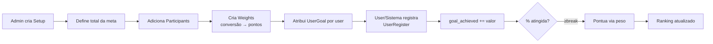

## Cálculo de pontos

Fórmula similar ao `VSaleEngine`:

```
pontos = ((goal_achieved / goal_value) * 100 − break_points) × percent_points
```

- Só pontua acima de `break_points` (% mínima para começar a valer).
- `percent_points` é quanto vale cada ponto percentual acima do break.
- Peso (`CompanyCampaignGoalWeight`) pode multiplicar por categoria.

## Integração com CSM

O controller importa `App\CustomIntegration\CSM` — **goals podem sincronizar com CRM CSM** em alguns tenants. Confirmar com equipe se está ativo para a campanha em questão.

## Gotchas

- **1 setup por campanha** — não há como ter múltiplas configs convivendo na mesma campanha.
- `registerGoalLog` grava audit em tabela dedicada — **não apagar** esse log mesmo que o registro seja deletado.
- `editSetup` e `deleteSetup` estão **parcialmente implementados** no código revisado. Validar antes de usar em produção.
- Participants são sincronizados em DIFF (mesmo padrão de [Grupos](../groups-departments.md)).
- Cálculo de pontos **não** dispara gamificação automaticamente. Se quiser creditar em wallet, chamar `BravoUtils::gamificationPoints` no momento do register.
- Ranking não tem paginação — para campanhas com milhares de participantes, pode ficar lento.

## Quando usar vs VSale/SellOut

- **Goals genérica** — campanha simples: "bata X, ganhe Y". Sem cluster/cycle/distributor.
- **VSale/SellOut** — precisa de clusters, ciclos mensais, boosters, penalizações, sorteios. Ver [VSale](vsale.md).

Escolher errado leva a retrabalho — converse com equipe antes de decidir.

---

# data/docs/modules/campaigns/overview.md

---

## title: "Campanhas — visão geral"

Campanhas são o **coração do BravoHub**. Uma campanha é uma mecânica de incentivo configurada por uma empresa para seus usuários (colaboradores, vendedores, afiliados, revendedores).

## Por que há tantos models com `CompanyCampaign*`

Porque cada **tipo de campanha** tem seu conjunto de entidades. A tabela-mãe é `company_campaigns` (model `CompanyCampaign`), e ela se relaciona com submódulos específicos por tipo.

## Tipos de campanha

| Tipo                | Mecânica                                                                                  | Módulo da doc                               |
| ------------------- | ----------------------------------------------------------------------------------------- | ------------------------------------------- |
| **VSale / SellOut** | Metas de venda com clusters, boosters, ciclos, distribuidores, produtos. O mais complexo. | [VSale](vsale.md)                           |
| **Afiliados**       | Programa de afiliação com links trackáveis, orders, pagamentos, tiers.                    | [Afiliados](affiliates.md)                  |
| **Cashback**        | Acúmulo de saldo em carteira, com extrato e parcelamento.                                 | [Cashback](cashback.md)                     |
| **Checkout**        | Loja/catálogo com produtos, categorias, marcas, pedidos.                                  | [Checkout](checkout.md)                     |
| **Discount**        | Cupons e códigos de desconto, com loterias associadas.                                    | [Descontos](discount.md)                    |
| **Real Estate**     | Campanhas imobiliárias — empreendimentos, torres, unidades, propostas.                    | [Real Estate](real-estate.md)               |
| **Rex**             | Multiplicadores Rex — mecânica de boost com challenges, flags, níveis.                    | [Rex](rex.md)                               |
| **Raffles**         | Sorteios (parte do VSale).                                                                | [Sorteios](raffles.md)                      |
| **Gift / Voucher**  | Entrega de vouchers / gift cards.                                                         | (coberto em [Gamificação](gamification.md)) |
| **Goal**            | Metas com pesos, participantes, setup.                                                    | (ver sub-seção no VSale)                    |
| **Ticket**          | Sistema de tickets da campanha.                                                           | (🚧 a documentar)                           |

## Relacionamento base

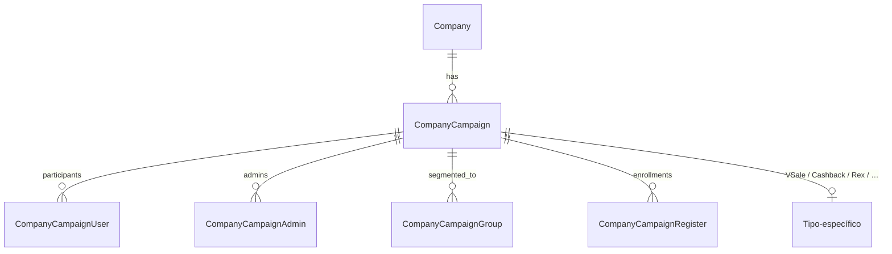

## Convenções de rotas

- **Client** (`/incentive/*`): participação do usuário final.
- **Studio** (`/studio/incentive/*`): CRUD para admin configurar.

```php
// Client
$router->group("/incentive");
$router->namespace("Source\App\Incentive");

// Studio
$router->group("/studio/incentive");
$router->namespace("Source\App\Studio\Incentive");
```

Controllers vivem em `www/api/source/App/Incentive/` e `www/api/source/App/Studio/Incentive/`.

## Identificação de campanha

- Internamente: `id` (auto-increment).
- Externamente/URL: `campaign_uuid` (UUID v4).

Lookup padrão:

```php
$campaign = (new CompanyCampaign())
    ->find(
        "campaign_uuid = :uuid AND company_id = :company",
        "uuid={$data['campaign_uuid']}&company={$company->id}"
    )->fetch();
```

## Camadas de uma campanha

Quase toda campanha passa pelas mesmas camadas, ainda que com nomes diferentes por tipo:

1. **Configuração (Studio)** — admin define regras, produtos, metas, premiação.
2. **Segmentação** — define quem participa (por grupo, departamento, store, etc.).
3. **Enrollment / Register** — usuário entra (pode ser automático ou com aceite).
4. **Eventos de progresso** — vendas, cliques, checkouts, leituras, quizzes, pontos.
5. **Validação / Aprovação** — eventos entram em análise (ex: notas fiscais), podem ser aprovados/reprovados (`CompanyCampaignReproved`).
6. **Cálculo de resultado** — motor calcula metas atingidas, pontos, posição.
7. **Premiação** — pontos na carteira, voucher, gift card, cashback, sorteio.
8. **Feed de resultados** — usuário vê seu progresso; admin vê relatórios.

Cada tipo de campanha instancia essas camadas de forma específica — veja a página do tipo.

## A fazer nesta seção

- [ ] Preencher páginas por tipo (VSale, Rex, Afiliados, etc.) com: tabelas envolvidas, fluxo de configuração, fluxo de participação, endpoints, jobs relacionados.
- [ ] Diagramar o motor de cálculo (`VSaleEngine` e similares).

---

# data/docs/modules/campaigns/raffles.md

---

## title: "Sorteios (Raffles)"

O BravoHub tem **dois sistemas de sorteio**, com tabelas separadas mas lógica parecida:

1. **VSale Raffles** (`VSaleRaffle*`) — sorteios acoplados a campanhas VSale/SellOut.
2. **Discount Lottery** (`CompanyCampaignDiscountLottery*`) — sorteios acoplados a campanhas de Desconto (ver [Descontos](discount.md)).

## Comparação

| Aspecto                            | VSale Raffle                                      | Discount Lottery                                         |
| ---------------------------------- | ------------------------------------------------- | -------------------------------------------------------- |
| Fonte de tickets                   | Pontos/performance no ciclo                       | Uso de voucher de desconto                               |
| Cluster/escopo                     | `VSaleRaffleClusters` (quais clusters participam) | `CompanyCampaignDiscountLotteryStore` (prêmios por loja) |
| Execução do sorteio                | Rota admin (`drawRaffle`)                         | `adminExecuteDraw`                                       |
| Admin controla tickets manualmente | Sim (`setRaffleCredits`, `importRaffleCredits`)   | Parcial (gera via `adminGenerateTickets`)                |

## VSale Raffles

### Models (`www/api/source/Models/VSale/`)

- `VSaleRaffles` — sorteio raiz (associado a campanha + ciclo).
- `VSaleRaffleClusters` — quais clusters da campanha participam.
- `VSaleRafflePrizes` — prêmios (descrição, quantidade, valor).
- `VSaleRaffleTickets` — tickets (1 ticket = 1 entrada).
- `VSaleRaffleCredits` — crédito de prêmio ao vencedor.

### Fluxo

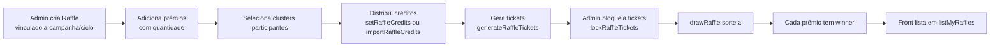

### Endpoints — Client

- `GET /incentive/vsale/raffles/{campaign}` — meus sorteios.
- `GET /incentive/vsale/raffle/{raffle_id}/{campaign}` — detalhe.

### Endpoints — Studio

Configuração e operação:

- `POST /studio/incentive/vsale/raffle/{campaign}` · `createRaffle`
- `GET /studio/incentive/vsale/raffles/{campaign}` · `listRaffles`
- `GET /studio/incentive/vsale/raffle/{id}` · `getRaffle`
- `POST /studio/incentive/vsale/raffle/{id}/update` · `/delete`
- `POST /studio/incentive/vsale/raffle/{id}/prize` · `/prize/{id}/update` · `/delete` — CRUD de prêmios.
- `POST /studio/incentive/vsale/raffle/{id}/distribute-tickets` · `distributeRaffleTickets`
- `POST /studio/incentive/vsale/raffle/{id}/generate-tickets` · `generateRaffleTickets`
- `GET /studio/incentive/vsale/raffle/{id}/tickets` · `listRaffleTickets`
- `POST /studio/incentive/vsale/raffle/{id}/lock-tickets` — congela o pool.
- `POST /studio/incentive/vsale/raffle/{id}/draw` — executa o sorteio.
- `POST /studio/incentive/vsale/raffle/{id}/reset-draw` — resetar (uso emergencial).
- `POST /studio/incentive/vsale/raffle/prize/{prize_id}/set-winner` — forçar vencedor.
- `POST /studio/incentive/vsale/raffle/{id}/credits` · `/credits/import` · `/credits/api` — gerenciar créditos.
- `GET /studio/incentive/vsale/raffle/{id}/credits/template` — template CSV para importação.
- `GET /studio/incentive/vsale/raffle/{id}/export-tickets` — exportar tickets.

## Discount Lottery

Mecânica paralela embutida no sistema de Descontos. Tickets são gerados automaticamente quando um voucher de desconto é usado. Detalhes em [Descontos e Loterias](discount.md).

Fluxo resumido:

- `CompanyCampaignDiscountLottery` criada.
- Ao usar voucher → `CompanyCampaignDiscountLotteryTicket` criado.
- `adminGenerateTickets` para geração em lote.
- `adminExecuteDraw` seleciona vencedores; `ticket_status = 'won'`.
- `CompanyCampaignDiscountLotteryStore` permite prêmios diferentes por loja.

## Gotchas

- **Tickets são independentes entre os dois sistemas** — não se misturam.
- **`reset-draw` é destrutivo** — apaga os resultados do sorteio. Usar só em caso de problema.
- `lockRaffleTickets` é **irreversível** sem reset — garante que novos tickets não entrem depois que o sorteio começou.
- Créditos (`VSaleRaffleCredits`) só registram que X ganhou — **entrega do prêmio é off-system** (nenhuma tabela de recebimento).
- Na Discount Lottery, um cliente com múltiplos tickets pode ganhar múltiplos prêmios no mesmo sorteio.
- Importação de créditos aceita CSV — formato no template exportável (`credits/template`).

## Arquivo legado

Há uma documentação antiga em `docs/vsale-raffles-api.md` — conteúdo a migrar para esta página e depois remover.

---

# data/docs/modules/campaigns/real-estate.md

---

## title: "Real Estate"

Campanhas para mercado imobiliário. Basicamente um **CRM de propostas** — registra empreendimentos, unidades e propostas de compra, sem cálculo automático de comissão.

## Controllers

- Client: `App/Incentive/RealEstate.php`
- Admin: `App/Studio/Incentive/RealEstate.php`

## Models

- `CompanyCampaignRealEstateAdmin` — quem administra a campanha.
- `CompanyCampaignRealEstateBuild` — empreendimento.
- `CompanyCampaignRealEstateBuildTower` — torre.
- `CompanyCampaignRealEstateBuildTowerUnit` — unidade (apartamento).
- `CompanyCampaignRealEstateRegister` — proposta/registro de venda.
- `CompanyCampaignRealEstateRegisterPorposer` — dados do proponente _(typo "Porposer" preservado no schema)_.
- `CompanyCampaignRealEstateRegisterPorposerFile` — anexos (docs, comprovantes).

## Hierarquia

```
Campaign
  └── Build (empreendimento)
        └── Tower (torre)
              └── Unit (apartamento / sala)
                    └── Register (proposta)
                          └── Porposer (proponente)
                                └── File (documentos)
```

## Endpoints Client

| Método | Path                                                                             |
| ------ | -------------------------------------------------------------------------------- |
| POST   | `/incentive/real-estate/admin` _(checa se usuário é admin da campanha)_          |
| POST   | `/incentive/real-estate/build-create` · `build-edit` · `build-delete` · `builds` |
| POST   | `/incentive/real-estate/tower-create` · `tower-edit`                             |
| POST   | `/incentive/real-estate/units` · `unit/create` · `unit/edit`                     |
| POST   | `/incentive/real-estate/porpose/create` · `porpose/edit` · `porpose/all`         |
| POST   | `/incentive/real-estate/porposers` · `porposes`                                  |
| POST   | `/incentive/real-estate/porpose/admin`                                           |

## Endpoints Studio

| Método | Path                                                       | Propósito                        |
| ------ | ---------------------------------------------------------- | -------------------------------- |
| GET    | `/studio/incentive/real-estate/users`                      | Listar usuários da empresa.      |
| POST   | `/studio/incentive/real-estate/admins` · `/admins/set`     | Designar admins da campanha.     |
| POST   | `/studio/incentive/real-estate/users-re` · `/users-re/set` | Designar usuários participantes. |

## Gotchas

- **Não há cálculo automático** de comissão/pontos. O sistema só registra propostas e anexos — o processamento financeiro é off-line.
- **Não há sorteios** nem mecânica de premiação associada.
- `admin` é apenas uma checagem booleana ("sou admin dessa campanha?") — não há ACL granular por unidade/torre.
- O schema preserva "Porposer" ao invés de "Proposer" — evitar renomear para não quebrar migrations.
- Arquivos vão para S3 via `BravoUtils::uploadFile`. URLs são públicas (`ACL: public-read`).
- Não há fluxo de aprovação/rejeição de proposta no código — é apenas repositório.

## Quando usar vs não usar

**Use Real Estate** se o caso é incorporadora/corretor listando unidades e coletando propostas.

**Não use** se você precisa calcular comissão automaticamente — para isso, VSale/SellOut ou Cashback são mais adequados.

---

# data/docs/modules/campaigns/rex.md

---

## title: "Rex (Multiplicadores)"

Programa de fidelidade com hierarquia de níveis, badges (flags), desafios e multiplicadores. Originalmente integração direta com parceiros (Gazin, Toro) via webhook/RabbitMQ.

## Conceitos centrais

| Conceito        | Model                                        | O que é                                                                                             |
| --------------- | -------------------------------------------- | --------------------------------------------------------------------------------------------------- |
| **Actor**       | `RexActors`                                  | Participante do programa.                                                                           |
| **Group**       | `RexGroups`                                  | Categoria de atores (ex: "vendedores locais", "atacado").                                           |
| **Level**       | `RexLevels`                                  | Hierarquia dentro de grupo. `level_parent` forma árvore (Regional → Distrito → Gerente → Vendedor). |
| **Flag**        | `RexFlags` + `RexActorFlags`                 | Badge/status (ex: "Ouro", "Diamante"). Ator pode ter múltiplas.                                     |
| **Challenge**   | `RexChallenges`                              | Desafio/meta.                                                                                       |
| **Multiplier**  | `RexChallengeMultipliers`                    | Fator aplicado à pontuação do challenge, variando por nível/flag.                                   |
| **Order**       | `RexOrders` + `RexOrderItems`                | Pedido registrado (fonte da pontuação).                                                             |
| **Transaction** | `RexTransactions` + `RexTransactionPayments` | Débito/crédito de pontos.                                                                           |
| **Chargeback**  | `RexChargebacks` + ...                       | Reversão de pontos (devolução).                                                                     |

### Multiplicadores por faixa

O motor aplica multiplicadores em **faixas de quantidade de produtos vendidos**. Definido na página legada `rex-multipliers-api.md`:

```
Faixa 1: 0–10 produtos   → 1.0x (100%)
Faixa 2: 11–20 produtos  → 1.5x (150%)
Faixa 3: 21+ produtos    → 2.0x (200%)
```

O multiplicador pode também variar por **level** ou **flag** do ator (`RexChallengeMultipliers.level_id`, `flag_id`).

## Controllers

| Camada                          | Caminho                         |
| ------------------------------- | ------------------------------- |
| Integração (webhook / RabbitMQ) | `App/CustomIntegration/Rex.php` |
| Studio (admin)                  | `App/Studio/Incentive/Rex.php`  |

Para estrutura Prov (provisionamento antigo): models em `Models/Rex/Prov/`.

## Fluxo

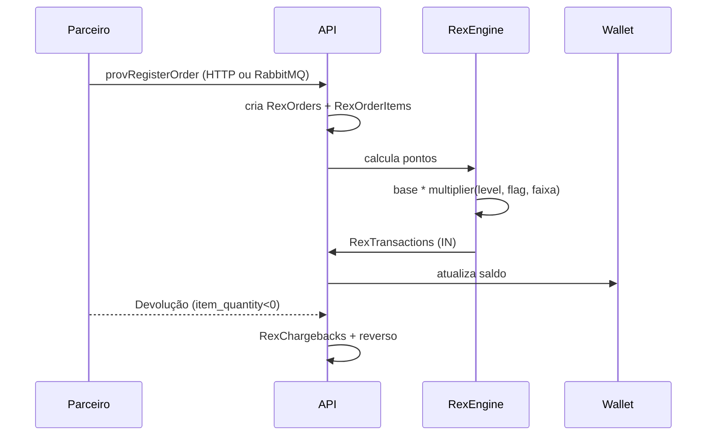

## Endpoints Studio

Configuração (admin) em `/studio/incentive/rex/*`:

- `GET /studio/incentive/rex/levels` — hierarquia de grupos + níveis.
- `GET /studio/incentive/rex/challenge/{challenge_id}/multipliers` — lista multiplicadores.
- `POST /studio/incentive/rex/challenge/{challenge_id}/multipliers` — cria/atualiza multiplicador.
- (ver `rex-multipliers-api.md` para payloads detalhados — migrar conteúdo para esta página.)

## Endpoints de integração externa

- `POST /ci/rex/order/*` · `provRegisterOrder` / `provRegisterOrderOLD` — recebe pedido do parceiro.
- Consumer RabbitMQ lê fila `rex.orders.create` (configuração em `Core/RabbitMQ.php`) e chama o mesmo fluxo.

## Devolução (chargeback)

Quando um `RexOrderItems` vem com `item_quantity < 0`, o motor:

1. Cria um `RexChargeback` referenciando o pedido original.
2. Reverte pontos via `RexTransactions` do tipo OUT.
3. Atualiza `RexChargebackItemPayments` se havia desembolso associado.

## Gotchas

- **Fila RabbitMQ sem auth**. Qualquer mensagem chega direto no consumer. Parceiros confiáveis apenas.
- **Multiplicadores podem acumular** dependendo da configuração (level + flag + faixa) — confirmar com equipe a regra exata (soma? máximo?).
- `provRegisterOrderOLD` é legado — novas integrações usam `provRegisterOrder`.
- **Tabelas Prov** (`Models/Rex/Prov/`) são estruturas de provisionamento pré-faturamento — ordens "invoiced" viram as permanentes.
- Não há "demote" automático de nível — sempre progride pra cima.
- Chargeback não tem janela configurável — qualquer item negativo reverte, independentemente da data.

## A migrar desta página

Já agregamos o essencial. Resta integrar as **definições exatas de payload** hoje em `rex-multipliers-api.md` (raiz do repo) aqui nesta página — e depois remover o arquivo legado.

---

# data/docs/modules/campaigns/sale.md

---

## title: "Sale (venda básica)"

Mecânica **enxuta** de registro de venda individual com metas e bônus por ciclo. Distinta de VSale/SellOut (hierarquia de clusters/distribuidores/sellers complexa) — aqui o modelo é **direto: usuário → meta → venda → bônus**.

Usado para campanhas simples: vendedor registra venda, acumula percentual de meta, ganha pontos e bônus.

## Controller

`App/Incentive/Sale.php`.

## Models

- `Sale\SaleUser` — usuário dentro da hierarquia (`user_parent_id`).
- `Sale\SaleLevel` — nível/cargo.
- `Sale\SaleUserGoal` — meta individual (goal_value, goal_achieved, goal_percent_points, goal_break_points).
- `Sale\SaleUserGoalRegister` — registro de progresso.
- `CompanyCampaignSell`, `CompanyCampaignSellItem` — venda e itens.
- `CompanyCampaignGoalSetup` — setup geral (meta total, incremento).
- `app_company_campaign_sale_cycle_bonus` — bônus por ciclo.

## Endpoints

| Método | Path                                                        | Propósito                       |
| ------ | ----------------------------------------------------------- | ------------------------------- |
| GET    | `/incentive/sale/user/resume/{campaign}`                    | Resumo de metas do usuário.     |
| POST   | `/incentive/sale/register/{campaign}`                       | Registrar venda.                |
| POST   | `/incentive/sale/remove/{campaign}`                         | Remover venda.                  |
| GET    | `/incentive/sale/user/sales/{campaign}`                     | Árvore de vendas (recursiva).   |
| GET    | `/incentive/sale/dash/resume/{campaign}`                    | Dashboard agregado.             |
| GET    | `/incentive/sale/admin/ranking/{campaign}/{cycle_id}`       | Ranking admin.                  |
| GET    | `/incentive/sale/user/ranking/{campaign}/{user}/{cycle_id}` | Ranking do usuário.             |
| POST   | `/incentive/sale/create/seller`                             | Criar vendedor + atribuir meta. |
| GET    | `/incentive/sale/user/global-resume`                        | Resumo global multi-campanha.   |

## Hierarquia + cálculo pai

`SaleUser.user_parent_id` forma uma árvore. Quando um filho atinge meta:

- **% da meta sobe ao pai** (agregação via `calculateParentGoals`).
- **Pontos e bônus ficam no filho** — pai recebe só o número agregado.

Isso permite um gerente acompanhar o time sem roubar bônus. Se quiser que o gerente também pontue, configure `SaleUserGoal` separado para ele.

## Fluxo

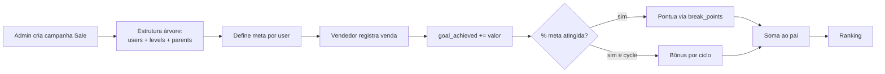

## Meta "Global" especial

`goal_id = 99999` é convenção para **"Meta Global"** — soma de todas as outras metas. **Não herda bônus dos filhos**, só serve de visualização agregada.

## Gotchas

- **Meta é por user**: a mesma campanha pode ter metas diferentes por vendedor.
- **Bônus não "escala"** — ganha o filho que bateu, não o pai.
- `calculateParentGoals` roda **recursivamente** ao registrar venda — em árvores muito profundas/largas pode ficar lento.
- **Remover venda reverte** `goal_achieved` do filho e propaga para pai.
- `adminRanking` é restrito a `user_admin = 1` — para granularidade use `CompanyCampaignAdmin`.
- Há `error_log()` em `calcParentGoals` (debug) — remover em produção.
- Diferença vs VSale/SellOut: **Sale é 1 tabela de vendas**, VSale/SellOut tem clusters/cycles/boosters/penals. Se precisar de mecânica avançada, migre.

---

# data/docs/modules/campaigns/team-nodes.md

---

## title: "Team, Node e NodeSelecta"

Três sistemas paralelos para **hierarquia de participantes** em campanhas. Parecem redundantes — cada um surgiu de uma necessidade diferente:

| Sistema         | Tabela principal              | Usado para                                                                     |
| --------------- | ----------------------------- | ------------------------------------------------------------------------------ |
| **Team**        | `CompanyCampaignUserNode`     | Hierarquia simples usuário → pai dentro de campanha.                           |
| **Node**        | `CompanyCampaignNode`         | Estrutura genérica de nós com UUID (admin granular).                           |
| **NodeSelecta** | `CompanyCampaignNodeSelecta*` | Nós com metas, incrementos e arquivos — marca específica (Selecta / Lesaffre). |

!!! info "Qual escolher em código novo"
Para campanha nova, prefira **Node** (estrutura mais moderna, UUID públicos) ou **SellOut** (completo, para vendas complexas — ver [VSale/SellOut](vsale.md)). **NodeSelecta é marca-específico**, não é abstração geral. **Team** é legado e convive.

## Team

### Controllers

- Client: `App/Incentive/Team.php` (visualiza a própria árvore).
- Studio: `App/Studio/Incentive/Team.php` (admin cria nós).

### Endpoints

| Método | Path                                     | Propósito                                                                    |
| ------ | ---------------------------------------- | ---------------------------------------------------------------------------- |
| POST   | `/incentive/team/data`                   | `Team:getUserCampaignData` — árvore recursiva do usuário com vendas e rotas. |
| POST   | `/studio/incentive/campaign/node/create` | `Team:createNode` — admin cria nó.                                           |
| POST   | `/studio/incentive/campaign/node`        | `Team:getNodes` — lista nós.                                                 |

### Fluxo

1. Admin cadastra usuários em `CompanyCampaignUserNode` com `node_parent` apontando para outro nó.
2. Usuário abre o app → `getUserCampaignData` busca seu nó + filhos recursivamente + vendas (`CompanyCampaignSell`) + rotas (`CompanyCampaignRoute`).

### Gotchas

- `node_parent != user_id` (bloqueio de auto-referência).
- `editNode` está vazio no controller — só declarado. Confirmar implementação antes de usar.
- `getNodes` retorna `user_id` em **base64** (ofuscação mínima, não criptografia).

---

## Node

### Controller

`App/Incentive/Node.php`.

### Endpoints

| Método | Path                                     | Propósito                                         |
| ------ | ---------------------------------------- | ------------------------------------------------- |
| POST   | `/incentive/node/{campaign}`             | `Node:createNode` — cria nó (admin da campanha).  |
| GET    | `/incentive/node/{campaign}?node={uuid}` | `Node:getNode` — árvore a partir de um nó.        |
| GET    | `/incentive/node-users/{campaign}`       | `Node:getUsersInTree` — todos os users da árvore. |

### Fluxo

1. Admin (validado em `CompanyCampaignAdmin`) chama `createNode` com `user_id` e `node_parent` opcional.
2. `node_id` é **UUID v4** (público).
3. `getNode` recursivamente traz filhos.

### Diferença vs Team

- **Node usa UUID público** (`node_id`).
- **Valida via `CompanyCampaignAdmin`** em vez de `user_admin = 1`.
- Estrutura mais limpa — não acoplada a Sells/Routes.

### Gotchas

- Usa SQL raw em alguns pontos (`$this->database->prepare`).
- `node_id = UUID`, `node_parent = UUID` — referenciam a si mesmos.

---

## NodeSelecta

Versão **com meta, incremento e aprovação de arquivos**. Mais rica, mas específica para um formato de distribuidor.

### Controller

`App/Incentive/NodeSelecta.php`.

### Models

- `CompanyCampaignNodeSelectaGoal` · `GoalValue` — meta e valores.
- `CompanyCampaignNodeSelectaIncrement` · `IncrementValue` — incrementos (registros de operação).
- `CompanyCampaignNodeSelectaRegister` · `RegisterFile` — registros com anexos.

### Endpoints

| Método | Path                                                       | Propósito                             |
| ------ | ---------------------------------------------------------- | ------------------------------------- |
| GET    | `/incentive/node/selecta/user/data/{campaign}`             | Dados do usuário + goals + registros. |
| GET    | `/incentive/node/selecta/admin/data/{campaign}`            | Dados admin do nó (com filhos).       |
| POST   | `/incentive/node/selecta/global-goal/{campaign}`           | Meta global.                          |
| GET    | `/incentive/node/selecta/user/ranking/{campaign}`          | Ranking de users.                     |
| GET    | `/incentive/node/selecta/admin/ranking/{campaign}`         | Ranking de nós (agregado).            |
| GET    | `/incentive/node/selecta/admin/registers/{campaign}`       | Registros admin.                      |
| GET    | `/incentive/node/selecta/user/resume`                      | Resumo home.                          |
| POST   | `/incentive/node/selecta/admin/create/register/{campaign}` | Admin cria registro.                  |
| POST   | `/incentive/node/selecta/admin/update/register/file`       | Admin aprova/rejeita arquivo.         |
| GET    | `/incentive/node/selecta/admin/register/files/{campaign}`  | Lista arquivos pendentes.             |
| POST   | `/incentive/node/selecta/create/register/file`             | Usuário envia arquivo.                |
| GET    | `/incentive/node/selecta/register/files`                   | Meus arquivos.                        |

### Fluxo

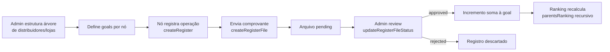

### Ranking recursivo

`parentsRanking` sobe pontos dos filhos para os pais — um gerente regional vê a soma dos distribuidores abaixo dele.

### Gotchas

- **Arquivo em S3** (`BravoUtils::uploadFile` ou S3Client direto).
- Status do arquivo: `pending`, `approved`, `rejected`.
- **Helper `arrayOrder`** ordena array por chave — não usar para datasets grandes (O(n²) em alguns casos).
- "Selecta" é referência à marca (Lesaffre Selecta). Não generalizar para outros clientes sem revisar regras.
- Registros **não revertem automaticamente** se arquivo for rejeitado depois — tem que deletar manualmente.

---

# data/docs/modules/campaigns/vsale.md

---

## title: "Campanhas VSale (SellOut)"

O tipo mais complexo do sistema. Campanhas de **meta de venda** com clusters, ciclos, metas, boosters, penalizações e sorteios. Existem **duas variantes** que convivem:

- **VSale** (`App/Incentive/VSale.php`) — versão enxuta com foco em boosters de localização/upload e sorteios.
- **SellOut** (`App/Incentive/SellOut.php`) — versão completa com hierarquia Distributor → Seller e clusters/ciclos.

A lógica de cálculo é centralizada no **motor `VSaleEngine`**.

## Conceitos

| Conceito        | Tabela principal                                     | O que é                                                           |
| --------------- | ---------------------------------------------------- | ----------------------------------------------------------------- |
| **Cluster**     | `vsale_clusters`, `company_campaign_sellout_cluster` | Agrupamento de distribuidores/atores com regras comuns.           |
| **Cycle**       | `vsale_cycles`, `company_campaign_sellout_cycle`     | Janela de tempo (mensal se `cycle_by_month=1`, ou único período). |
| **Goal**        | `vsale_goals`, `company_campaign_sellout_cycle_goal` | Meta quantitativa de um ator no ciclo (valor ou unidades).        |
| **Booster**     | `vsale_boosters`                                     | Bonificação condicional (ex: bateu meta X → +N pontos).           |
| **Penal**       | `vsale_penals`                                       | Penalização (débito de pontos).                                   |
| **Actor**       | `vsale_actors`                                       | Participante (pode ser distribuidor, seller, operação).           |
| **Distributor** | `company_campaign_sellout_distributor`               | Agente comercial atacadista.                                      |
| **Seller**      | `company_campaign_sellout_seller`                    | Vendedor dentro de um distribuidor.                               |

## Motor `VSaleEngine`

`www/api/source/Models/VSale/VSaleEngine.php` — classe **estática** (nunca instanciada). Três entradas principais:

```php
VSaleEngine::goal(...);     // calcula pontos de meta
VSaleEngine::booster(...);  // calcula pontos de booster
VSaleEngine::penal(...);    // calcula débito de penalização
```

**Fórmula base de meta:**

```
pontos = ((goal_achieved / goal_value) * 100 − goal_break) × goal_break_points
```

- `goal_achieved` — quanto o ator realizou.
- `goal_value` — meta definida.
- `goal_break` — **percentual** (0–100). Ator só pontua **se ultrapassar esse mínimo**.
- `goal_break_points` — pontos por ponto percentual acima do break.
- Decimais controlados por `config_decimals`; arredondamento por `config_points_rule` (`ceil`, `floor`, `round`).
- Aplica limite máximo se `goal_points_max > 0`.

**Booster:**

- `booster_unique = 1` → tudo-ou-nada (atingiu a condição = ganha `booster_points`).
- Acumulativo → `items * booster_points`.
- `booster_user_break_value` opcional para um break individual.

**Penal:** débito de pontos (mesma estrutura, sinal invertido).

Se chamado com `updateDatabase = true`, o motor **persiste** o resultado em `VSaleActorGoals` / `VSaleActorBoosters` / `VSaleActorPenals`.

!!! warning "Quando o motor roda"
Em geral sob demanda, quando rotas de ranking/métricas são chamadas (cálculo on-the-fly), **não** via cron dedicado. Para campanhas grandes isso pode ficar lento — considerar cache ou pré-cálculo por job se necessário.

## Fluxo end-to-end

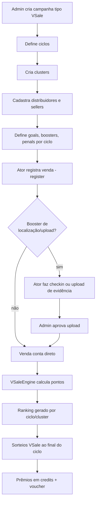

## Endpoints

### VSale (client) — `Source\App\Incentive\VSale`

| Método | Path                                                       | Propósito                             |
| ------ | ---------------------------------------------------------- | ------------------------------------- |
| GET    | `/incentive/vsale/metrics/new/{campaign}`                  | Métricas do ator no ciclo.            |
| GET    | `/incentive/vsale/ranking/{campaign}/{cycle_id}`           | Ranking por ciclo.                    |
| GET    | `/incentive/vsale/ranking-global/{campaign}`               | Ranking global da campanha.           |
| GET    | `/incentive/vsale/user/global-resume/{campaign}`           | Resumo global do usuário.             |
| POST   | `/incentive/vsale/booster/{id}/verify-location/{campaign}` | Verifica geolocalização para booster. |
| POST   | `/incentive/vsale/booster/{id}/checkin/{campaign}`         | Check-in presencial.                  |
| POST   | `/incentive/vsale/booster/{id}/upload/{campaign}`          | Upload de evidência.                  |
| GET    | `/incentive/vsale/booster/{id}/uploads/{campaign}`         | Lista uploads do booster.             |
| GET    | `/incentive/vsale/raffles/{campaign}`                      | Meus sorteios.                        |
| GET    | `/incentive/vsale/raffle/{raffle_id}/{campaign}`           | Detalhe de um sorteio.                |

### VSale (studio) — `Source\App\Studio\Incentive\VSale`

CRUD de clusters, aprovação de uploads, rankings, sorteios:

- `/studio/incentive/vsale/clusters/{campaign}`
- `/studio/incentive/vsale/cluster/{id}/ranking-global` · `/ranking/{cycle_id}` · `/cycles-summary`
- `/studio/incentive/vsale/uploads/{campaign}` · `/upload/{register_id}/approve` · `/reject`
- `/studio/incentive/vsale/raffle/*` (criar, prêmios, distribuir tickets, sortear, exportar — ver [Sorteios](raffles.md))

### SellOut (client) — `Source\App\Incentive\SellOut`

Duas perspectivas (seller e distributor) + visão admin:

| Path                                                    | Propósito                                                   |
| ------------------------------------------------------- | ----------------------------------------------------------- |
| `/incentive/sellout/seller/cycles/{campaign}`           | Ciclos do vendedor.                                         |
| `/incentive/sellout/seller/cycles/distributors/{cycle}` | Distribuidores e metas.                                     |
| `/incentive/sellout/seller/cycle/booster/{cycle}`       | Boosters do ciclo.                                          |
| `/incentive/sellout/seller/ranking/cycle/{cycle}`       | Ranking no ciclo.                                           |
| `/incentive/sellout/seller/final/ranking/cycle/{cycle}` | Ranking final.                                              |
| `/incentive/sellout/seller/final/general/ranking/`      | Ranking geral.                                              |
| `/incentive/sellout/distributor/*`                      | Variantes para distribuidor.                                |
| `/incentive/sellout/admin/*`                            | Rankings admin.                                             |
| `/incentive/sellout/user/type/{campaign}`               | Identifica papel do usuário (seller / distributor / admin). |
| `/incentive/sellout/clusters/{campaign}`                | Lista clusters da campanha.                                 |

### SellOut (studio) — `Source\App\Studio\Incentive\SellOut`

Rotas de configuração (CRUD completo):

- Clusters: `createCluster`, `getClusters`, `getCluster`, `createClusterBooster`.
- Distributors: `createDistributor`, `createDistributorOperation`, `getDistributors`.
- Sellers: `createSeller`, `getSellers`.
- Cycles: `createCycle`, `getCycles`, `getCycleGoals`.
- Goals: `createCycleGoal`, `editCycleGoal`, `createDistributorGoal`, `createProductGoal`.
- Products: `createProduct`, `getProducts`, `importProducts` (upload Excel Lesaffre).
- Registers: `createRegister`.

## Gotchas

- **`goal_break` é percentual (0–100), não quantidade.** Uma meta com `break = 80` só começa a pontuar acima de 80% do objetivo.
- **VSale é simples** (Cluster → Actors → Goals). **SellOut é hierárquico** (Seller → Distributor → Goals → Boosters/Products). Escolher o tipo certo no início da campanha.
- Penals batem direto nos pontos — podem zerar um ranking.
- `VSaleActorUploadRegister` passa por aprovação manual antes de virar pontos (`/studio/.../upload/{id}/approve`).
- Boosters de localização validam com `verify-location` antes do `checkin`, para evitar fraude.
- Importação de produtos Lesaffre (`importProducts`/`importDistributors`) é o fluxo padrão de onboarding grande — espera layout de planilha específico.

## Sorteios (raffles)

Sorteios são uma mecânica associada a VSale. Ver página dedicada: [Sorteios (Raffles)](raffles.md).

---

# data/docs/modules/campus.md

---

## title: "Campus (Cursos)"

Plataforma de cursos internos com módulos, aulas (vídeo/arquivos), quizzes, certificados e ranking.

## Hierarquia

```
Course
  └── Module
        ├── Lesson (vídeo, texto, arquivos)
        │     └── LessonFile (anexos)
        │     └── LessonView (registro de visualização)
        └── Quiz (opcional)
              ├── Question
              │     └── QuestionOption
              ├── QuizSession (tentativa do usuário)
              ├── QuizAnswer (resposta)
              └── QuizResult (pontuação final)
```

## Controllers

- `Source\App\Campus` — client (consumir)
- `Source\App\Studio\Campus` — admin (configurar)

## Models

- `CompanyCampusCourse`, `CompanyCampusCourseGroup` (segmentação)
- `CompanyCampusCourseCertificate`, `CompanyCampusCourseCertificateUser`
- `CompanyCampusModule`
- `CompanyCampusLesson`, `CompanyCampusLessonFile`, `CompanyCampusLessonView`
- `CompanyCampusModuleQuiz`, `CompanyCampusModuleQuizQuestion`, `CompanyCampusModuleQuizQuestionOption`
- `CompanyCampusModuleQuizAnswer`, `CompanyCampusModuleQuizSession`, `CompanyCampusQuizResult`

## Fluxo

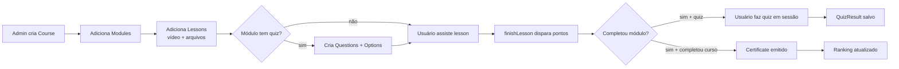

## Endpoints Client — `/campus/*`

| Método | Path                                   | Propósito                          |
| ------ | -------------------------------------- | ---------------------------------- |
| GET    | `/campus/courses`                      | Cursos disponíveis para o usuário. |
| GET    | `/campus/course/{uuid}`                | Detalhes de curso.                 |
| GET    | `/campus/modules/{course}`             | Módulos do curso.                  |
| GET    | `/campus/module/{uuid}`                | Detalhes do módulo.                |
| GET    | `/campus/lessons/{module}`             | Aulas do módulo.                   |
| GET    | `/campus/lesson/{uuid}`                | Detalhes de aula.                  |
| POST   | `/campus/lesson/finish/{uuid}`         | Marcar aula como concluída.        |
| POST   | `/campus/lesson/view/increment/{uuid}` | Incrementar tempo de visualização. |
| GET    | `/campus/module/quiz/{uuid}`           | Obter quiz.                        |
| POST   | `/campus/module/quiz/session/{uuid}`   | Abrir sessão de quiz.              |
| POST   | `/campus/module/quiz/send`             | Enviar respostas.                  |
| GET    | `/campus/course/certificate/{course}`  | Meu certificado.                   |
| GET    | `/campus/ranking`                      | Ranking do curso.                  |
| GET    | `/campus/quiz/report`                  | Relatório de tentativas.           |
| GET    | `/campus/quiz/report/export`           | Exportar CSV.                      |

## Endpoints Studio — `/studio/campus/*`

CRUD completo. Principais:

- **Course**: `create`, `edit`, `order`, `delete`, `courses`, `course/{uuid}`, `course/certificate/{create|edit|delete|uuid}`.
- **Module**: `create`, `edit`, `order`, `delete/{uuid}`, `modules/{course}`, `module/{uuid}`.
- **Lesson**: `create`, `edit`, `manage` (visualização), `video/duration` (YouTube API), `file/upload`, `delete/{uuid}`, `files/delete/{id}`, `files/update/{id}`, `files/{lesson}` (batch).
- **Quiz**: `create/{module}`, `edit`, `delete/{id}`, `question/create` (upsert), `question/delete/{id}`, `question/option/delete/{id}`.

## Certificados

`CompanyCampusCourseCertificate` guarda o **template HTML**. Ao emitir para usuário:

```php
BravoUtils::generateCourseCertificate($user, $course, $certificate): string
```

Substitui placeholders (`{{user_name}}`, `{{course_name}}`, etc.) e persiste o vínculo em `CompanyCampusCourseCertificateUser`. Não há revogação — uma vez emitido, fica.

## Duração

Duração do módulo é **recalculada dinamicamente** somando todas as aulas (`recalculateModuleDuration` em `Studio/Campus.php`). Uma aula nova dispara recálculo.

Duração de vídeo do YouTube usa `BravoUtils::getYoutubeVideoDuration($url)` (YouTube Data API).

## Integração com gamificação

Disparos típicos (valor vem de `CompanyGamificationDefaultValue`):

| Ação                           | Flag sugerida        |
| ------------------------------ | -------------------- |
| Concluir aula (`finishLesson`) | `lesson_complete`    |
| Concluir módulo                | `module_complete`    |
| Passar no quiz                 | `quiz_pass`          |
| Concluir curso inteiro         | `course_complete`    |
| Receber certificado            | `course_certificate` |

Confirmar com equipe quais estão realmente cabeados — o schema prevê, mas nem toda empresa tem todas ativas.

## Galileu — esclarecimento

`App/Galileu.php` **não é o Campus**. É um **builder de dashboards** (BI interno). Tem pastas `CustomDB/` e `CustomPositec/` para integrações específicas com dois clientes. Ver [Widgets](widgets.md) e [rotas `/galileu/*`](../reference/routes.md).

Apesar do nome, não está relacionado a cursos/Campus.

## Gotchas

- Quiz permite **múltiplas tentativas** (cada `QuizSession` é uma tentativa). O melhor score tende a ser tomado — confirmar regra exata.
- `LessonFile` aceita upload arbitrário pelo admin (vai para S3 com ACL pública — cuidado com anexos sensíveis).
- `incrementViewDuration` é usado para acumular tempo real de visualização (compliance de treinamento obrigatório).
- Scoring automático de quiz depende de `QuestionOption.is_correct` — se o admin esquecer de marcar, a questão não pontua.
- Não há revogação de certificado — considerar isso se compliance exigir anulação.
- Ordem de módulos/cursos é mantida em coluna `*_order` manipulada por `changeCourseOrder` / `changeModuleOrder`.

---

# data/docs/modules/email-campaigns.md

---

## title: "Campanhas de e-mail (marketing)"

Sistema de **email marketing** com templates HTML, agendamento, envio em lote, tracking de abertura/clique e cota mensal por empresa.

Complementa a página base [E-mail](email.md) (que cobre o envio transacional via `BravoUtils`).

## Models

- `Notifications\EmailCampaign` — campanha (`campaign_status`: draft / scheduled / sending / sent / cancelled).
- `Notifications\EmailCampaignLog` — log por destinatário (`log_status`: queued / sent / opened / clicked / failed).
- `Notifications\EmailCredit` — saldo de créditos (se aplicável ao tenant).
- `CompanyEmailMonth` — quota mensal (`month_limit`, `month_sended`).

## Controllers

- `App/Studio/Notifications/EmailCampaignController.php` — CRUD + envio.
- `App/Studio/NotificationEmail.php` — consulta de limite mensal.
- `App/EmailTracking.php` — tracking (pixel + redirect).

## Ciclo de vida da campanha

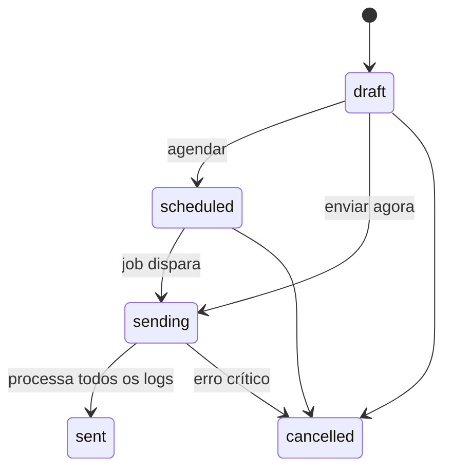

## Endpoints — `/studio/notifications/emails/*`

| Método | Path                                                          | Propósito                                                  |
| ------ | ------------------------------------------------------------- | ---------------------------------------------------------- |
| POST   | `/studio/notifications/emails/upload-image`                   | Upload de imagem para template (S3, 5MB max, png/jpg/gif). |
| GET    | `/studio/notifications/emails?page=1&per_page=20&status=sent` | Listar paginado.                                           |
| POST   | `/studio/notifications/emails`                                | Criar campanha (draft).                                    |
| GET    | `/studio/notifications/emails/{id}`                           | Detalhe.                                                   |
| PUT    | `/studio/notifications/emails/{id}`                           | Editar (apenas se draft).                                  |
| POST   | `/studio/notifications/emails/{id}/send`                      | Enviar (imediato ou agendado).                             |
| POST   | `/studio/notifications/emails/{id}/cancel`                    | Cancelar.                                                  |
| GET    | `/studio/notifications/emails/{id}/metrics`                   | Métricas de tracking (opens, clicks, fails).               |
| GET    | `/studio/notifications/emails/limit`                          | Cota mensal consumida.                                     |

## Segmentação de destinatários

Mesmo modelo de [Notificações](notifications.md) — seleção dinâmica:

```json
{
  "campaign_name": "Promo abril",
  "subject": "Confira suas ofertas",
  "template_html": "<html>...</html>",
  "scheduled_at": "2026-04-20 09:00:00",
  "recipients": {
    "user_ids": [],
    "group_ids": [15, 16],
    "department_ids": [3],
    "campaign_ids": [],
    "level_ids": [],
    "exclude_user_ids": [42]
  }
}
```

Lista final materializada **no momento do `send`**, não na criação.

## Template HTML

- Editado no admin (rich text + upload de imagens).
- Imagens hospedadas em S3 via `uploadImage`.
- Placeholders típicos: `{{user_name}}`, `{{company_name}}` (substituição acontece no envio — verificar lógica exata no controller).
- **Sem validação de HTML** — XSS por admin malicioso é possível.

## Processamento

Job `send-email-campaign.php` (ver [Jobs](jobs.md)) processa campanhas em `status = 'sending'`:

1. Busca até **500 logs** com `log_status = 'queued'` por execução.
2. Para cada log:
   - Injeta pixel: `/email/track/open/{log_id}">` antes de `</body>`.
   - Reescreve `<a href="X">` → `<a href="<BASE>/email/track/click/{log_id}?url=X">`.
   - Envia via SendGrid.
   - Atualiza `log_status`.
3. Incrementa `CompanyEmailMonth.month_sended`.
4. Quando todos os logs acabam, muda campaign para `status = 'sent'`.

## Tracking (`/email/track/*`)

Endpoints **públicos** (sem JWT) em `App/EmailTracking.php`:

| Rota                                      | Efeito                                           |
| ----------------------------------------- | ------------------------------------------------ |
| `GET /email/track/open/{log_id}`          | Responde pixel 1×1 GIF. `log_status = 'opened'`. |
| `GET /email/track/click/{log_id}?url=...` | Redireciona para URL. `log_status = 'clicked'`.  |

## Quota mensal

`CompanyEmailMonth` registra 1 linha por empresa × `YYYYMM`:

```sql
-- exemplo
(company_id=42, month='2026-04', month_limit=10000, month_sended=7420)
```

`GET /studio/notifications/emails/limit` retorna quantos ainda cabem.

!!! info "Aplicação do limit"
Não está claro no código se o `send` **bloqueia** ao atingir o limite ou apenas mede reativamente. Confirmar com equipe antes de fazer suposições em campanhas grandes.

## Gotchas

- **Token SendGrid é global** por ambiente, não por tenant. Remetente (`company_sendgrid_email`) é por tenant — tem que estar autenticado no SendGrid da BravoHub.
- **Log IDs são sequenciais e públicos** no pixel/link — qualquer um que adivinhe pode "fake abrir". Mitigar com token hash no log_id se virar problema.
- Reescrita de link usa regex sobre HTML — HTML complexo (aspas simples, entidades) pode quebrar.
- **500 logs/execução** é gargalo. Campanha de 1M envios leva ~2000 execuções do cron.
- Editar campanha em `sending`/`sent` não é permitido — apenas `draft` / `scheduled` aceitam PUT.
- Upload de imagem no template tem **limite 5MB**. Vídeo e GIF animado grande não são aceitos.
- Cancelar `sending` parcial **deixa parte dos logs em `sent`** — quem já recebeu, recebeu.

---

# data/docs/modules/email.md

---

## title: "E-mail"

## Provedor default: SendGrid

A API usa predominantemente **SendGrid** via `SENDGRID_API_KEY` (em `Config.php`). Outros provedores aparecem só em casos isolados:

| Provedor             | Onde é usado                                                        | Status                         |
| -------------------- | ------------------------------------------------------------------- | ------------------------------ |
| **SendGrid**         | Padrão para campanhas, OTPs, notificações                           | Principal                      |
| **PHPMailer (SMTP)** | `App/Tenancy.php` (onboarding de novo tenant, credenciais iniciais) | Legado, restrito               |
| **Resend**           | Função `emailResend()` em `Utils/utils.php`                         | Secundário (casos específicos) |
| **MailerSend**       | Constante `MAILERSEND_API` em `Config.php`                          | Preparado mas sem uso claro    |
| **Mailgun**          | Referenciado no schema, não encontrado no código PHP recente        | Possivelmente legado removido  |

## API central de envio

Em `BravoUtils`:

### `emailSend($company, $user, $subject, $title, $content)`

SendGrid com **template dinâmico** `d-db1b0a201be44ceebbdc925b9e6573db`:

```php
BravoUtils::emailSend(
    $company,
    $user,
    "Assunto",
    "Título do email",
    "Corpo do email (HTML escape? — depende do template)"
);
```

Remetente: `$company->company_sendgrid_email`.

### `emailSendHtml($company, $user, $subject, $htmlContent)`

SendGrid com HTML inline (sem template):

```php
BravoUtils::emailSendHtml($company, $user, "Assunto", "<h1>oi</h1>");
```

### `utils.php` — helpers

- `mailTemplate($company, $user, $subject, $content, ...)` — template HTML padrão.
- `mailTemplateOrder(...)` — template para pedidos.
- `sendCashbackOrderEmail(...)` — usado pelo fluxo de cashback.
- `emailResend($to, $from, $subject, $content)` — via Resend (alternativo).

## Campanhas de e-mail em lote

Disparadas pelo job **`www/api/jobs/send-email-campaign.php`**. Fluxo:

1. Job busca campanhas com `status = 'sending'`.
2. Para cada campanha, pega até **500 logs** com `status = 'queued'` por execução.
3. Para cada log:
   - Injeta **pixel de abertura**: `` antes de `</body>`.
   - Reescreve todos os links: `/email/track/click/{log_id}?url=<original>`.
   - Envia via SendGrid.
   - Marca log como `sent` ou `failed` conforme resposta.

## EmailTracking — `App/EmailTracking.php`

Endpoints **públicos** (sem JWT), IDs na URL:

| Rota                                      | Propósito                                                         |
| ----------------------------------------- | ----------------------------------------------------------------- |
| `GET /email/track/open/{log_id}`          | Responde pixel 1x1 GIF. Atualiza `log_status = 'opened'`.         |
| `GET /email/track/click/{log_id}?url=...` | Redireciona para URL original. Atualiza `log_status = 'clicked'`. |

## Templates de notificação

`App/Studio/NotificationEmail.php` orquestra o envio de notificações via e-mail (dispara jobs / cria campanhas). A geração do HTML final fica a cargo de `BravoUtils::mailHtml()` ou do template SendGrid configurado.

## Limites — `CompanyEmailMonth`

Tabela de quota mensal por empresa. Registra consumo por mês (quantos e-mails enviados).

!!! info "A lógica exata de hard-limit precisa ser confirmada"
O schema existe, mas não está claro no código revisado **se há check de quota antes de enviar** ou apenas medição reativa. Confirmar com equipe. Para medir, `CompanyEmailMonth` tem linha por `company_id` × `YYYYMM`.

## Gotchas

- **Log IDs são sequenciais e públicos** — qualquer um que adivinhe o ID pode marcar "aberto" ou forçar redirect. Considerar hash/token ao invés de ID bruto se isso virar problema.
- **Todo e-mail de campanha leva pixel** — não há opção "enviar sem tracking".
- Reescrita de links usa regex sobre HTML — **pode quebrar** em HTML complexo (atributos com aspas simples, entidades mal escapadas). Templates simples são mais seguros.
- Job processa só 500 logs/execução. Para campanhas de milhões de destinatários, o fluxo atual fica lento — precisaria paralelização/fila.
- `PHPMailer` vs `SendGrid`: **não misturar**. `PHPMailer` só é usado em `Tenancy` para onboarding; tudo mais passa por `BravoUtils`.
- Constante `SENDGRID_API_KEY` é global (não por tenant). Remetente SIM é por tenant (`company_sendgrid_email`) — isso deveria ficar alinhado com o domínio autenticado no SendGrid.

---

# data/docs/modules/events.md

---

## title: "Events (eventos corporativos)"

Eventos com **salas virtuais** criadas pelos participantes, convites ponto-a-ponto e RSVP. Não confundir com Campus (conteúdo didático).

## Diferença de Campus

|           | Events                          | Campus                   |
| --------- | ------------------------------- | ------------------------ |
| Objetivo  | Encontro / momento              | Aprendizagem             |
| Estrutura | Rooms + Invites                 | Course → Module → Lesson |
| Interação | Ponto-a-ponto (convida, aceita) | Consumo individual       |
| Duração   | Data e hora fixas               | Contínuo                 |

## Models (`Source/Models/Events/`)

- `Event` — evento raiz.
- `EventUser` — quem está inscrito.
- `EventRoom` — sala criada por um usuário.
- `EventRoomInvite` — convite para sala (`invite_status`: 0=pending, 1=accepted, ...).

## Controllers

- Client: `App/Events.php`
- Admin: `App/Studio/Events.php`

## Endpoints Client — `/events/*`

| Método | Path                                                | Propósito                                               |
| ------ | --------------------------------------------------- | ------------------------------------------------------- |
| GET    | `/events/`                                          | Meus eventos + status (room_owner / in_room / no_room). |
| GET    | `/events/{event_id}`                                | Detalhe do evento.                                      |
| GET    | `/events/{event_id}/my-status`                      | Meu status nesse evento.                                |
| GET    | `/events/{event_id}/my-room`                        | Minha sala (se dono ou membro).                         |
| POST   | `/events/{event_id}/rooms/create`                   | Criar sala.                                             |
| POST   | `/events/{event_id}/rooms/{room_id}/invites`        | Enviar convites.                                        |
| POST   | `/events/{event_id}/rooms/{room_id}/leave`          | Sair da sala.                                           |
| DELETE | `/events/{event_id}/rooms/{room_id}/kick/{user_id}` | Expulsar da sala.                                       |
| DELETE | `/events/{event_id}/rooms/{room_id}`                | Apagar sala.                                            |
| GET    | `/events/{event_id}/invites/received`               | Convites que recebi.                                    |
| POST   | `/events/{event_id}/invites/{invite_id}/accept`     | Aceitar.                                                |
| POST   | `/events/{event_id}/invites/{invite_id}/decline`    | Recusar.                                                |
| DELETE | `/events/{event_id}/invites/{invite_id}`            | Cancelar (quem enviou).                                 |
| GET    | `/events/{event_id}/participants`                   | Listar participantes.                                   |

## Endpoints Studio — `/studio/events/*`

CRUD completo do evento + gestão de participantes e salas:

- `GET /studio/events`, `GET /studio/events/{id}`
- `POST /studio/events` · `PUT /studio/events/{id}` · `DELETE /studio/events/{id}`
- `GET /studio/events/{id}/users` · `POST /studio/events/{id}/users` · `/users/bulk` · `DELETE /users/{user_id}`
- `GET /studio/events/{id}/rooms` · `GET /rooms/{room_id}` · `GET /rooms/{room_id}/invites`
- `GET /studio/events/{id}/invites`
- `GET /studio/events/{id}/dashboard` — métricas agregadas.

## Fluxo

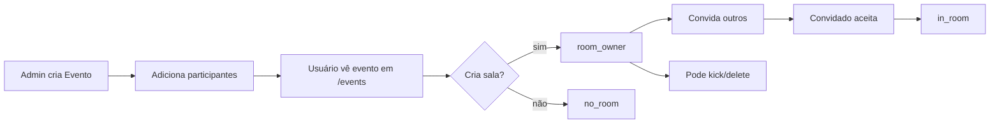

## Status do usuário

Calculado dinamicamente por subqueries em `list($data)`:

- `room_owner` — é dono de uma sala ativa.
- `in_room` — foi convidado e aceitou.
- `no_room` — nenhuma sala.

## Gotchas

- **Não há timeout automático de convite** — `invite_status = 0` persiste até alguém agir.
- Notificações de convite vão por **SendGrid** (não pelo sistema central de notificações).
- Deletar sala **não cancela** os convites já aceitos — libera os usuários de volta ao status `no_room`.
- Não há controle de capacidade de sala (qtde máxima de participantes) no schema.
- `addUsersBulk` é importação em lote por admin (CSV/JSON de IDs).
- **Eventos não creditam gamificação automaticamente.** Se quiser pontuar presença, dispare `BravoUtils::gamificationPoints` no `acceptInvite` ou customize.

---

# data/docs/modules/feed-posts.md

---

## title: "Feed e Posts"

Comunicação interna da empresa. Três sistemas convivem e são frequentemente confundidos:

| Sistema             | Propósito                                                                       | Controller                 | Models                                                          |
| ------------------- | ------------------------------------------------------------------------------- | -------------------------- | --------------------------------------------------------------- |
| **Posts / Feed**    | Timeline social (publicações, comentários, reações).                            | `App/Post`, `App/Reaction` | `CompanyPost*`, `CompanyReaction`                               |
| **Channels**        | Canais **em grupo** (tipo #geral no Slack). Membros adicionados explicitamente. | `App/Channels`             | `CompanyChannel`, `CompanyChannelMessage`, `CompanyChannelUser` |
| **Messages (Chat)** | DM **1-a-1** entre dois usuários.                                               | `App/Messages`             | `CompanyChat`, `CompanyChatMessage`                             |

## Posts (Feed social)

### Models

- `CompanyPost` — post raiz.
- `CompanyPostMedia` — anexos (imagem/vídeo, N por post).
- `CompanyPostComment` — comentários.
- `CompanyPostGroup` — associa post a um ou mais grupos de usuários (segmentação).
- `CompanyReaction` — reações (curtida, coração, etc.) em posts **e** comentários.

### Como a segmentação funciona

Post é criado e **vinculado a N grupos** via `CompanyPostGroup`. Usuário só vê o post se pertencer a algum desses grupos (tabela `app_company_user_group`). Sem vínculo explícito = post público para toda a empresa.

### Endpoints

| Método | Path                                                     | Propósito                                     |
| ------ | -------------------------------------------------------- | --------------------------------------------- |
| POST   | `/post/create` / `/post/create/v2`                       | Criar post (v2 é o recomendado).              |
| POST   | `/post/edit` / `/post/edit/v2`                           | Editar.                                       |
| POST   | `/post/posts`                                            | Listar feed do usuário (filtrado por grupos). |
| POST   | `/post/single`                                           | Detalhe de um post.                           |
| POST   | `/post/delete`                                           | Deletar.                                      |
| POST   | `/post/count`                                            | Contador.                                     |
| POST   | `/post/save`                                             | Salvar rascunho.                              |
| POST   | `/post/comment/create` · `/comments` · `/comment/delete` | Comentários.                                  |
| GET    | `/post/comment/reactions/{comment}`                      | Reações de um comentário.                     |

Reações globais:

- `POST /reactions/create` · `/reactions/all`

## Channels (canais em grupo)

Canais são **criados por admin**, com nome/descrição e lista explícita de membros (`CompanyChannelUser`). Cada canal tem suas próprias mensagens (`CompanyChannelMessage`).

### Endpoints Client — `/channels/*`

| Método | Path                 | Propósito                 |
| ------ | -------------------- | ------------------------- |
| GET    | `/channels/`         | Listar canais do usuário. |
| POST   | `/channels/members`  | Listar/alterar membros.   |
| POST   | `/channels/send`     | Enviar mensagem.          |
| POST   | `/channels/messages` | Listar mensagens.         |

### Endpoints Studio — `/studio/channels/*`

- `GET /studio/channels` — listar.
- `POST /studio/channels/users` — listar usuários candidatos.
- `POST /studio/channels/create` · `/edit` · `/delete` · `/single` — CRUD.

### Real-time

Usa **Pusher**. Ao enviar mensagem, dispara evento `message` no canal `channel-{uuid}`. Ao adicionar membro, evento `channels` notifica o novo membro.

## Messages (DM 1-a-1)

`CompanyChat` representa a **sala** (par de usuários), `CompanyChatMessage` cada mensagem. Usuário precisa ter `user_message_accept = 1` para aparecer na lista de contatos de outros.

### Endpoints — `/messages/*`

| Método | Path                 |
| ------ | -------------------- |
| POST   | `/messages/users`    |
| POST   | `/messages/room`     |
| POST   | `/messages/send`     |
| POST   | `/messages/get`      |
| POST   | `/messages/view`     |
| POST   | `/messages/chats`    |
| POST   | `/messages/not-view` |

### Real-time

Pusher com evento `message` no canal `bravohub-{company_slug}-{user_id}` — cada usuário escuta seu próprio canal privado para receber DMs em tempo real.

## Tipos de mídia

`CompanyPostMedia` aceita uploads via `BravoUtils::uploadFile` (S3, ACL pública). Tipos: inferido do MIME do upload (imagem, vídeo, PDF). Não há restrição explícita no código — validação do front é o único gatekeeper.

## Reações — tabela única

`CompanyReaction` usa colunas `reaction_target_type` (`post` ou `comment`) + `reaction_target_id` para se referenciar a post ou comentário genericamente. Não há tabela separada.

## Gotchas

- **Post com múltiplos grupos**: se um grupo é deletado, o vínculo em `CompanyPostGroup` fica órfão (não há cascade). Filtros subsequentes ainda mostram o post corretamente se o usuário está em outro grupo vinculado.
- **Channels não herdam de grupos de usuários**. Um usuário é membro do canal somente se tiver linha em `CompanyChannelUser`.
- `Messages` exige `user_message_accept = 1` — bloqueia o usuário na lista de outros se = 0.
- Versões `v2` dos endpoints de Post são mais novas — use v2 em código novo.
- `App/Reaction.php` é minimalista: só `create` e `all`. Toda a lógica de "qual reação existe" fica no schema (`CompanyReaction`).
- Pusher está configurado no cluster `sa1` — ver `Config.php` (`PUSHER_CLUSTER`).

---

# data/docs/modules/gifts.md

---

## title: "Gifts (brindes/vouchers de campanha)"

Brindes associados a uma campanha — digitais (com lista de códigos) ou físicos (entregues manualmente).

!!! note "Gifts × Store × Checkout" - **Gift** (aqui) — brinde **de uma campanha** específica. Resgate gamificado (pontos/moedas). - **Store** — loja permanente da empresa, troca por moedas. Ver [Store](store.md). - **Checkout** — catálogo de produtos **dentro de uma campanha**. Ver [Checkout](campaigns/checkout.md).

## Models

- `CompanyCampaignGift` — brinde (nome, total, capa, `gift_digital_voucher` flag, custo em pontos/moedas).
- `CompanyCampaignGiftConfig` — configuração por campanha (limite de resgates por usuário, label do botão "Resgatar").
- `CompanyCampaignGiftVoucher` — códigos individuais (para brindes digitais).
- `GifttyProduct`, `GiftCardRedeem`, `CompanyGifttyStore` — integração com catálogo externo **Giftty** (não coberto no fluxo padrão).

## Controllers

- Admin: `App/Studio/Incentive/Gift.php`
- Client: `App/Incentive/Gift.php`

## Endpoints Studio — `/studio/incentive/gift/*`

| Método | Path                                        | Propósito                                    |
| ------ | ------------------------------------------- | -------------------------------------------- |
| GET    | `/studio/incentive/gift/config/{campaign}`  | Config (cria default se não existir).        |
| POST   | `/studio/incentive/gift/config/{campaign}`  | Atualizar config.                            |
| POST   | `/studio/incentive/gift/create/{campaign}`  | Criar brinde (multipart, streaming).         |
| POST   | `/studio/incentive/gift/edit/{gift}`        | Editar (valida que total ≥ resgates feitos). |
| POST   | `/studio/incentive/gift/delete/{gift}`      | Remover (bloqueia se já resgatado).          |
| GET    | `/studio/incentive/gifts/{campaign}`        | Listar brindes, ordenados por `gift_order`.  |
| GET    | `/studio/incentive/gift/{gift}`             | Detalhe.                                     |
| POST   | `/studio/incentive/gift/reorder`            | Reordenar.                                   |
| GET    | `/studio/incentive/gift/extract/{campaign}` | Extrato de resgates (JOIN user + gift).      |

## Endpoints Client — `/incentive/gift/*`

| Método | Path                                       | Propósito                   |
| ------ | ------------------------------------------ | --------------------------- |
| GET    | `/incentive/gift/config/{campaign}`        | Config para o front.        |
| GET    | `/incentive/gift/gifts/{campaign}`         | Listar disponíveis.         |
| GET    | `/incentive/gift/takes/{campaign}`         | Meus resgates.              |
| POST   | `/incentive/gift/take/{gift}`              | **Resgatar** um brinde.     |
| POST   | `/incentive/gift/delete/{voucher}`         | Devolver voucher digital.   |
| POST   | `/incentive/gift/code/verify/{campaign}`   | Verificar código recebido.  |
| POST   | `/incentive/gift/code/validate/{campaign}` | Validar (marca como usado). |

## Digital × físico

O campo `gift_digital_voucher` controla:

- `= 1` (digital) — obriga **upload de CSV** com códigos na criação. Cada linha vira `CompanyCampaignGiftVoucher`. Quantidade deve bater com `gift_total`.
- `= 0` (físico) — sem CSV. Entrega manual. `gift_total` apenas define quantos resgates são permitidos no sistema.

## Fluxo de criação (streaming)

`createGift` tem comportamento incomum: faz **streaming HTTP** durante o parse do CSV, emitindo progresso como `[n|total]` para o front. No final emite `###success###` antes de fechar. Front precisa ler o stream incrementalmente.

```
POST /studio/incentive/gift/create/{campaign}
Content-Type: multipart/form-data

gift_name=Notebook
gift_cover=@cover.png
gift_thumb=@thumb.png
gift_total=500
gift_digital_voucher=1
gift_gamification_points=1000
vouchers_file=@codes.csv  (header: "vouchers")
```

Resposta (stream):

```
[1|500]
[2|500]
...
[500|500]
###success###
```

## Fluxo de resgate

```mermaid
flowchart LR
    A[Usuário escolhe brinde] --> B[POST take/{gift}]
    B --> C{tem pontos/moedas<br/>suficientes?}
    C -->|não| D[erro 400]
    C -->|sim| E{limite por usuário<br/>atingido?}
    E -->|sim| D
    E -->|não| F[Debita gamification]
    F --> G{digital_voucher?}
    G -->|sim| H[Aloca voucher_code<br/>status=0]
    G -->|não| I[Registra resgate<br/>entrega manual]
    H --> J[Mostra código pro user]
    I --> K[Admin vê extrato]
```

## Gotchas

- **CSV precisa ter header literal `vouchers`** — qualquer outra coluna é ignorada.
- **Total de vouchers digitais deve bater com `gift_total`** na criação. Se divergir, controller retorna erro.
- **Streaming HTTP**: front que espera response JSON único quebra. O progresso em `[n|total]` ajuda a exibir barra de progresso em uploads grandes.
- **Brinde com resgates não pode ser apagado** — use `status = 0` para esconder.
- Cancelar resgate = devolver voucher (liberar `voucher_status = 1`), **mas não devolve pontos/moedas automaticamente** — se precisar reembolso, chamar `gamificationPoints` manualmente.
- `gift_order` é manipulado via `reorderGifts` — `gift_order = index + 1` reatribuído em todos.
- **Giftty** (integração externa de catálogo) tem models próprios (`GifttyProduct`, `CompanyGifttyStore`, `GiftCardRedeem`) e **não é coberto por esta página** — ver integrações.

---

# data/docs/modules/groups-departments.md

---

## title: "Grupos e Departamentos"

Segmentação transversal de usuários. **Praticamente todo módulo consome grupos** para decidir visibilidade (posts, campanhas, pastas Sapiens, notificações, e-mails, WhatsApp).

## Conceitos

| Entidade          | Tabela                              | Uso                                                   |
| ----------------- | ----------------------------------- | ----------------------------------------------------- |
| **Grupo**         | `app_company_group`                 | Agrupamento livre (cargo, região, papel no programa). |
| **Departamento**  | `app_company_department`            | Hierarquia organizacional.                            |
| **User ↔ Group**  | `app_company_user_group`            | Membresia (pivot).                                    |
| **Store ↔ Group** | `app_company_discount_store_groups` | Lojas de desconto associadas ao grupo.                |

Um usuário pode estar em **N grupos** e em 1 departamento.

## Controllers

| Camada                 | Caminho                      |
| ---------------------- | ---------------------------- |
| Client                 | `App/Group.php`              |
| Studio (grupos)        | `App/Studio/Group.php`       |
| Studio (departamentos) | `App/Studio/Departments.php` |

## Endpoints Client

| Método | Path      | Propósito                                |
| ------ | --------- | ---------------------------------------- |
| POST   | `/group/` | `Group:getGroup` — obter grupo por slug. |

## Endpoints Studio — Grupos

| Método | Path                             | Propósito                                                           |
| ------ | -------------------------------- | ------------------------------------------------------------------- |
| POST   | `/studio/groups`                 | `Group:studioGetGroups` — listar.                                   |
| POST   | `/studio/groups/create`          | `Group:studioCreateGroup` — cria + gera slug.                       |
| POST   | `/studio/groups/edit`            | `Group:studioUpdateGroup` — editar.                                 |
| GET    | `/studio/groups/all`             | `Group:getAllGroups` — todos com contagem de usuários.              |
| GET    | `/studio/groups/stores`          | `Group:getAllDiscountStores` — lojas de desconto associáveis.       |
| GET    | `/studio/group/users/{group_id}` | `Group:getGroupUsers` — listar usuários com flag "pertence ou não". |
| POST   | `/studio/group/users/manage`     | `Group:manageGroupUsers` — sync em lote (DIFF add/remove).          |

## Endpoints Studio — Departamentos

| Método | Path                                 | Propósito                                   |
| ------ | ------------------------------------ | ------------------------------------------- |
| GET    | `/studio/departments`                | `Departments:departments` — listar.         |
| POST   | `/studio/departments/create`         | `Departments:create` — criar.               |
| POST   | `/studio/departments/update`         | `Departments:update` — editar.              |
| GET    | `/studio/department/users/{dept_id}` | `Departments:getDepartmentUsers` — listar.  |
| POST   | `/studio/department/users/manage`    | `Departments:manageDepartmentUsers` — sync. |

## Como a segmentação funciona

Exemplo prático (em `Incentive:getCampaigns`):

```sql
SELECT * FROM app_company_campaign
WHERE company_id = :c
  AND campaign_id IN (
      SELECT campaign_id FROM app_company_campaign_group
      WHERE group_id IN (
          SELECT group_id FROM app_company_user_group
          WHERE user_id = :u
      )
  )
```

Isto é, **o SELECT cruza 3 tabelas** (campaign → campaign_group → user_group) para só retornar campanhas visíveis ao usuário atual.

O mesmo padrão se repete em:

- **Posts** — `company_post_group` (quem vê o post).
- **Sapiens** — `company_sapiens_folder_group` (pasta).
- **Notificações / E-mail / WhatsApp** — destinatários selecionados por `group_ids[]`.

## Sync em lote (DIFF)

`manageGroupUsers` e `manageDepartmentUsers` operam em **DIFF**: comparam o payload com o estado atual e só inserem/removem o que mudou, em chunks de 500.

Vantagem: em grupos com dezenas de milhares de usuários, não reescreve tudo. Payload típico:

```json
{
  "group_id": 42,
  "users": [1, 2, 3, 4, 10, 11, 12],
  "stores": [7, 8]
}
```

Resultado:

- Usuários já no grupo + no payload → mantidos.
- Usuários só no grupo → removidos.
- Usuários só no payload → adicionados.

Loja atribuída a grupo **automaticamente** adiciona `store.user_id` (dono) + todos os `businesses` associados ao grupo (ver [Descontos](campaigns/discount.md)).

## Gotchas

- **Slug do grupo é gerado automaticamente** (`strtolower(str_replace(...))`). Dois grupos com nome parecido podem colidir — validação impede nome duplicado.
- `manageGroupUsers` **não valida** se os `user_id` pertencem à mesma empresa — o controller filtra por `company_id` no SELECT, então usuário de outra empresa simplesmente não é encontrado. Mas cuidado ao aceitar IDs externos.
- Grupos **não substituem CAUM** — grupos controlam _visibilidade de conteúdo_; CAUM controla _acesso a módulos_. Veja [Permissões](../auth/permissions.md).
- Não existe "grupo pai/filho" (hierarquia). Para estrutura em árvore, use **departamentos**.
- `app_company_discount_store_groups` é **específico do módulo de descontos** — não é abstração geral.
- Remover usuário do grupo **não reverte** conteúdo já consumido (posts já lidos, campanhas já registradas).

## Quando usar Grupo × Departamento

- **Grupo**: segmentação flexível, ad-hoc, pode virar e desvirar para campanhas/comunicação.
- **Departamento**: estrutura fixa da empresa (RH, Vendas Nordeste). Costuma ser referência permanente.

Ambos podem coexistir no mesmo usuário.

---

# data/docs/modules/i18n.md

---

## title: "Multi-idioma (i18n)"

Sistema simples de **key → text** por idioma da empresa. Front resolve labels localmente a partir do dicionário entregue pelo `/company/{slug}`.

## Models

- `CompanyLanguage` — idiomas habilitados (`language_slug`: `pt-br`, `en`, `es`; `language_default` boolean).
- `CompanyDictionaryTerm` — termo (`term_key`, `term_text`, `language_slug`).

## Como chega ao front

Via [Tenancy config](tenancy-config.md) — o response de `GET /company/{slug}` já inclui:

```json
{
  "langs": [
    { "slug": "pt-br", "name": "Português" },
    { "slug": "en", "name": "English" }
  ],
  "default_lang": "pt-br",
  "terms": {
    "pt-br": { "home_title": "Início", "submit_btn": "Enviar" },
    "en": { "home_title": "Home", "submit_btn": "Submit" }
  }
}
```

Front resolve labels em tempo de render a partir de `terms[user_lang || default_lang][key]`.

## CRUD administrativo

Nenhum controller **dedicado** foi identificado nesta exploração para CRUD de idiomas/termos — provavelmente vive:

- Em `/studio/...` menos explorado.
- Ou gerenciado direto no banco via script.

!!! info "A confirmar com equipe"
Se a necessidade aparecer, documentar aqui os endpoints reais.

## Gotchas

- **Sem plurals / gênero** — é puro key→text. Se precisar regras complexas, o front resolve.
- `language_default = 1` em apenas uma linha por empresa (convenção, não constraint — risco de duplicata).
- `terms` é entregue **inteiro** no `/company/{slug}`. Empresas com dicionário gigante (milhares de chaves × N idiomas) geram response pesada — lazy-load por idioma pode ser necessário se virar problema.
- Atualização de termo **não dispara** nada no front em execução — usuários veem o novo valor no próximo reload.
- Chaves não presentes no dicionário caem para **fallback do front** (geralmente a própria chave bruta).
- Falta de `language_slug` no usuário resolve para `default_lang` — confirmar que o perfil/registro captura idioma preferido.

---

# data/docs/modules/jobs.md

---

## title: "Jobs e Fila"

Scripts de background em `www/api/jobs/`. Três modos de execução convivem:

- **Cron** (agendado pelo crontab do servidor).
- **RabbitMQ consumer** (long-running, escuta fila).
- **Invocação manual** (one-off, via SSH).

## Estrutura

```
www/api/jobs/
├── bravohub/                  # jobs gerais da plataforma
├── befly/ clubeguaramais/     # onboarding/sync de parceiros
├── gazin/                     # importação Gazin
├── guararapes/ mm/ mwm/ mwm-2026/
├── tigre/ torors/ tupy/ vellore/ berlanda/
├── gazin-poupancao.php
├── gazin-poupancao-atacado.php
├── send-email-campaign.php
├── send-whatsapp-campaign.php
├── session-killer.php
└── sql/                       # scripts SQL ad-hoc
```

## Jobs raiz (gerais)

### `send-email-campaign.php` (cron)

Processa campanhas de e-mail com `status = 'sending'`. Até **500 logs** por execução, marca como `sent`/`failed`. Injeta pixel de tracking e reescreve links. Ver [E-mail](email.md).

### `send-whatsapp-campaign.php` (cron)

Processa campanhas WhatsApp (`status = 'sending'`) via **EvaSend**. Tipos: `text`, `text_with_image`, `text_with_video`, `text_with_button`, `carousel`. Respeita `campaign_scheduled_at`.

### `session-killer.php` (cron)

Encerra sessões de analytics sem evento há mais de **60 min** (respeitando timezone da empresa). Itera todas as empresas. Ao final, envia ping para um bot Telegram hardcoded.

### `gazin-poupancao.php` / `gazin-poupancao-atacado.php` (cron)

Import de clientes e pontos do programa Poupança Gazin. Executa em lote, grava logs em `cronjobs_logs`.

## Jobs por parceiro

Cada pasta tem scripts específicos. Exemplos representativos (ver arquivos para detalhes):

- `tupy/` — import de representantes, metas, bônus.
- `tigre/` — sync de usuários e eventos.
- `mm/`, `mwm/`, `mwm-2026/` — poupanças e vendas.
- `guararapes/`, `clubeguaramais/` — onboarding + cashback.
- `vellore/` — sync com Oracle OCI8 (Vellore).
- `berlanda/` — sync ERP Berlanda.

## RabbitMQ — consumers

### Fila `rex.orders.create`

Consumer em `Source\Core\RabbitMQ::queuesConnect()`. Processa pedidos Rex de parceiros (Toro/Gazin) em real-time via `Rex::provRegisterOrder`. Logs em `rabbit_logs`.

Credenciais atuais estão hardcoded (`34.207.138.176:5672`, user `torors`). Sem dead-letter queue.

### Helpers

- `App/CustomIntegration/RabbitMQHelpers.php` — wrappers para publish de mensagens.
- A classe `Rex` aceita flag `$rabbit = true` no construtor para diferenciar origem HTTP vs fila.

## Logging

| Tabela          | O que grava                           |
| --------------- | ------------------------------------- |
| `cronjobs_logs` | Execução de cron (início, fim, erro). |
| `rabbit_logs`   | Mensagens RabbitMQ processadas.       |

## Criar novo job

```php
<?php
// www/api/jobs/[dominio]/meu-job.php

require __DIR__ . "/../../vendor/autoload.php";

use Source\Models\CronjobsLogs;

$log = new CronjobsLogs();
$log->cron_name  = "meu-job";
$log->cron_start = date("Y-m-d H:i:s");
$log->save();

try {
    // ... lógica
    $log->cron_status = "success";
} catch (\Throwable $e) {
    $log->cron_status = "error";
    $log->cron_error  = $e->getMessage();
}

$log->cron_end = date("Y-m-d H:i:s");
$log->save();
```

Depois pedir para o time de infra adicionar ao crontab da máquina.

## Gotchas

- **Frequência de cron não está no repo** — vive no crontab do servidor. Ao criar job novo, documentar aqui a frequência acordada com infra.
- **Sem retry automático para cron**: se falhar, só na próxima execução. Use idempotência no job (marcar como processado antes de processar tudo).
- **RabbitMQ sem DLQ**: falhas são re-enqueued via `basic_nack(requeue=true)` — se o erro é determinístico, vira loop infinito. Considerar DLQ + max-retries no médio prazo.
- Credenciais RabbitMQ e bot Telegram estão **em plaintext** nos jobs — mover para env/`Config.php` quando possível.
- Scripts em `jobs/sql/` são **queries ad-hoc** (imports, migrações manuais) — não rodam em produção automaticamente.
- Jobs não têm timeout/memória configurados — travamentos em jobs longos devem ser investigados na infra.

## Runbook básico

Se um job falha em produção:

1. Ver `cronjobs_logs` ou `rabbit_logs` na data/hora.
2. SSH no servidor de jobs → `cd /path/api && php jobs/xxx.php` para rodar manual.
3. Se dá erro de conexão RabbitMQ, conferir se o host `34.207.138.176` está acessível.
4. Para campanhas travadas em `sending`, resetar para `queued` no banco e esperar o próximo cron.

---

# data/docs/modules/landing-pages.md

---

## title: "Landing Pages e Leads"

Páginas de captura de leads associadas a uma empresa, com banners, footers, vídeo YouTube e script `on_lead`.

## Models

- `CompanyLandingPages` — página (slug, status, banner/thumb legado, vídeo YouTube).
- `CompanyLandingPagesMedia` — banners e footers **modernos** (N por página, agendáveis, com link).
- `CompanyLandingPagesLeads` — leads capturados (nome, e-mail, telefone, etc.).

## Controllers

- Client (público): `App/LandingPages.php` — renderização da página.
- Studio: CRUD de páginas (não auditado em detalhe nesta passagem — confirmar em `App/Studio/LandingPages.php` se existir).

## Endpoints públicos

| Método | Path                                  | Propósito                                           |
| ------ | ------------------------------------- | --------------------------------------------------- |
| GET    | `/landing/{company_slug}/{page_slug}` | Retorna config da página (banners, footers, vídeo). |
| POST   | `/landing/{page_id}/leads`            | Capturar lead (presumido).                          |

**Sem JWT** — endpoints são públicos (a página é pública). Validação de `company_slug` + `page_status` = 1.

## Media (banners e footers modernos)

`CompanyLandingPagesMedia` permite múltiplas mídias por página, com:

- `media_type`: `banner` ou `footer`.
- `media_desktop`, `media_mobile` — URLs separadas.
- `media_order` — ordem de exibição.
- `media_start_date` / `media_end_date` — agendamento.
- `media_link` — URL de clique.

### Compatibilidade retroativa

Se a página **não tem mídias** em `CompanyLandingPagesMedia`, o controller cai para os campos legados `page_banner` / `page_banner_mobile` da própria `CompanyLandingPages`. Isso mantém páginas antigas funcionando.

## Vídeo

`page_youtube_video_url` é processado via `BravoUtils::getYoutubeVideoDuration()` para obter duração (auto-hide player após tempo, por exemplo).

## Comportamentos opcionais por LP

Dois flags em `CompanyLandingPages` controlam comportamentos pos-cadastro:

- `page_require_store` (TINYINT, default `1`) — quando `company_id = 19`
  (Clube Guara), o cadastro **exige** a selecao de loja parceira no formulario
  e cria os vinculos `CompanyCampaignDiscountBusiness` (campanha 24), grupo 66
  e grupo 175 (marcenarias nao-Maringa). Setar `0` para LPs simplificadas
  (ex.: feiras): o lead entra sem loja, e o feed exibe o botao "Escolher minha
  loja parceira" em `StoreResume` ate o usuario completar.
- `page_gift_id` (VARCHAR(36), nullable) — UUID de um `CompanyCampaignGift`.
  Quando preenchido, apos `CompanyLandingPagesLeads::save` o controller gera
  um `CompanyCampaignGiftVoucher` para o novo usuario e dispara
  `sendWhatsappMessage($user, $company, $voucherCode, 'feira')` — atualmente
  cabeado apenas para `clubeguara` (template `clubeguara_feira` via
  BLiP/Take em `Utils/utils.php`). Substitui o fluxo manual (login +
  resgate) durante eventos presenciais.

## Script `on_lead`

Scripts com `script_position = 'on_lead'` (ver [Widgets](widgets.md)) são executados **quando um lead é capturado**. Uso típico:

- Enviar evento para Facebook Pixel.
- Disparar tag GA `conversion`.
- POST para CRM próprio.

## Fluxo

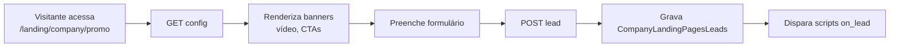

## Gotchas

- **Legado vs moderno**: página pode ter **ou** `page_banner` legado **ou** entradas em `CompanyLandingPagesMedia`. O front lida — mas migre sempre que editar para o modelo novo.
- `media_start_date` / `end_date` **não** filtram no SELECT do controller lido — são apenas informativos, a menos que o front filtre. Confirmar antes de agendar.
- `page_gift_id` so dispara WhatsApp para `company_id = 19`. Para
  habilitar em outros tenants, e necessario adicionar um branch novo em
  `sendWhatsappMessage` (`Utils/utils.php`) com namespace + template
  proprios. Caso contrario o voucher e criado mas a mensagem nao sai.
- **Leads não têm validação de duplicata** (mesmo e-mail pode entrar várias vezes). Dedup lógica fica a cargo do consumidor.
- Endpoint público **não tem rate-limit específico** — vulnerável a flood de leads fake se não estiver atrás de CAPTCHA no front.
- `page_status != 1` retorna 404/bloqueia acesso — use para ocultar sem apagar.
- Script `on_lead` executa **no cliente**, não no servidor — não esperar segurança server-side.

---

# data/docs/modules/notifications.md

---

## title: "Notificações (Pusher)"

## Modelo geral

Notificações no BravoHub são **pull-based** na maior parte — usuário busca via `GET /notification/all`. Há, em paralelo, canais push para **e-mail** e **WhatsApp** para campanhas massivas.

**Pusher (WebSocket) é usado por Channels e Messages (chat)**, não pelo sistema de notificações central. Ver [Feed e Posts](feed-posts.md).

## Models

- `CompanyNotification` — definição da notificação (título, conteúdo, link, `notification_type`, status de envio).
- `CompanyNotificationUser` — entrega por usuário (lida/não lida).
- `BravoAnalyticsSession`, `BravoAnalyticsEvent` — auditoria.
- `CompanyPartner` — parceiros externos que podem disparar notificações.

## Controllers

| Camada             | Caminho                                                   |
| ------------------ | --------------------------------------------------------- |
| Client             | `App/Notification.php`                                    |
| Admin              | `App/Studio/Notification.php`                             |
| Canal E-mail       | `App/Studio/NotificationEmail.php`                        |
| Campanhas WhatsApp | `App/Studio/Notifications/WhatsappCampaignController.php` |

## Endpoints Client — `/notification/*`

| Método | Path                     | Propósito                                               |
| ------ | ------------------------ | ------------------------------------------------------- |
| GET    | `/notification/all`      | Minhas notificações (ordenadas, com status de leitura). |
| GET    | `/notification/{id}`     | Obter uma — marca como lida no acesso.                  |
| POST   | `/notification/read-all` | Marcar todas como lidas.                                |

## Endpoints Studio — `/studio/notification/*`

| Método | Path                                      | Propósito                         |
| ------ | ----------------------------------------- | --------------------------------- |
| POST   | `/studio/notification/recipients-count`   | Contar destinatários da seleção.  |
| GET    | `/studio/notification/recipients-details` | Lista detalhada de destinatários. |
| POST   | `/studio/notification/create`             | Criar notificação.                |
| POST   | `/studio/notification/edit`               | Editar.                           |
| POST   | `/studio/notification/send`               | Disparar envio.                   |
| GET    | `/studio/notification/list`               | Listar.                           |
| GET    | `/studio/notification/{id}`               | Detalhes.                         |
| DELETE | `/studio/notification/{id}`               | Deletar.                          |

### Seleção dinâmica de destinatários

O payload de criação aceita múltiplos critérios, combinados:

- **Usuários** (`user_ids[]`) — explícitos.
- **Grupos** (`group_ids[]`) — todos os membros em `app_company_user_group`.
- **Departamentos** (`department_ids[]`).
- **Campanhas** (`campaign_ids[]`) — todos com `app_company_campaign_user`.
- **Níveis de gamificação** (`level_ids[]`) — usuários com pontos na faixa do nível.
- **Exclusões** (`exclude_user_ids[]`).

!!! warning "Materialização no momento do envio"
A lista final de destinatários é **calculada no momento do `send`**, não no `create`. Se um usuário entrar num grupo depois, ele não recebe; se sair antes do envio, não recebe também. Mudanças posteriores NÃO reenviam.

## Canal E-mail — `App/Studio/NotificationEmail.php`

Dispara campanhas de e-mail (`POST /studio/notification/email/send`). Fluxo executado pelo job `send-email-campaign.php` com tracking de abertura/clique (ver [E-mail](email.md)).

## Canal WhatsApp — `App/Studio/Notifications/WhatsappCampaignController.php`

Campanhas WhatsApp via **EvaSend** (`https://painel.evasend.com.br/api/campaigns/send`). Job: `www/api/jobs/send-whatsapp-campaign.php`.

Tipos suportados:

- `text` — texto puro.
- `text_with_image` — texto + imagem.
- `text_with_video` — texto + vídeo.
- `text_with_button` — texto + CTA.
- `carousel` — carrossel de cartões.

Agendamento via `campaign_scheduled_at`. Job processa contatos em batch.

## Preferências do usuário

**Hoje não há preferências granulares** (ex: "não quero receber push de X tipo"). O único opt-out explícito no schema é:

- `user_message_accept` — aceitar DMs (ver [Feed](feed-posts.md)).

Se precisar granular, planejar: tabela `company_user_notification_preference` com `user_id` + `notification_type` + `enabled`.

## Gotchas

- **Notificações não expiram automaticamente** — ficam no `/notification/all` indefinidamente (ordenadas por data).
- `notification_type` é **string livre** — não validada contra enum. Variantes duplicadas aparecem se não houver convenção.
- E-mail e WhatsApp têm **tabelas próprias** de campanha, **não reutilizam `CompanyNotification`**. São 3 sistemas semi-acoplados.
- Marcação "lida" acontece no `GET /{id}` — leitura em lote pelo `read-all`.
- A integração Pusher (`PUSHER_APP_ID`, etc.) é usada por Channels/Messages, **não** pelo centro de notificações. Push in-app em tempo real via Pusher para notificações não existe hoje — front precisa polling.

---

# data/docs/modules/qrcode-points.md

---

## title: "QR Code Points (check-in)"

Sistema de check-in por QR code. Admin gera pontos com código e janela de validade; usuário escaneia e recebe pontos/moedas.

## Models

- `CompanyQRCodePoint` — ponto (`point_code` único, `point_status`, `point_start`/`point_end`, `point_points`, `point_coins`, expirações).
- `CompanyQRCodePointCheck` — check-in do usuário (único por par user/point).

## Controllers

- Client: `App/QRCodePoint.php`
- Admin: `App/Studio/QRCodePoint.php`

## Endpoints Client — `/qrcode/*`

| Método | Path               | Propósito                                          |
| ------ | ------------------ | -------------------------------------------------- |
| POST   | `/qrcode/verify`   | Verifica código + janela, retorna se já foi usado. |
| POST   | `/qrcode/validate` | **Cria check-in** e distribui gamificação.         |

## Endpoints Studio — `/studio/qrcode/*`

| Método | Path                             | Propósito                                                    |
| ------ | -------------------------------- | ------------------------------------------------------------ |
| POST   | `/studio/qrcode`                 | Criar ponto (gera `point_code` via `generateUniqueCode(8)`). |
| GET    | `/studio/qrcode`                 | Listar.                                                      |
| GET    | `/studio/qrcode/{point}`         | Detalhe.                                                     |
| PUT    | `/studio/qrcode/{point}`         | Editar (não muda `point_code`).                              |
| DELETE | `/studio/qrcode/{point}`         | Remover (bloqueia se já houve check-in).                     |
| GET    | `/studio/qrcode/{point}/extract` | Relatório de participantes.                                  |

## Fluxo

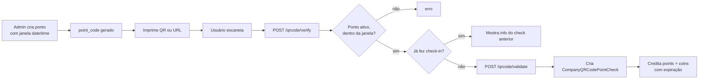

## Validação temporal

`validatePoint` valida **`NOW() BETWEEN point_start AND point_end`** (datetime, não só data). Pontos fora da janela retornam erro.

## Distribuição de gamificação

Ao validar, dispara:

```php
createGamificationPontuation([
    "user_id"     => $user->user_id,
    "company_id"  => $company->company_id,
    "type"        => "IN",
    "value"       => $point->point_points,
    "flag"        => "qrcode_checkin",
    "description" => $point->point_name,
    "data"        => (string)$point->point_id,
    "expires"     => $point->point_points_expires,  // dias
]);

// idem para coins
```

## Gotchas

- **Um check-in por usuário por ponto.** Segunda tentativa retorna "já validado" com os dados do check anterior.
- **`point_code` não é editável** após criado — preserva a relação físico (QR impresso) × digital.
- **Ponto com check-ins não pode ser apagado** — use `point_status = 0` para inativar.
- Janela considera **datetime completo**, inclusive horário. Pontos criados só com data (00:00:00) fecham à meia-noite exata.
- `generateUniqueCode(8)` gera alfanumérico — se colidir com outro código existente (improvável), o INSERT falha por constraint. Retry manual é necessário.
- Extract ordena por `check_created DESC` — últimos no topo.
- Pontos **não expiram automaticamente** no banco — expirados ficam como "acabados" mas linha permanece.

## Uso típico

- Eventos presenciais (check-in da palestra).
- Treinamentos obrigatórios (presença registrada).
- Promoções em loja física.

---

# data/docs/modules/sapiens.md

---

## title: "Sapiens (Wiki / Knowledge Base)"

Wiki corporativa: pastas hierárquicas, tópicos, arquivos, tags e segmentação por grupo.

## Models

- `CompanySapiensFolder` — pasta (com `folder_parent` formando árvore).
- `CompanySapiensFolderEditor` — usuários com permissão de editar uma pasta.
- `CompanySapiensFolderGroup` — grupos que **veem** a pasta.
- `CompanySapiensFolderTag` — tags associadas à pasta.
- `CompanySapiensTag` — tags livres (tag_title, tag_slug).
- `CompanySapiensTopic` — conteúdo dentro de pasta.
- `CompanySapiensTopicFile` — anexos do tópico.

## Controllers

- Client: `App/Sapiens.php`
- Admin: `App/Studio/Sapiens.php`

## Endpoints Client — `/sapiens/*`

| Método | Path                            | Propósito                                       |
| ------ | ------------------------------- | ----------------------------------------------- |
| GET    | `/sapiens/folders`              | Listar pastas visíveis (via grupos do usuário). |
| GET    | `/sapiens/folder/{folder}`      | Detalhe da pasta.                               |
| GET    | `/sapiens/folder/topic/{topic}` | Detalhe do tópico com arquivos.                 |

## Endpoints Studio — `/studio/sapiens/*`

- **Tag**: `tags` · `tag/{tag}` · `tag/create` · `tag/update/{tag}` · `tag/delete/{tag}`.
- **Folder**: `folders` · `folder/{folder}` · `folder/create` · `folder/update/{folder}` · `folder/delete/{folder}`.
- **Topic**: `topic/create` · `topics/{folder}` · `topic/{topic}` · `topic/update/{topic}` · `topic/delete/{topic}`.
- **File**: `topic/files/{topic}` (upload em lote) · `topic/files/{topic}` (listar) · `topic/files/delete/{file}` · `topic/files/update/{file}`.

## Estrutura hierárquica

Pasta pode ter `folder_parent` apontando a outra pasta, formando árvore:

```
Raiz
├── Políticas
│   ├── RH
│   └── Financeiro
├── Manuais
│   ├── Vendas
│   └── Atendimento
└── Ferramentas
```

Query de folders visíveis filtra **por grupo do usuário**:

```sql
SELECT DISTINCT folder_id FROM app_company_sapiens_folder_group
WHERE group_id IN (
    SELECT group_id FROM app_company_user_group WHERE user_id = :u
)
```

Pasta sem associação a grupos é **privada** — admin tem que explicitar quem vê.

## Tags

Grupos de assuntos transversais (`tag_slug` único por empresa). Uma pasta pode ter N tags; uma tag pode estar em N pastas.

## Edição granular

`CompanySapiensFolderEditor` define usuários específicos que podem editar uma pasta, sem precisar ser admin da empresa.

## Gotchas

- **Não há validação de ciclo** na árvore de pastas. Tecnicamente `folder_parent` poderia apontar a uma descendente e o front entraria em loop. Proteger ao adicionar.
- Pasta sem grupos associados = **invisível para todos** (não é public by default).
- Tag slug é gerado automaticamente com `strtolower` — mudar o `tag_title` **não** recalcula slug (mantém o antigo). Se quiser renomear com clean slug, deletar e recriar.
- Arquivos vão para S3 com ACL pública — não usar para conteúdo confidencial.
- `CompanySapiensFolderGroup` é uma tabela de visibilidade: delete de grupo deixa linhas órfãs (sem cascade). Pasta fica "flutuando" sem ninguém ver.
- Sem versionamento de conteúdo — editar `topic_content` sobrescreve.

---

# data/docs/modules/store.md

---

## title: "Company Store (loja geral)"

E-commerce interno da empresa em **moedas de gamificação**. Catálogo permanente (não é campanha), com vouchers digitais ou produtos físicos.

!!! note "Diferenciação"
**Company Store** (`CompanyStore*`) — loja **geral** da empresa, permanente. Aqui.
**Campaign Checkout** (`CompanyCampaignCheckout*`) — catálogo de **uma campanha específica**. Ver [Checkout](campaigns/checkout.md).
**Campaign Gift** (`CompanyCampaignGift*`) — brindes/vouchers **de uma campanha**. Ver [Gifts](gifts.md).

## Models

- `CompanyStore` — loja raiz (1 por empresa).
- `CompanyStoreCategory` — categorias.
- `CompanyStoreProduct` — produto (com `product_type`, `product_stock`, `product_coins`, `product_user_limit_redeem`).
- `CompanyStoreProductLevel` — restrição "disponível a partir do nível X".
- `CompanyStoreProductVoucher` — códigos de voucher (para produtos digitais).
- `CompanyStoreOrder` — pedido (`order_status`: 0=pending, 1=approved, 2=done, 3=cancelled).
- `CompanyStoreOrderMessage` — mensagens trocadas no pedido.
- `CompanyStoreManager` — admins da loja que recebem notificação de pedido.

## Controllers

- Client: `App/Store.php`
- Admin: `App/Studio/Store.php`

## Endpoints Client — `/store/*`

| Método | Path                          | Propósito                                                     |
| ------ | ----------------------------- | ------------------------------------------------------------- |
| GET    | `/store`                      | Configuração da loja.                                         |
| GET    | `/store/categories`           | Listar categorias.                                            |
| GET    | `/store/categories/{id}`      | Detalhe.                                                      |
| GET    | `/store/products`             | Listar produtos **filtrados pelo nível do usuário**.          |
| GET    | `/store/products/{id}`        | Detalhe.                                                      |
| POST   | `/store/orders`               | Criar pedido (valida estoque + saldo + level + limit_redeem). |
| GET    | `/store/orders`               | Meus pedidos.                                                 |
| GET    | `/store/orders/{id}/messages` | Mensagens do pedido.                                          |

## Endpoints Studio — `/studio/store/*`

CRUD completo:

- **Store config**: `updateStore`.
- **Categoria**: `categoryCreate/Edit/Delete/GetAll/GetById`.
- **Produto**: `productCreate/Edit/Delete/GetAll/GetById` — `create` aceita multipart (cover + `vouchers_file` CSV se for voucher).
- **Pedido**: `orderGetAll` (filtro por produto, status, range de data), `orderGetById`, `orderChangeStatus`, `orderCancel` (reverte estoque e moedas), `orderMessageSend`, `orderMessages`.
- **Managers**: `storeCreateManagers`, `storeGetManagers`, `storeDeleteManager`.

## Fluxo

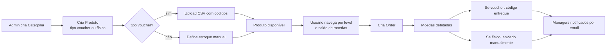

## Restrição por nível (`product_level_id`)

Filtro aplicado direto no SELECT do `productGetAll`:

```sql
SELECT p.* FROM company_store_product p
LEFT JOIN company_store_product_level pl ON pl.product_id = p.product_id
WHERE p.company_id = :c
  AND (pl.level_id IS NULL OR pl.level_id = :userLevel)
```

Produto sem restrição (`level_id IS NULL`) aparece para todos. Produto com restrição só aparece se `user.level = level_id`.

## Limite por usuário

`product_user_limit_redeem = 0` → ilimitado. > 0 → máximo de resgates por usuário. Verificado em `orderCreate` antes de aprovar.

## Vouchers digitais

Quando `product_type = 'voucher'`:

1. Admin faz upload de CSV (header `vouchers`).
2. Cada linha vira um `CompanyStoreProductVoucher` com `voucher_status = 1`.
3. Ao criar pedido, um voucher é marcado `status = 0`, vinculado a `user_id` e `order_id`.
4. Front exibe `voucher_code` no pedido do usuário.

## Cancelamento / chargeback

`orderCancel` (status 3):

- Reverte estoque.
- Credita moedas de volta no usuário (via `BravoUtils::gamificationCoins` com flag `store_cancel`, expiração hardcoded em 365 dias).
- Se voucher, libera de volta para o pool (`voucher_status = 1`, desvincula).

## Integração com gamificação

- Débito ao criar pedido: `gamificationCoins($userId, "OUT", $product_coins, "store_purchase", $order_uuid)`.
- Reversão no cancelamento: `gamificationCoins($userId, "IN", $value, "store_cancel", ..., 365)`.

Ver [Gamificação](campaigns/gamification.md).

## Gotchas

- **Produto não pode ser deletado** se tiver pedidos (`productDelete` bloqueia). Alternativa: desativar (`product_status = 0`).
- **Chargeback com 365 dias hardcoded** — mudança na política exige editar o controller.
- CSV de vouchers exige header literal `vouchers`; arquivos com outro cabeçalho quebram silenciosamente.
- Notificação de pedido a manager é por **SendGrid direto** (via `BravoUtils::emailSend`), não pelo sistema central de notificações.
- `order_value` é armazenado no pedido (snapshot) — mudar preço do produto não afeta pedidos antigos.
- `company_store_category.category_id = NULL` é aceito em produto — produto "sem categoria" aparece em lista geral.

---

# data/docs/modules/surveys.md

---

## title: "Pesquisas (Surveys)"

Pesquisas de satisfação e coleta de feedback. Suporta 3 tipos de pergunta, permite edição de resposta em tipos específicos.

## Controllers

- Client: `App/Survey.php`
- Admin: `App/Studio/Survey.php`

## Models

- `CompanySurvey` — pesquisa.
- `CompanySurveyQuestion` — perguntas ordenadas (`question_order`).
- `CompanySurveyQuestionAnswer` — opções pré-definidas (para one-choice/multiple-choice).
- `CompanySurveyUserAnswer` — resposta do usuário (pode existir 1 ou N por pergunta, dependendo do tipo).

## Tipos de pergunta (`question_type`)

| Tipo                | Comportamento                                                                       | Resposta guardada em      |
| ------------------- | ----------------------------------------------------------------------------------- | ------------------------- |
| `one-choice`        | Múltipla escolha, **1 opção**. Usuário pode mudar de opinião → **UPDATE** da linha. | `answer_id`               |
| `multiple-choice`   | Múltipla escolha, **N opções**. Novas respostas **INSERT**, não substituem.         | várias linhas `answer_id` |
| `input` (ou `text`) | Texto livre. Nova resposta **sobrescreve** a anterior.                              | `text_response`           |

## Endpoints Client — `/surveys/*`

| Método | Path                             | Propósito                                         |
| ------ | -------------------------------- | ------------------------------------------------- |
| GET    | `/surveys/`                      | Lista pesquisas ativas, com flag "já respondida". |
| POST   | `/surveys/save`                  | Salvar/atualizar respostas.                       |
| GET    | `/surveys/responses/{survey_id}` | Obter minhas respostas para uma pesquisa.         |

## Endpoints Studio — `/studio/surveys/*`

| Método | Path                                   | Propósito                             |
| ------ | -------------------------------------- | ------------------------------------- |
| GET    | `/studio/surveys`                      | Listar pesquisas.                     |
| POST   | `/studio/surveys`                      | Criar.                                |
| POST   | `/studio/surveys/update/{id}`          | Atualizar.                            |
| POST   | `/studio/surveys/delete/{id}`          | Deletar.                              |
| POST   | `/studio/surveys/question/delete/{id}` | Remover pergunta.                     |
| GET    | `/studio/surveys/responses/{id}`       | Obter respostas de todos os usuários. |

## Integração com gamificação

Se a empresa habilitar crédito por resposta, `saveUserResponse` pode chamar `BravoUtils::gamificationPoints` com flag `survey_answer` — **confirmar com equipe quais tenants têm isso ligado**. Não é automático para todos.

## Gotchas

- `survey_status != 1` **não aparece** para usuários no endpoint client.
- Para `multiple-choice`, o cliente envia array `answer_ids`; o backend faz N inserts sem deduplicar — cuidado com chamadas duplicadas.
- Para `one-choice`, se já existe resposta, é **UPDATE** (sobrescreve).
- `input` também sobrescreve — não há histórico de resposta anterior.
- Não há exportação nativa para CSV no controller listado — se for necessário, agendar implementação.
- Visibilidade/segmentação de pesquisa **não está no schema**. Se precisar segmentar por grupo, adicionar tabela de relacionamento e filtrar em `getSurveys`.

---

# data/docs/modules/tenancy-config.md

---

## title: "Tenancy / configuração da empresa"

Endpoint público que retorna toda a configuração visual, funcional e de conteúdo de uma empresa. É o **primeiro request** do front ao carregar a aplicação.

## Endpoints públicos

| Método | Path              | Propósito                          |
| ------ | ----------------- | ---------------------------------- |
| GET    | `/company/{slug}` | Config completa por slug.          |
| POST   | `/company/domain` | Resolver `custom_domain` → `slug`. |

Sem JWT — apenas identificação pública. Dados sensíveis (tokens, senhas) nunca aparecem na resposta.

## Payload de `GET /company/{slug}`

```json
{
  "tenant": "empresax",
  "company": "Empresa X",
  "logo": "https://s3.../logo.png",
  "favicon": "https://s3.../favicon.png",
  "custom_style": "/styles?c=empresax",
  "langs": [
    { "slug": "pt-br", "name": "Português" },
    { "slug": "en", "name": "English" }
  ],
  "default_lang": "pt-br",
  "terms": {
    "pt-br": { "key_a": "valor A", "key_b": "valor B" },
    "en": { "key_a": "value A", "key_b": "value B" }
  },
  "theme": {
    "d_sidebar_background": "#292929",
    "d_sidebar_text": "#FFFFFF",
    "button_background": "#0066FF",
    "button_text": "#FFFFFF"
  },
  "has_superpass": false,
  "register_url": "https://empresax.bravohub.club/cadastro",
  "modules": {
    "feed": true,
    "campus": true,
    "wiki": true,
    "channels": true,
    "message": true,
    "incentive": true,
    "gamification": true,
    "todo": true,
    "galileu": false,
    "survey": true,
    "events": true,
    "store": { "enabled": true, "coins_label": "Stars" }
  },
  "support": {
    "phone": "+55 11 9...",
    "message": "Fale conosco"
  },
  "scripts": [
    { "script_name": "GA", "script_content": "...", "script_position": "head" },
    {
      "script_name": "Pixel",
      "script_content": "...",
      "script_position": "body_end"
    },
    {
      "script_name": "OnLead",
      "script_content": "...",
      "script_position": "on_lead"
    }
  ]
}
```

## Defaults on-the-fly

Se a empresa **não tem** CAUM / Theme / Store ainda, o próprio endpoint **cria defaults** antes de responder:

- Perfil CAUM default com todos os módulos habilitados.
- `CompanyTheme` com cores padrão.
- `CompanyStore` com `store_status = 0` (desativada).

Isso evita 500 em empresas recém-criadas que nunca passaram por onboarding completo.

## Resolver domínio customizado

`POST /company/domain` com body `{ "domain": "empresax.com.br" }` retorna `{ "slug": "empresax" }`. Front usa o `slug` para o `/company/{slug}`.

## Scripts customizados

`scripts[]` contém apenas scripts **ativos** (`script_status = 1`). Front injeta no DOM conforme `script_position`:

- `head`, `body`, `body_end` — inseridos em carga.
- `on_lead` — só executa quando um lead é capturado (ver [Landing Pages](landing-pages.md)).

## Módulos habilitados

`modules` mapeia colunas `company_module_*` da tabela `app_company` para booleanos. O front usa isso para esconder menus. **Não substitui** autorização server-side — continua necessário checar CAUM/admin nos controllers.

## Traduções

`terms` é um **dicionário completo** carregado no onboarding da página. Front resolve labels por `terms[default_lang][key]`. Atualizações só aparecem após novo load.

Ver [Multi-idioma](i18n.md).

## Gotchas

- **Endpoint público expõe**: logo, favicon, tema, idiomas, scripts (inclusive conteúdo JS) e módulos habilitados. Nada sensível, mas **enumeração de slugs** é trivial. Considerar rate-limit se isso virar vetor de scraping.
- Scripts `head` injetados do lado do cliente **não são sanitizados**. Admin pode colocar JS arbitrário.
- Defaults on-the-fly **gravam no banco** — primeira chamada em empresa nova tem efeito colateral. Teste em prod requer cuidado.
- Se `custom_domain` não estiver mapeado, `POST /company/domain` retorna 404 — front cai para fluxo de slug explícito.
- `terms` pode ficar grande (dicionário inteiro). Se a empresa tiver milhares de chaves × múltiplos idiomas, a resposta fica lenta — considerar lazy-load por idioma solicitado.
- **Nenhuma autenticação** protege este endpoint, então **nunca colocar dados privados** na resposta (ex: lista de usuários, IDs internos sensíveis).

---

# data/docs/modules/todo-pwa.md

---

## title: "Todo e PWA"

Dois módulos pequenos, documentados juntos por brevidade.

## Todo — tarefas pessoais

### Model

- `CompanyTodo` — tarefa (`todo_uuid`, `todo_item`, `todo_status` 0/1, `todo_status_change`).

### Controller

`App/Todo.php`.

### Endpoints — `/todo/*`

| Método | Path            | Propósito         |
| ------ | --------------- | ----------------- |
| GET    | `/todo/`        | Meus todos.       |
| POST   | `/todo/create`  | Criar.            |
| POST   | `/todo/edit`    | Editar texto.     |
| POST   | `/todo/check`   | Marcar concluído. |
| POST   | `/todo/uncheck` | Desmarcar.        |
| POST   | `/todo/delete`  | Apagar.           |

### Notas

- É **puramente pessoal** — `WHERE user_id = :uid`. Não há atribuição entre usuários.
- Sem data de vencimento, prioridade, tags, anexos.
- `todo_uuid` é UUID v4 (identificador público).
- Admin **não pode** atribuir/ver todos dos outros.
- Se a empresa precisa de gerenciamento de tarefas de verdade, considerar módulo dedicado (não existe hoje).

---

## PWA — Web App Manifest

### Controller

`App/PWA.php`.

### Endpoint

| Método | Path                  | Propósito                     |
| ------ | --------------------- | ----------------------------- |
| GET    | `/pwa/{company_slug}` | Retorna JSON do manifest PWA. |

**Público** (sem JWT).

### Formato da resposta

Compatível com o `manifest.json` do W3C:

```json
{
  "theme_color": "#292929",
  "background_color": "#292929",
  "display": "standalone",
  "scope": "/",
  "start_url": "/",
  "name": "Empresa X",
  "icons": [
    { "src": "https://s3.../logo.png", "sizes": "192x192", "type": "image/png" }
  ]
}
```

### Notas

- `theme_color` e `background_color` vêm de `CompanyTheme.d_sidebar_background`.
- Extensão do logo determina `type` (`image/png` ou `image/jpeg`).
- Se a empresa **não tem** tema definido, o endpoint falha — considerar fallback.
- Instalação da PWA usa esse manifest + service worker separado (lado do front).
- O campo `scope` aparece duplicado na implementação atual (`"/"` e `"/"`) — cosmético, sem impacto.

---

# data/docs/modules/whatsapp-campaigns.md

---

## title: "Campanhas de WhatsApp (marketing)"

Envio em massa de mensagens WhatsApp (texto, imagem, vídeo, carousel) via **EvaSend**.

## Models

- `Notifications\WhatsappCampaign` — campanha (`campaign_status`, `template_type`, `campaign_scheduled_at`).
- `Notifications\WhatsappCampaignLog` — log por destinatário (`log_status`: queued / sent / delivered / failed).
- `Notifications\WhatsappCredit` — saldo de créditos.

## Controller

`App/Studio/Notifications/WhatsappCampaignController.php`.

## Provedor

**EvaSend** — `https://painel.evasend.com.br/api/campaigns/send`. Token está hoje **hardcoded** no controller.

!!! danger "Token hardcoded"
`eva_01f0807b...` no código. Prioridade alta mover para `Config.php` (ou, melhor, por-tenant em `Company`).

## Tipos de template (`template_type`)

| Tipo               | Campos obrigatórios                      |
| ------------------ | ---------------------------------------- |
| `text`             | Texto.                                   |
| `text_with_image`  | Texto + imagem (URL S3).                 |
| `text_with_video`  | Texto + vídeo (URL S3).                  |
| `text_with_button` | Texto + botão CTA (label + url).         |
| `carousel`         | Array de cartões (imagem + texto + CTA). |

## Endpoints — `/studio/notifications/whatsapp/*`

| Método | Path                                                | Propósito                                        |
| ------ | --------------------------------------------------- | ------------------------------------------------ |
| POST   | `/studio/notifications/whatsapp/upload-media`       | Upload de mídia (S3, 16MB, png/jpg/gif/mp4/mov). |
| GET    | `/studio/notifications/whatsapp?page=1&status=sent` | Listar campanhas.                                |
| POST   | `/studio/notifications/whatsapp`                    | Criar campanha.                                  |
| GET    | `/studio/notifications/whatsapp/{id}`               | Detalhe.                                         |
| PUT    | `/studio/notifications/whatsapp/{id}`               | Editar (apenas se draft).                        |
| POST   | `/studio/notifications/whatsapp/{id}/send`          | Disparar.                                        |
| POST   | `/studio/notifications/whatsapp/{id}/cancel`        | Cancelar.                                        |
| GET    | `/studio/notifications/whatsapp/{id}/metrics`       | Métricas.                                        |

## Segmentação

Mesmo modelo dinâmico das [Notificações](notifications.md): `user_ids`, `group_ids`, `department_ids`, `campaign_ids`, `level_ids`, `exclude_user_ids`. Materializa no `send`.

**Requer `user_phone` válido** (com DDI). Usuários sem telefone **não entram** nos logs — consideram-se inelegíveis.

## Payload exemplo

```json
{
  "campaign_name": "Promo WhatsApp",
  "template_type": "text_with_image",
  "message_text": "Olá {{user_name}}, confira a oferta!",
  "media_url": "https://s3.../promo.jpg",
  "button_label": "Ver ofertas",
  "button_url": "https://app.bravohub.com/ofertas",
  "scheduled_at": "2026-04-20 10:00:00",
  "recipients": {
    "group_ids": [15, 16]
  }
}
```

## Processamento

Job `send-whatsapp-campaign.php` (ver [Jobs](jobs.md)):

1. Busca campanhas em `status = 'sending'` cuja `scheduled_at <= NOW()`.
2. Agrupa contatos por `campaign_id` e envia em batch para EvaSend.
3. Consome `WhatsappCredit` por mensagem.
4. Logs marcam `sent` / `delivered` / `failed` conforme resposta do webhook da EvaSend (se configurado).

## Gotchas

- **EvaSend impõe templates pré-aprovados** pelo WhatsApp Business para envio em massa. Texto livre fora de janela de 24h pode ser rejeitado — confirmar com a EvaSend antes de montar campanha nova.
- **Token hardcoded é risco de segurança** — qualquer vazamento do repo expõe a conta.
- Carousel tem **limite do WhatsApp** (max 10 cartões) — o payload não é validado server-side no BravoHub.
- Upload de **vídeo grande** (próximo dos 16 MB) pode falhar na EvaSend mesmo que aceito aqui — limite real depende do provedor.
- Placeholders (`{{user_name}}`) **não são universalmente substituídos** — depende se o template EvaSend suporta variáveis. Verificar na criação.
- **Créditos esgotados silenciosamente**: logs ficam em `failed` sem aviso proeminente. Monitorar `WhatsappCredit.balance` antes de disparar campanha grande.
- `log_status = 'delivered'` depende de webhook da EvaSend (entrega confirmada pelo WhatsApp). Se webhook não está configurado, logs ficam em `sent` mesmo após entrega.

---

# data/docs/modules/widgets.md

---

## title: "Widgets personalizados"

!!! warning "O que \"widget\" significa aqui"
Apesar do nome, **não existe um sistema de componentes drag-and-drop** na home. O que o código chama informalmente de "customização" / "widgets" consiste em duas coisas:

    1. **Tema visual** — cores, logos, fundo de login (via `CompanyTheme`).
    2. **Scripts injetados** — fragmentos HTML/JS colocados em pontos da página (via `CompanyScript`).

    Personalização dinâmica de blocos na home (tipo dashboard) é feita por outro sistema — **Galileu** (`App/Galileu.php`).

## Tema visual — `CompanyTheme`

### Controller

`App/Studio/Customize.php`:

- `POST /studio/customize/theme` · `editTheme` — atualiza tema + faz upload de logo/favicon/loginBg.

### Campos

Tokens armazenados em `CompanyTheme` (cores hex, URLs):

- `button_background`, `button_text`
- `icon_dash_background`, `icon_dash_text`
- `avatar_background`, `avatar_text`
- `sidebar_*`, `header_*`
- `loginBg` (URL de imagem), `logo`, `favicon`

Uploads vão para S3 (ACL `public-read`).

### Atenção

`CompanyTheme` não suporta `destroy()` — só **upsert**. Para voltar ao default, sobrescrever todos os campos com valores vazios/padrão.

## Scripts customizados — `CompanyScript`

### Controller

`App/Studio/Scripts.php`:

| Método | Path                     | Propósito       |
| ------ | ------------------------ | --------------- |
| GET    | `/studio/scripts/get`    | Listar scripts. |
| POST   | `/studio/scripts/create` | Criar script.   |
| POST   | `/studio/scripts/update` | Editar.         |
| DELETE | `/studio/scripts/delete` | Remover.        |

### Posições suportadas

Campo `script_position` aceita:

- `head` — antes de `</head>`.
- `body` — início de `<body>`.
- `body_end` — antes de `</body>`.
- `on_lead` — disparado quando um novo lead chega (tracker de landing).

Conteúdo é **HTML/JS arbitrário** — o código **não valida** XSS. Uso típico: Google Tag Manager, Facebook Pixel, custom tracking.

### Segmentação

**Scripts e tema são globais por empresa.** Não há suporte nativo para aplicar tema/script diferente por grupo/segmento de usuário. Se precisar segmentar, o caminho hoje é: dentro do próprio script, usar JS para checar `user_id` / grupo e decidir se executa.

## Custom Fields (campos de perfil)

Correlato: campos extras no cadastro do usuário. Controller `App/CustomFields.php`:

| Método | Path                   |
| ------ | ---------------------- |
| POST   | `/custom-field/create` |
| GET    | `/custom-field/get`    |
| PUT    | `/custom-field/update` |
| DELETE | `/custom-field/delete` |

Models: `CompanyUserCustomFields` (definição) + `CompanyUserCustomFieldsItem` (valores por usuário).

Tipos de campo aceitos são livres (validação do front). Nome do campo é único por empresa.

## Landing Pages — relação

`CompanyLandingPages*` é sistema **separado** de landing pages captadoras de leads. Não compartilha infra com widgets/scripts — mas páginas podem injetar scripts `on_lead` quando lead é captado.

## Gotchas

- **Scripts são vetor XSS** se a empresa cola código malicioso. Trate o painel de Scripts como "executar código no frontend da empresa" — acesso restrito a admins confiáveis.
- `script_status = 0` existe mas **não há documentação clara** se o front respeita a flag ao renderizar. Confirmar com equipe do frontend.
- Não há audit log de quem editou tema/scripts — considerar adicionar se compliance exigir.
- Se a empresa quiser widget-like dinâmico (dashboard configurável), use **Galileu** (`App/Galileu.php` → `bravo()` retorna blocos dinâmicos de dados).

## A longo prazo

Se "widgets configuráveis" virar requisito real (ex: empresa escolher quais cards mostrar na home), vai precisar de nova abstração:

- Tabela `company_widget_instance` com `type`, `config` (JSON), `order`, `group_ids`.
- Endpoint Studio para CRUD.
- Endpoint Client agregando os widgets visíveis do usuário.

Não existe hoje — se precisar planejar, abrir PR separada.

---

# data/docs/vsale-raffles-api.md

---

## title: "VSale Sorteios - Documentacao API"

Documentacao completa dos endpoints de sorteios (raffles) da VSale para implementacao no frontend.

---

## Conceitos

| Conceito             | Descricao                                                              |
| -------------------- | ---------------------------------------------------------------------- |
| **Sorteio (Raffle)** | Micro-campanha de sorteio dentro de uma campanha VSale                 |
| **Bilhete (Ticket)** | Numero sequencial distribuido igualmente entre participantes           |
| **Premio (Prize)**   | Item a ser sorteado, com ordem de prioridade                           |
| **Cluster**          | Grupo de participantes elegiveis ao sorteio                            |
| **Trava (Lock)**     | Regra que bloqueia bilhetes de participantes que nao atendem criterios |

### Status do Sorteio (`raffle_status`)

| Valor | Significado                             |
| ----- | --------------------------------------- |
| `1`   | Ativo (padrao)                          |
| `2`   | Sorteado (todos os premios preenchidos) |

### Tipos de Trava (`raffle_lock_type`)

| Valor         | Descricao                                                                     |
| ------------- | ----------------------------------------------------------------------------- |
| `none`        | Sem trava - todos os bilhetes permanecem ativos                               |
| `eligibility` | Bloqueia bilhetes de quem NAO esta elegivel no ciclo (`raffle_lock_cycle_id`) |
| `min_points`  | Bloqueia bilhetes de quem tem menos de `raffle_lock_value` pontos             |

---

## Fluxo Operacional (Studio)

```
1. Criar Sorteio (createRaffle)
   - Definir nome, datas, total de bilhetes, clusters e regra de trava

2. Adicionar Premios (addRafflePrize)
   - Criar premios em ordem (1o, 2o, 3o...)

3. Distribuir Bilhetes (distributeRaffleTickets)
   - Sistema divide igualmente entre participantes dos clusters
   - Operacao unica (nao pode redistribuir)

4. Avaliar Travas (lockRaffleTickets) [opcional]
   - Aplica regra de trava e bloqueia/desbloqueia bilhetes

5. Realizar Sorteio
   - Opcao A: drawRaffle - Sistema sorteia aleatoriamente
   - Opcao B: setRafflePrizeWinner - Informar numero da loteria federal
```

---

## STUDIO - Endpoints Admin

Base URL: `/studio`

Todos os endpoints requerem autenticacao (token no header).

---

### 1. Criar Sorteio

```
POST /studio/incentive/vsale/raffle/{campaign_uuid}
```

**Body (form-data):**

| Campo                  | Tipo    | Obrigatorio | Descricao                                                            |
| ---------------------- | ------- | ----------- | -------------------------------------------------------------------- |
| `raffle_name`          | string  | Sim         | Nome do sorteio                                                      |
| `raffle_description`   | string  | Nao         | Descricao                                                            |
| `raffle_regulation`    | string  | Nao         | Regulamento completo                                                 |
| `raffle_start_date`    | date    | Sim         | Data inicio (YYYY-MM-DD)                                             |
| `raffle_end_date`      | date    | Sim         | Data fim (YYYY-MM-DD)                                                |
| `raffle_total_tickets` | int     | Nao         | Total de bilhetes a distribuir (default: 0)                          |
| `raffle_lock_type`     | string  | Nao         | Tipo de trava: `none`, `eligibility`, `min_points` (default: `none`) |
| `raffle_lock_value`    | decimal | Nao         | Valor da trava (usado com `min_points`)                              |
| `raffle_lock_cycle_id` | int     | Nao         | ID do ciclo de referencia (usado com `eligibility` e `min_points`)   |
| `cluster_ids[]`        | array   | Nao         | IDs dos clusters participantes                                       |

**Response (200):**

```json
{
  "status": "success",
  "message": "Sorteio criado com sucesso",
  "data": {
    "raffle_id": "123"
  }
}
```

---

### 2. Listar Sorteios

```
GET /studio/incentive/vsale/raffles/{campaign_uuid}
```

**Response (200):**

```json
{
  "status": "success",
  "data": {
    "raffles": [
      {
        "raffle_id": "1",
        "raffle_name": "Sorteio de Natal",
        "raffle_description": "Sorteio especial...",
        "raffle_start_date": "2026-01-01",
        "raffle_end_date": "2026-03-31",
        "raffle_total_tickets": 1000,
        "raffle_lock_type": "eligibility",
        "raffle_status": 1,
        "raffle_created": "2026-01-15 10:30:00",
        "tickets_distributed": 1000,
        "prizes_count": 3
      }
    ],
    "campaign": {
      "campaign_id": 45,
      "campaign_uuid": "abc-123-def",
      "campaign_name": "Campanha Q1 2026"
    }
  }
}
```

---

### 3. Detalhes do Sorteio

```
GET /studio/incentive/vsale/raffle/{raffle_id}
```

**Response (200):**

```json
{
  "status": "success",
  "data": {
    "raffle": {
      "raffle_id": "1",
      "raffle_name": "Sorteio de Natal",
      "raffle_description": "Sorteio especial...",
      "raffle_regulation": "Regulamento completo do sorteio...",
      "raffle_start_date": "2026-01-01",
      "raffle_end_date": "2026-03-31",
      "raffle_total_tickets": 1000,
      "raffle_lock_type": "eligibility",
      "raffle_lock_value": 0,
      "raffle_lock_cycle_id": "5",
      "raffle_status": 1,
      "raffle_created": "2026-01-15 10:30:00"
    },
    "clusters": [
      {
        "cluster_id": "10",
        "cluster_name": "Equipe SP"
      },
      {
        "cluster_id": "11",
        "cluster_name": "Equipe RJ"
      }
    ],
    "prizes": [
      {
        "prize_id": "1",
        "prize_order": 1,
        "prize_name": "iPhone 15",
        "prize_description": "iPhone 15 Pro Max 256GB",
        "prize_image": "https://...",
        "winner_ticket_id": null,
        "winner_actor_id": null,
        "winner_user_id": null,
        "winner_ticket_number": null,
        "prize_drawn_at": null
      },
      {
        "prize_id": "2",
        "prize_order": 2,
        "prize_name": "Smart TV 55\"",
        "prize_description": null,
        "prize_image": null,
        "winner_ticket_id": "542",
        "winner_actor_id": "88",
        "winner_user_id": "201",
        "winner_ticket_number": "00542",
        "prize_drawn_at": "2026-03-15 14:00:00",
        "winner_name": "Joao Silva",
        "winner_email": "joao@email.com",
        "winner_document": "123.456.789-00"
      }
    ],
    "tickets_stats": {
      "total": 1000,
      "locked": 150,
      "active": 850
    }
  }
}
```

> **Nota:** Os campos `winner_name`, `winner_email` e `winner_document` so aparecem quando o premio ja tem vencedor.

---

### 4. Atualizar Sorteio

```
POST /studio/incentive/vsale/raffle/{raffle_id}/update
```

**Body (form-data):** Todos os campos sao opcionais. Envie apenas os que deseja alterar.

| Campo                  | Tipo    | Descricao                              |
| ---------------------- | ------- | -------------------------------------- |
| `raffle_name`          | string  | Nome                                   |
| `raffle_description`   | string  | Descricao                              |
| `raffle_regulation`    | string  | Regulamento                            |
| `raffle_start_date`    | date    | Data inicio                            |
| `raffle_end_date`      | date    | Data fim                               |
| `raffle_total_tickets` | int     | Total de bilhetes                      |
| `raffle_lock_type`     | string  | Tipo de trava                          |
| `raffle_lock_value`    | decimal | Valor da trava                         |
| `raffle_lock_cycle_id` | int     | Ciclo de referencia                    |
| `raffle_status`        | int     | Status                                 |
| `cluster_ids[]`        | array   | Substitui todos os clusters vinculados |

**Response (200):**

```json
{
  "status": "success",
  "message": "Sorteio atualizado com sucesso"
}
```

---

### 5. Excluir Sorteio

```
POST /studio/incentive/vsale/raffle/{raffle_id}/delete
```

> Nao permite exclusao se `raffle_status = 2` (ja sorteado).

**Response (200):**

```json
{
  "status": "success",
  "message": "Sorteio excluido com sucesso"
}
```

**Erro (400):**

```json
{
  "status": "error",
  "message": "Nao e possivel excluir um sorteio ja realizado"
}
```

---

### 6. Adicionar Premio

```
POST /studio/incentive/vsale/raffle/{raffle_id}/prize
```

**Body (form-data):**

| Campo               | Tipo   | Obrigatorio | Descricao                              |
| ------------------- | ------ | ----------- | -------------------------------------- |
| `prize_name`        | string | Sim         | Nome do premio                         |
| `prize_description` | string | Nao         | Descricao                              |
| `prize_image`       | string | Nao         | URL da imagem                          |
| `prize_order`       | int    | Nao         | Ordem (auto-incrementa se nao enviado) |

**Response (200):**

```json
{
  "status": "success",
  "message": "Premio adicionado com sucesso",
  "data": {
    "prize_id": "5",
    "prize_order": 1
  }
}
```

---

### 7. Atualizar Premio

```
POST /studio/incentive/vsale/raffle/prize/{prize_id}/update
```

**Body (form-data):** Campos opcionais.

| Campo               | Tipo   | Descricao     |
| ------------------- | ------ | ------------- |
| `prize_name`        | string | Nome          |
| `prize_description` | string | Descricao     |
| `prize_image`       | string | URL da imagem |
| `prize_order`       | int    | Ordem         |

**Response (200):**

```json
{
  "status": "success",
  "message": "Premio atualizado com sucesso"
}
```

---

### 8. Remover Premio

```
POST /studio/incentive/vsale/raffle/prize/{prize_id}/delete
```

> Nao permite exclusao se o premio ja tem vencedor.

**Response (200):**

```json
{
  "status": "success",
  "message": "Premio removido com sucesso"
}
```

---

### 9. Distribuir Bilhetes

```
POST /studio/incentive/vsale/raffle/{raffle_id}/distribute-tickets
```

Nao requer body. Distribui `raffle_total_tickets` igualmente entre os participantes dos clusters vinculados. Operacao unica - retorna erro se bilhetes ja existem.

**Response (200):**

```json
{
  "status": "success",
  "message": "Bilhetes distribuidos com sucesso",
  "data": {
    "total_distributed": 1000,
    "actors_count": 50,
    "tickets_per_actor": 20
  }
}
```

**Erro (400) - Ja distribuidos:**

```json
{
  "status": "error",
  "message": "Bilhetes ja foram distribuidos para este sorteio",
  "data": {
    "tickets_distributed": 1000
  }
}
```

---

### 10. Listar Bilhetes

```
GET /studio/incentive/vsale/raffle/{raffle_id}/tickets
```

**Query params (opcionais):**

| Param      | Tipo      | Descricao                                |
| ---------- | --------- | ---------------------------------------- |
| `actor_id` | int       | Filtrar por participante                 |
| `locked`   | int (0/1) | Filtrar por status de trava              |
| `page`     | int       | Pagina (default: 1)                      |
| `per_page` | int       | Items por pagina (default: 50, max: 100) |

**Response (200):**

```json
{
  "status": "success",
  "data": {
    "tickets": [
      {
        "ticket_id": "1",
        "ticket_number": "00001",
        "ticket_locked": 0,
        "actor_id": "88",
        "user_id": "201",
        "user_name": "Joao Silva",
        "user_email": "joao@email.com",
        "user_document": "123.456.789-00",
        "ticket_created": "2026-02-01 08:00:00"
      }
    ],
    "pagination": {
      "page": 1,
      "per_page": 50,
      "total": 1000,
      "total_pages": 20
    }
  }
}
```

---

### 11. Avaliar Travas (Lock Tickets)

```
POST /studio/incentive/vsale/raffle/{raffle_id}/lock-tickets
```

Nao requer body. Usa as configuracoes de trava do sorteio (`raffle_lock_type`, `raffle_lock_value`, `raffle_lock_cycle_id`) para avaliar e bloquear/desbloquear bilhetes de cada participante.

**Response (200):**

```json
{
  "status": "success",
  "message": "Bilhetes avaliados com sucesso",
  "data": {
    "lock_type": "eligibility",
    "locked": 150,
    "unlocked": 850,
    "total": 1000
  }
}
```

---

### 12. Realizar Sorteio (Sistema)

```
POST /studio/incentive/vsale/raffle/{raffle_id}/draw
```

Nao requer body. Sorteia aleatoriamente um bilhete nao travado para cada premio sem vencedor. Se todos os premios forem preenchidos, o `raffle_status` muda para `2`.

**Response (200):**

```json
{
  "status": "success",
  "message": "Sorteio realizado com sucesso",
  "data": {
    "winners": [
      {
        "prize_id": "1",
        "prize_name": "iPhone 15",
        "winner": {
          "ticket_id": "542",
          "ticket_number": "00542",
          "actor_id": "88",
          "user_id": "201",
          "user_name": "Joao Silva",
          "user_email": "joao@email.com"
        }
      },
      {
        "prize_id": "2",
        "prize_name": "Smart TV",
        "winner": {
          "ticket_id": "123",
          "ticket_number": "00123",
          "actor_id": "42",
          "user_id": "305",
          "user_name": "Maria Santos",
          "user_email": "maria@email.com"
        }
      },
      {
        "prize_id": "3",
        "prize_name": "Fone Bluetooth",
        "winner": null,
        "message": "Sem bilhetes elegiveis disponiveis"
      }
    ],
    "raffle_status": 2,
    "remaining_prizes": 0
  }
}
```

> **Nota:** Se `winner` for `null`, significa que nao havia bilhetes elegiveis para aquele premio (todos travados ou ja sorteados).

---

### 13. Definir Vencedor Manual (Loteria Federal)

```
POST /studio/incentive/vsale/raffle/prize/{prize_id}/set-winner
```

**Body (form-data):**

| Campo           | Tipo   | Obrigatorio | Descricao                                |
| --------------- | ------ | ----------- | ---------------------------------------- |
| `ticket_number` | string | Sim         | Numero do bilhete vencedor (ex: "00542") |

**Response - Vencedor encontrado (200):**

```json
{
  "status": "success",
  "data": {
    "found": true,
    "locked": false,
    "message": "Vencedor registrado com sucesso",
    "winner": {
      "ticket_id": "542",
      "ticket_number": "00542",
      "actor_id": "88",
      "user_id": "201",
      "user_name": "Joao Silva",
      "user_email": "joao@email.com",
      "user_document": "123.456.789-00"
    }
  }
}
```

**Response - Numero nao pertence a nenhum participante (200):**

```json
{
  "status": "success",
  "data": {
    "found": false,
    "message": "Nenhum participante possui o bilhete com este numero",
    "ticket_number": "99999"
  }
}
```

**Response - Bilhete travado (200):**

```json
{
  "status": "success",
  "data": {
    "found": true,
    "locked": true,
    "message": "O bilhete encontrado esta travado e nao e elegivel",
    "ticket_number": "00100"
  }
}
```

> **Frontend:** Use o campo `found` e `locked` para determinar a UI:
>
> - `found: false` -> Exibir mensagem que o numero nao teve ganhador
> - `found: true, locked: true` -> Exibir mensagem que o bilhete esta bloqueado
> - `found: true, locked: false` -> Exibir card de vencedor

---

## CLIENT - Endpoints Participante

Base URL: `/incentive`

Todos os endpoints requerem autenticacao (token no header).

---

### 14. Listar Meus Sorteios

```
GET /incentive/vsale/raffles/{campaign_uuid}
```

Retorna apenas sorteios onde o participante logado tem acesso (via cluster).

**Response (200):**

```json
{
  "status": "success",
  "data": {
    "raffles": [
      {
        "raffle_id": "1",
        "raffle_name": "Sorteio de Natal",
        "raffle_description": "Concorra a premios incriveis!",
        "raffle_start_date": "2026-01-01",
        "raffle_end_date": "2026-03-31",
        "raffle_status": 1,
        "my_tickets": 20,
        "my_locked_tickets": 0,
        "my_active_tickets": 20,
        "prizes_count": 3
      }
    ]
  }
}
```

**Campos uteis para a UI:**

| Campo               | Uso na UI                                   |
| ------------------- | ------------------------------------------- |
| `raffle_status`     | `1` = Ativo, `2` = Sorteado (mostrar badge) |
| `my_tickets`        | Total de bilhetes do participante           |
| `my_active_tickets` | Bilhetes validos (nao travados)             |
| `my_locked_tickets` | Bilhetes bloqueados (exibir alerta se > 0)  |
| `prizes_count`      | Quantidade de premios                       |

---

### 15. Detalhes do Meu Sorteio

```
GET /incentive/vsale/raffle/{raffle_id}/{campaign_uuid}
```

**Response (200):**

```json
{
  "status": "success",
  "data": {
    "raffle": {
      "raffle_id": "1",
      "raffle_name": "Sorteio de Natal",
      "raffle_description": "Concorra a premios incriveis!",
      "raffle_regulation": "Regulamento completo...",
      "raffle_start_date": "2026-01-01",
      "raffle_end_date": "2026-03-31",
      "raffle_status": 1
    },
    "my_tickets": [
      {
        "ticket_id": "100",
        "ticket_number": "00100",
        "ticket_locked": 0
      },
      {
        "ticket_id": "101",
        "ticket_number": "00101",
        "ticket_locked": 0
      },
      {
        "ticket_id": "102",
        "ticket_number": "00102",
        "ticket_locked": 1
      }
    ],
    "my_tickets_count": 3,
    "my_active_tickets": 2,
    "prizes": [
      {
        "prize_id": "1",
        "prize_order": 1,
        "prize_name": "iPhone 15",
        "prize_description": "iPhone 15 Pro Max 256GB",
        "prize_image": "https://...",
        "has_winner": false,
        "prize_drawn_at": null
      },
      {
        "prize_id": "2",
        "prize_order": 2,
        "prize_name": "Smart TV 55\"",
        "prize_description": null,
        "prize_image": null,
        "has_winner": true,
        "prize_drawn_at": "2026-03-15 14:00:00",
        "winner_ticket_number": "00542",
        "is_me": true,
        "winner_name": "Joao Silva"
      },
      {
        "prize_id": "3",
        "prize_order": 3,
        "prize_name": "Fone Bluetooth",
        "prize_description": null,
        "prize_image": null,
        "has_winner": true,
        "prize_drawn_at": "2026-03-15 14:00:05",
        "winner_ticket_number": "00789",
        "is_me": false,
        "winner_name": "Maria S***"
      }
    ]
  }
}
```

**Campos uteis para a UI:**

| Campo               | Uso na UI                                            |
| ------------------- | ---------------------------------------------------- |
| `ticket_locked`     | `0` = ativo (verde), `1` = travado (vermelho/cinza)  |
| `has_winner`        | Se o premio ja foi sorteado                          |
| `is_me`             | `true` = o proprio usuario ganhou (destacar!)        |
| `winner_name`       | Nome completo se `is_me`, mascarado se outro usuario |
| `raffle_regulation` | Texto do regulamento (exibir em modal/accordion)     |

---

## Erros Comuns

Todos os endpoints podem retornar:

| HTTP | Body                                                                             | Causa                                 |
| ---- | -------------------------------------------------------------------------------- | ------------------------------------- |
| 404  | `{ "status": "error", "message": "Campanha nao encontrada" }`                    | UUID invalido                         |
| 404  | `{ "status": "error", "message": "Sorteio nao encontrado" }`                     | ID invalido ou nao pertence a empresa |
| 404  | `{ "status": "error", "message": "Participante nao encontrado nesta campanha" }` | Usuario nao e actor na campanha       |
| 400  | `{ "status": "error", "message": "Campanha nao e do tipo VSale" }`               | Campanha errada                       |
| 400  | `{ "status": "error", "message": "..." }`                                        | Validacao especifica do endpoint      |

---

## Sugestao de Telas

### Studio (Admin)

1. **Lista de Sorteios** - Tabela com `listRaffles`, botao "Novo Sorteio"
2. **Criar/Editar Sorteio** - Formulario com campos + selecao de clusters
3. **Detalhes do Sorteio** - Tabs:
   - **Geral** - Info do sorteio (`getRaffle`)
   - **Premios** - CRUD de premios (add/edit/delete)
   - **Bilhetes** - Tabela paginada com filtros (`listRaffleTickets`)
   - **Acao** - Botoes: "Distribuir Bilhetes", "Avaliar Travas", "Realizar Sorteio" ou "Inserir Numero"

### Client (Participante)

1. **Meus Sorteios** - Cards com `listMyRaffles`, mostrando bilhetes ativos
2. **Detalhe do Sorteio** - Secoes:
   - Header com nome e datas
   - "Meus Bilhetes" - Grid de numeros (verde=ativo, cinza=travado)
   - "Premios" - Lista de premios com status (pendente / ganhador)
   - Regulamento (expandivel)
